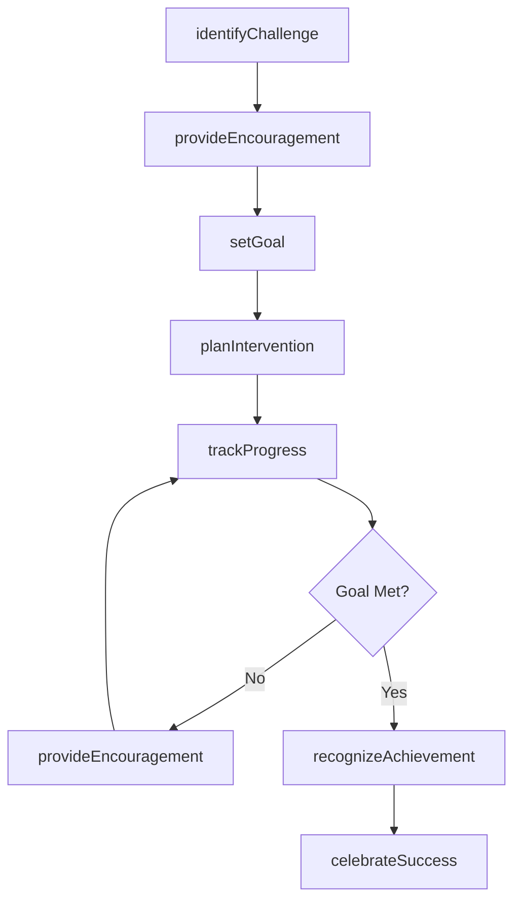
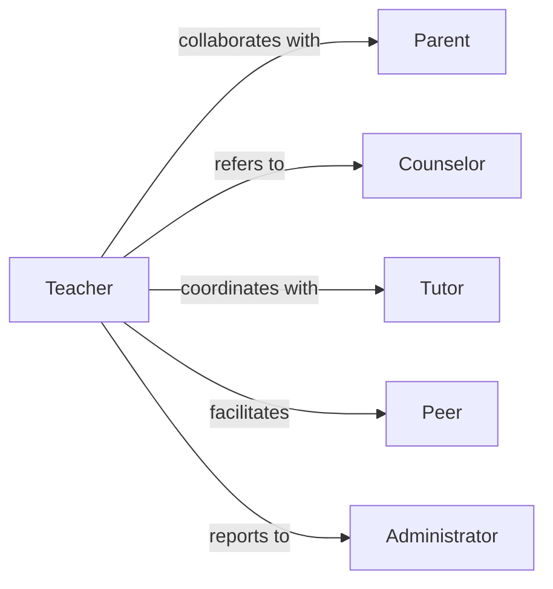

# Encourage Students

> Business-as-Code definition for student encouragement and motivation. Models the provision of support, recognition, and positive reinforcement to enhance student engagement and achievement.

## Overview

Student encouragement involves providing positive reinforcement, emotional support, and motivational guidance to help students overcome challenges and achieve academic and personal goals. This definition exposes actions for delivering encouragement, tracking progress, and automating recognition workflows.

## Actors

| Actor | Description |
|-------|-------------|
| Parent | Provides home support and reinforcement of encouragement |
| Counselor | Offers professional guidance and emotional support |
| Tutor | Provides academic assistance and skill-building |
| Peer | Offers social support and collaboration |
| Administrator | Sets institutional policies for student support |
| CommunityMentor | Provides external guidance and real-world perspective |

## Roles

| Role | Description |
|------|-------------|
| Teacher | Primary educator providing classroom encouragement |
| Advisor | Guides students through academic and career planning |
| Coach | Motivates students in extracurricular activities |
| Mentor | Provides long-term guidance and support |

## Entities

| Entity | Description |
|--------|-------------|
| Student | Individual receiving encouragement and support |
| Goal | Academic or personal objective being pursued |
| Achievement | Milestone or accomplishment reached by student |
| Challenge | Obstacle or difficulty student is facing |
| Intervention | Targeted support action to address specific needs |
| Progress | Measurable advancement toward goals |

## Actions

| Action | Description |
|--------|-------------|
| provideEncouragement | Deliver positive reinforcement to a student |
| recognizeAchievement | Acknowledge student accomplishments |
| setGoal | Establish clear objectives with student |
| trackProgress | Monitor student advancement toward goals |
| identifyChallenge | Recognize obstacles hindering student success |
| planIntervention | Develop targeted support strategy |
| celebrateSuccess | Formally recognize student accomplishments |

## Events

| Event | Description |
|-------|-------------|
| encouragementProvided | Positive reinforcement has been delivered |
| achievementRecognized | Student accomplishment has been acknowledged |
| goalSet | Student objective has been established |
| progressTracked | Student advancement has been measured |
| challengeIdentified | Obstacle has been recognized |
| interventionPlanned | Support strategy has been developed |
| successCelebrated | Student accomplishment has been formally recognized |

## Searches

| Search | Description |
|--------|-------------|
| findStudents | Retrieve students by performance, need, or cohort |
| getGoals | List student objectives by status or category |
| getProgress | Retrieve progress metrics for students or goals |
| getChallenges | Find obstacles by student, type, or severity |

## Workflow



## Actor Relationships



## Usage

### Calling Actions

```typescript
import { encourageStudents } from '@headlessly/encourage-students'

const encouragement = encourageStudents()

// Provide encouragement to a struggling student
await encouragement.provideEncouragement({
  studentId: 'stu_123',
  message: 'Your progress in mathematics has been impressive this week',
  context: 'improved_test_scores',
  method: 'in_person'
})

// Set a goal with a student
const goal = await encouragement.setGoal({
  studentId: 'stu_123',
  objective: 'Complete all homework assignments on time',
  targetDate: '2026-03-15',
  milestones: ['Week 1: 5 of 5', 'Week 2: 5 of 5']
})

// Track student progress
await encouragement.trackProgress({
  studentId: 'stu_123',
  goalId: goal.id,
  metrics: { completed: 8, total: 10, percentage: 80 }
})
```

### Event-Driven Automation

```typescript
// Automatically recognize achievements
encouragement.progressTracked(async ({ studentId, goalId, metrics }) => {
  if (metrics.percentage >= 100) {
    await encouragement.recognizeAchievement({
      studentId,
      goalId,
      recognition: 'Goal successfully completed'
    })
  }
})

// Trigger intervention when challenges are identified
encouragement.challengeIdentified(async ({ studentId, challenge, severity }) => {
  if (severity === 'high') {
    await encouragement.planIntervention({
      studentId,
      challengeId: challenge.id,
      actions: ['one_on_one_meeting', 'tutoring_referral']
    })
  }
})
```
