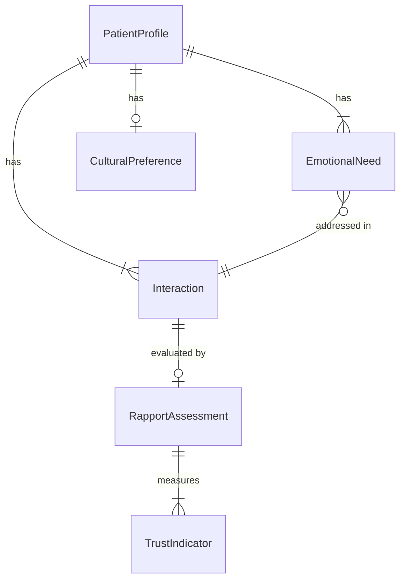
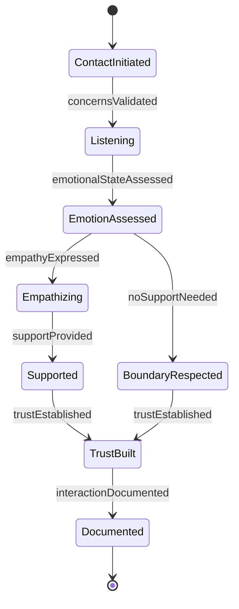
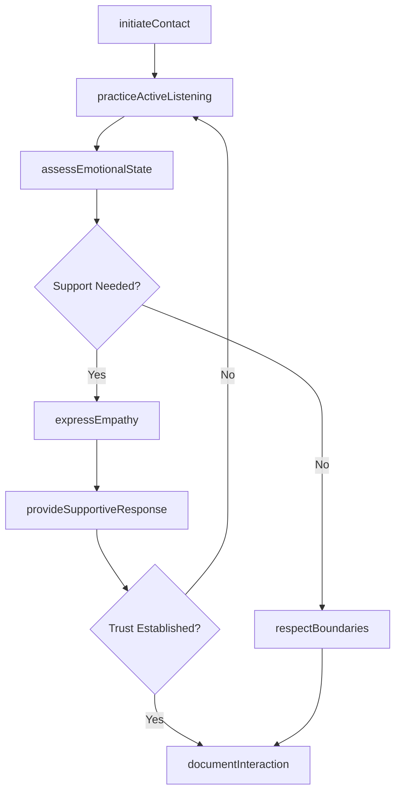
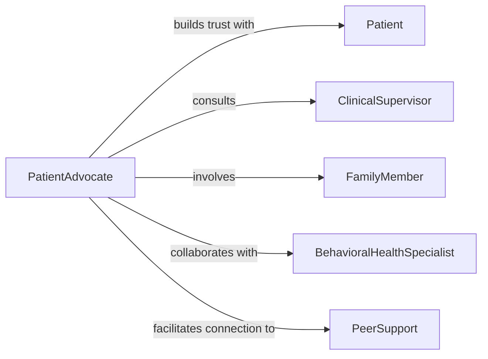

# Interact Patients Build Rapport Provide

> Business-as-Code definition for establishing therapeutic relationships and delivering emotional support. Models trust-building, active listening, and empathetic communication workflows.

## Overview

Interacting with patients to build rapport and provide emotional support involves establishing trust, demonstrating empathy, practicing active listening, respecting cultural differences, and maintaining appropriate professional boundaries. This definition exposes actions for relationship-building and emotional support, events for tracking patient engagement and wellbeing, and searches for monitoring interaction quality and patient satisfaction across healthcare, mental health, and social service settings.

## Actors

| Actor | Description |
|-------|-------------|
| Patient | Individual receiving care and support |
| ClinicalSupervisor | Oversees quality of patient interactions |
| FamilyMember | Loved one involved in patient care |
| BehavioralHealthSpecialist | Provides consultation on emotional support strategies |
| PeerSupport | Fellow patients offering shared experience |
| CulturalLiaison | Facilitates culturally sensitive communication |

## Roles

| Role | Description |
|------|-------------|
| PatientAdvocate | Champions patient needs and preferences |
| CareCoordinator | Manages comprehensive patient support plan |
| EmotionalSupportSpecialist | Delivers targeted mental health interventions |
| RelationshipBuilder | Focuses on establishing and maintaining trust |

## Entities

| Entity | Description |
|--------|-------------|
| PatientProfile | Demographic and psychosocial information |
| Interaction | Documented communication with patient |
| RapportAssessment | Evaluation of relationship quality |
| EmotionalNeed | Identified support requirement |
| TrustIndicator | Measurable sign of relationship strength |
| CulturalPreference | Patient-specific communication considerations |

## Actions

| Action | Description |
|--------|-------------|
| initiateContact | Begin interaction with patient |
| practiceActiveListening | Attentively hear and validate patient concerns |
| expressEmpathy | Demonstrate understanding of patient emotions |
| assessEmotionalState | Evaluate patient mental and emotional wellbeing |
| provideSupportiveResponse | Offer comfort and reassurance |
| respectBoundaries | Honor patient preferences and privacy |
| documentInteraction | Record communication and observations |

## Events

| Event | Description |
|-------|-------------|
| contactInitiated | Interaction with patient has begun |
| concernsValidated | Patient feelings have been acknowledged |
| empathyExpressed | Understanding has been demonstrated |
| emotionalStateAssessed | Wellbeing evaluation has been completed |
| supportProvided | Comfort and reassurance have been delivered |
| trustEstablished | Rapport has been successfully built |
| interactionDocumented | Communication has been recorded |

## Searches

| Search | Description |
|--------|-------------|
| findInteractions | List patient communications by date or type |
| getRapportScores | Retrieve relationship quality assessments |
| getEmotionalNeeds | Find patients requiring support interventions |
| getTrustIndicators | Monitor relationship strength over time |

## Entity Relationships



## State Diagram



## Workflow



## Actor Relationships



## Usage

### Calling Actions

```typescript
import { interactPatientsBuildRapportProvide } from '@headlessly/interact-patients-build-rapport-provide'

const patientSupport = interactPatientsBuildRapportProvide()

// Initiate contact with a new patient
const interaction = await patientSupport.initiateContact({
  patientId: 'patient-567',
  method: 'in-person',
  purpose: 'initial-intake',
  culturalConsiderations: ['interpreter-needed', 'family-centered-care']
})

// Practice active listening and assess emotional state
await patientSupport.practiceActiveListening({
  interactionId: interaction.id,
  patientConcerns: ['fear-of-procedure', 'family-stress'],
  validationResponse: 'I understand this is a difficult time for you'
})

const assessment = await patientSupport.assessEmotionalState({
  patientId: 'patient-567',
  indicators: ['anxiety', 'sadness'],
  severity: 'moderate'
})

// Provide supportive response
await patientSupport.provideSupportiveResponse({
  patientId: 'patient-567',
  interventionType: 'reassurance',
  message: 'We are here to support you through every step'
})
```

### Event-Driven Automation

```typescript
// Escalate when high emotional distress is detected
patientSupport.emotionalStateAssessed(async ({ patientId, severity }) => {
  if (severity === 'severe') {
    await notify({
      to: 'behavioral-health-specialist',
      message: `Patient ${patientId} requires immediate emotional support consultation`,
      priority: 'urgent'
    })
  }
})

// Track rapport development over time
patientSupport.trustEstablished(async ({ patientId, interactionId }) => {
  await updateMetrics({
    patientId,
    metric: 'rapport-quality',
    value: 'established',
    timestamp: new Date()
  })
})
