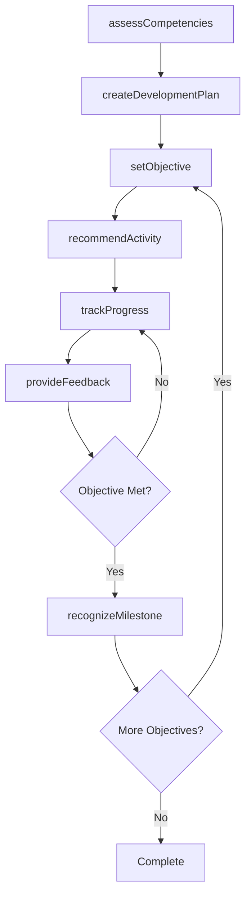
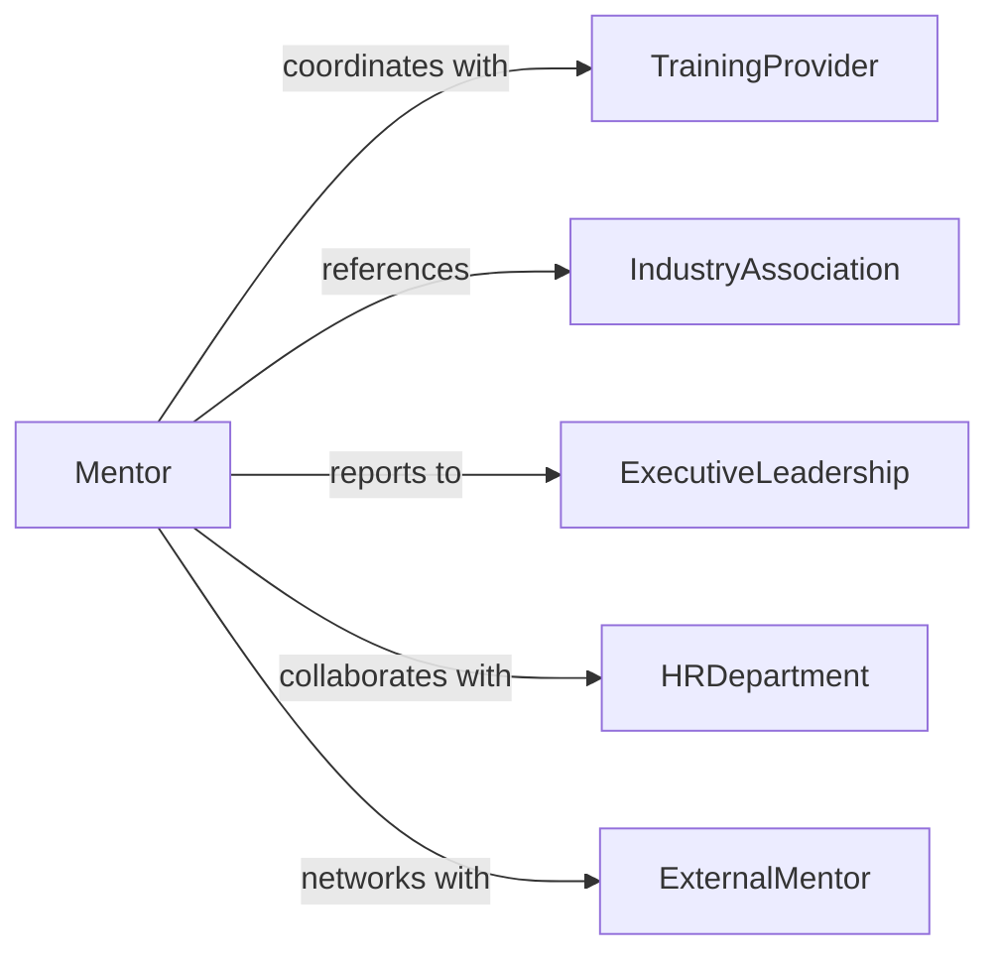

# Support Professional Development Others

> Business-as-Code definition for supporting professional development. Models mentoring, coaching, and skill-building activities to advance careers and capabilities of colleagues and team members.

## Overview

Professional development support involves guiding others through career advancement, skill acquisition, and performance improvement. This definition exposes actions for creating development plans, providing coaching, tracking competencies, and automating recognition of professional growth milestones.

## Actors

| Actor | Description |
|-------|-------------|
| TrainingProvider | Delivers courses and certification programs |
| IndustryAssociation | Offers networking and professional standards |
| ExecutiveLeadership | Approves development budgets and promotions |
| HRDepartment | Manages talent development programs |
| ExternalMentor | Provides industry expertise and guidance |
| Certifier | Issues professional credentials and certifications |

## Roles

| Role | Description |
|------|-------------|
| Mentor | Provides ongoing guidance and career advice |
| Coach | Delivers targeted skill development sessions |
| Manager | Oversees team member development plans |
| PeerCoach | Offers lateral support and knowledge sharing |

## Entities

| Entity | Description |
|--------|-------------|
| DevelopmentPlan | Structured roadmap for professional growth |
| Competency | Skill or knowledge area to be developed |
| Objective | Specific professional goal or milestone |
| Assessment | Evaluation of current skill level |
| Activity | Training, course, or development action |
| Milestone | Achievement marking progress in development |

## Actions

| Action | Description |
|--------|-------------|
| createDevelopmentPlan | Establish a structured growth roadmap |
| assessCompetencies | Evaluate current skill levels and gaps |
| setObjective | Define specific professional goals |
| recommendActivity | Suggest training or learning opportunities |
| provideFeedback | Offer constructive guidance on performance |
| trackProgress | Monitor advancement through development plan |
| recognizeMilestone | Acknowledge achievement of development goals |

## Events

| Event | Description |
|-------|-------------|
| developmentPlanCreated | Growth roadmap has been established |
| competenciesAssessed | Skills have been evaluated |
| objectiveSet | Professional goal has been defined |
| activityRecommended | Learning opportunity has been suggested |
| feedbackProvided | Guidance has been delivered |
| progressTracked | Advancement has been measured |
| milestoneRecognized | Development achievement has been acknowledged |

## Searches

| Search | Description |
|--------|-------------|
| findDevelopmentPlans | Retrieve plans by employee, status, or timeframe |
| getCompetencies | List skills by category or proficiency level |
| getActivities | Find training opportunities by skill or type |
| getMilestones | Retrieve achievements by employee or period |

## Workflow



## Actor Relationships



## Usage

### Calling Actions

```typescript
import { supportProfessionalDevelopmentOthers } from '@headlessly/support-professional-development-others'

const development = supportProfessionalDevelopmentOthers()

// Create a development plan for a team member
const plan = await development.createDevelopmentPlan({
  employeeId: 'emp_456',
  focus: ['technical_leadership', 'public_speaking'],
  duration: '12_months',
  budget: 5000
})

// Assess current competencies
const assessment = await development.assessCompetencies({
  employeeId: 'emp_456',
  competencies: [
    { name: 'Project Management', level: 'intermediate' },
    { name: 'Data Analysis', level: 'beginner' }
  ]
})

// Recommend a learning activity
await development.recommendActivity({
  planId: plan.id,
  activity: {
    type: 'course',
    title: 'Advanced Project Management Certification',
    provider: 'PMI',
    duration: '6_weeks'
  }
})
```

### Event-Driven Automation

```typescript
// Auto-recommend activities based on competency gaps
development.competenciesAssessed(async ({ employeeId, competencies }) => {
  const gaps = competencies.filter(c => c.level === 'beginner')
  for (const gap of gaps) {
    await development.recommendActivity({
      employeeId,
      competency: gap.name,
      activityType: 'training'
    })
  }
})

// Notify manager when milestones are achieved
development.milestoneRecognized(async ({ employeeId, milestone }) => {
  await notify({
    to: 'manager',
    message: `${employeeId} achieved milestone: ${milestone.title}`
  })
})
```
