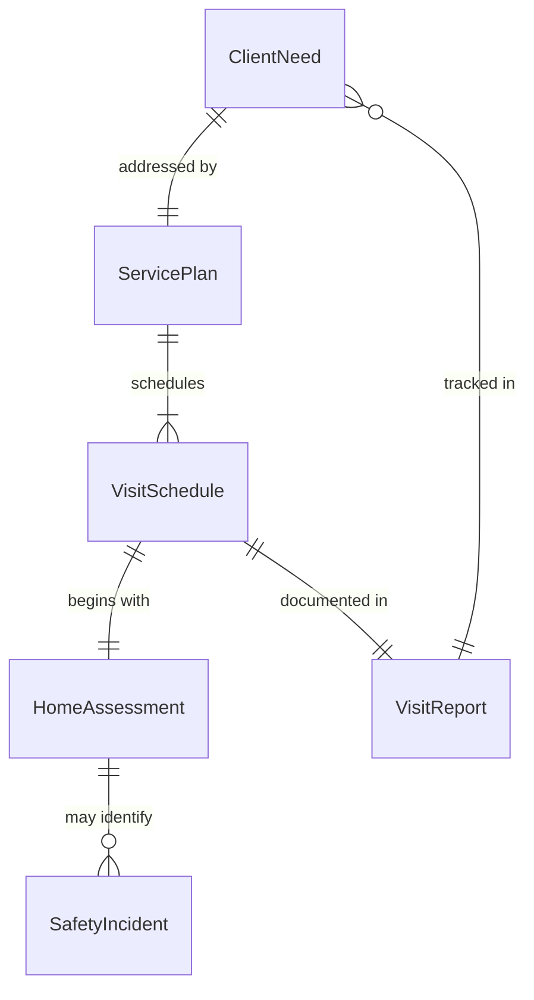
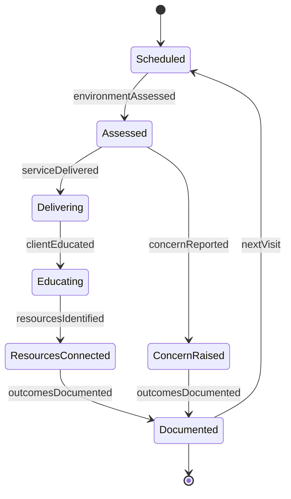
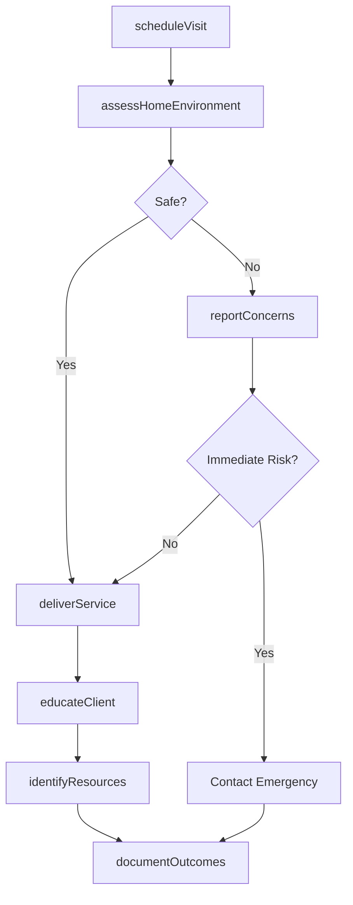
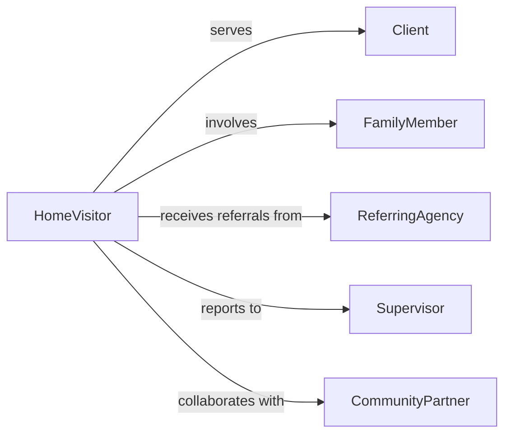

# Visit Individuals Their Homes Provide

> Business-as-Code definition for delivering in-home support and educational services. Models visit scheduling, safety assessment, service delivery, and outcome documentation workflows.

## Overview

Visiting individuals in their homes to provide support or information involves scheduling visits, assessing home environment safety, delivering personalized services, educating clients and families, and documenting outcomes. This definition exposes actions for the complete home visit lifecycle, events for tracking service delivery and client engagement, and searches for monitoring visit compliance and outcomes across home healthcare, social services, early childhood intervention, and community outreach programs.

## Actors

| Actor | Description |
|-------|-------------|
| Client | Individual receiving in-home services |
| FamilyMember | Household member involved in care |
| ReferringAgency | Organization requesting home visit services |
| Supervisor | Manager overseeing field staff safety and quality |
| EmergencyContact | Designated person for urgent situations |
| CommunityPartner | Local organization providing supplemental resources |

## Roles

| Role | Description |
|------|-------------|
| HomeVisitor | Field staff delivering in-home services |
| CaseManager | Coordinates comprehensive client support plan |
| Educator | Provides training and information to clients |
| SafetyMonitor | Assesses and addresses environmental hazards |

## Entities

| Entity | Description |
|--------|-------------|
| VisitSchedule | Planned home visit appointments |
| ClientNeed | Identified support or information requirement |
| HomeAssessment | Evaluation of living environment |
| ServicePlan | Personalized intervention strategy |
| VisitReport | Documentation of activities and outcomes |
| SafetyIncident | Hazard or concern identified during visit |

## Actions

| Action | Description |
|--------|-------------|
| scheduleVisit | Arrange in-home appointment with client |
| assessHomeEnvironment | Evaluate safety and suitability of living space |
| deliverService | Provide planned support or intervention |
| educateClient | Share information and skills training |
| identifyResources | Connect client with community supports |
| documentOutcomes | Record visit activities and results |
| reportConcerns | Flag safety or wellbeing issues |

## Events

| Event | Description |
|-------|-------------|
| visitScheduled | In-home appointment has been arranged |
| environmentAssessed | Home safety evaluation has been completed |
| serviceDelivered | Planned intervention has been provided |
| clientEducated | Information or training has been delivered |
| resourcesIdentified | Community supports have been connected |
| concernReported | Safety or wellbeing issue has been documented |
| outcomesDocumented | Visit results have been recorded |

## Searches

| Search | Description |
|--------|-------------|
| findVisits | List scheduled or completed home visits |
| getServicePlans | Retrieve personalized intervention strategies |
| getAssessments | Find home environment evaluations |
| getConcerns | Identify reported safety or wellbeing issues |

## Entity Relationships



## State Diagram



## Workflow



## Actor Relationships



## Usage

### Calling Actions

```typescript
import { visitIndividualsTheirHomesProvide } from '@headlessly/visit-individuals-their-homes-provide'

const homeVisits = visitIndividualsTheirHomesProvide()

// Schedule a home visit
const visit = await homeVisits.scheduleVisit({
  clientId: 'client-890',
  visitDate: '2026-02-10',
  visitTime: '10:00',
  purpose: 'developmental-screening',
  estimatedDuration: 60
})

// Assess home environment upon arrival
const assessment = await homeVisits.assessHomeEnvironment({
  visitId: visit.id,
  safetyChecks: ['smoke-detectors', 'clean-water', 'heating', 'secure-stairs'],
  hazardsIdentified: ['loose-electrical-cord']
})

// Deliver service and educate client
await homeVisits.deliverService({
  visitId: visit.id,
  serviceType: 'child-development-screening',
  toolsUsed: ['ASQ-3', 'observation']
})

await homeVisits.educateClient({
  visitId: visit.id,
  topics: ['age-appropriate-activities', 'nutrition', 'safety'],
  materialsProvided: ['activity-guide', 'community-resources-list']
})
```

### Event-Driven Automation

```typescript
// Alert supervisor when safety concerns are reported
homeVisits.concernReported(async ({ visitId, clientId, concern }) => {
  if (concern.severity === 'high') {
    await notify({
      to: 'supervisor',
      message: `Urgent concern during visit ${visitId} for client ${clientId}: ${concern.description}`,
      priority: 'immediate'
    })
  }
})

// Track visit completion rates
homeVisits.outcomesDocumented(async ({ visitId, clientId }) => {
  await updateMetrics({
    clientId,
    metric: 'visit-completion',
    timestamp: new Date()
  })
})
