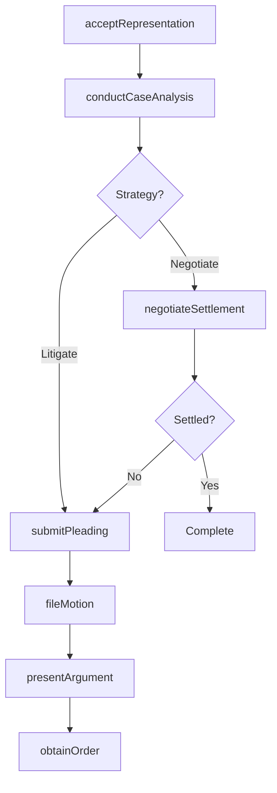
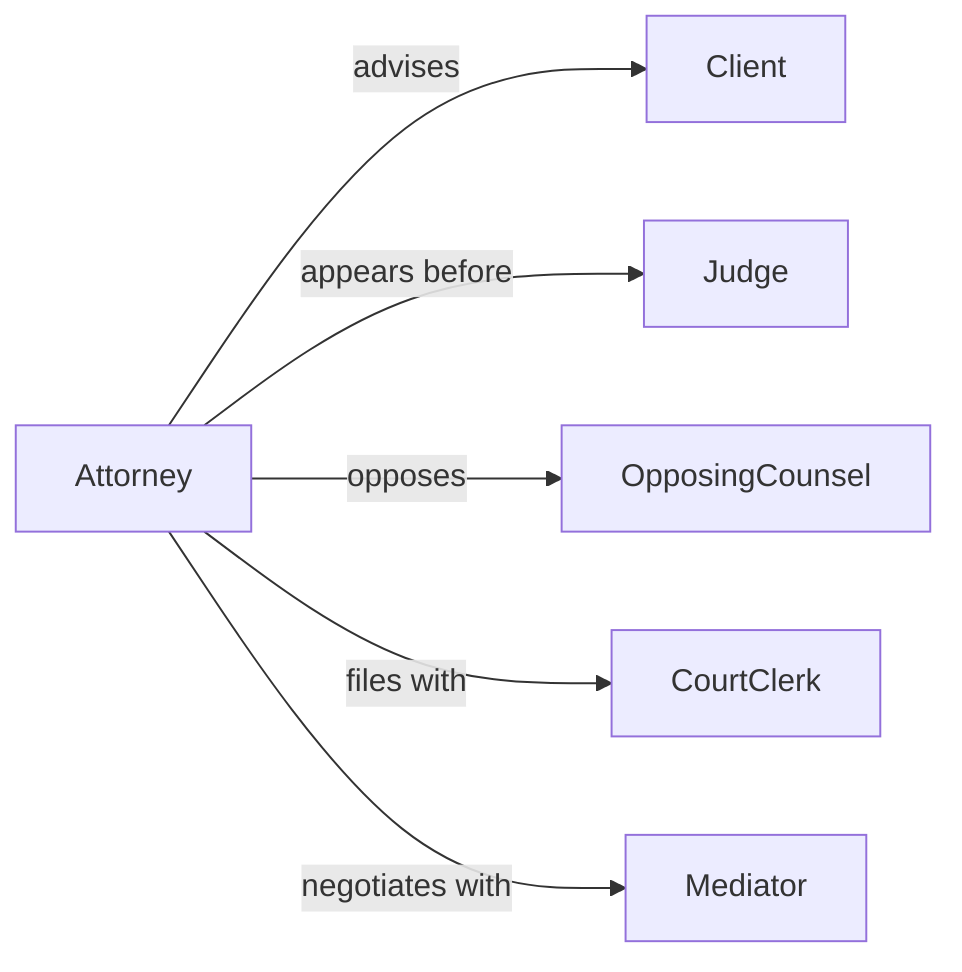

# Represent Interests Clients Legal Proceedings

> Business-as-Code definition for client representation in legal proceedings. Models advocacy, case management, and procedural actions performed on behalf of clients in courts and tribunals.

## Overview

Legal representation involves advocating for client interests, managing case strategy, filing motions, and presenting arguments in legal proceedings. This definition exposes actions for case preparation, filing procedures, courtroom advocacy, and settlement negotiations.

## Actors

| Actor | Description |
|-------|-------------|
| Client | Individual or entity being represented |
| Judge | Presides over proceedings and issues rulings |
| OpposingParty | Adversary in the legal matter |
| OpposingCounsel | Attorney representing the opposing party |
| CourtClerk | Manages filing and administrative procedures |
| Mediator | Facilitates settlement discussions |

## Roles

| Role | Description |
|------|-------------|
| Attorney | Primary legal representative for client |
| ParalegalAssistant | Supports case preparation and documentation |
| LitigationSpecialist | Manages courtroom strategy and arguments |
| SettlementNegotiator | Conducts resolution discussions |

## Entities

| Entity | Description |
|--------|-------------|
| Case | Legal matter being pursued or defended |
| Motion | Formal request submitted to court |
| Pleading | Legal document asserting claims or defenses |
| Evidence | Documentation supporting client position |
| Settlement | Negotiated resolution of legal matter |
| Order | Court ruling or directive |

## Actions

| Action | Description |
|--------|-------------|
| acceptRepresentation | Formally agree to represent client |
| conductCaseAnalysis | Evaluate legal merits and strategy |
| fileMotion | Submit formal request to court |
| submitPleading | File legal document asserting position |
| presentArgument | Deliver advocacy in courtroom |
| negotiateSettlement | Conduct resolution discussions |
| obtainOrder | Secure favorable court ruling |

## Events

| Event | Description |
|-------|-------------|
| representationAccepted | Client representation has been established |
| caseAnalyzed | Legal merits have been evaluated |
| motionFiled | Formal request has been submitted |
| pleadingSubmitted | Legal document has been filed |
| argumentPresented | Advocacy has been delivered in court |
| settlementNegotiated | Resolution discussions have occurred |
| orderObtained | Court ruling has been secured |

## Searches

| Search | Description |
|--------|-------------|
| findCases | Retrieve cases by client, status, or type |
| getMotions | List motions by case or filing date |
| getPleadings | Find legal documents by case or type |
| getOrders | Retrieve court rulings by case or date |

## Workflow



## Actor Relationships



## Usage

### Calling Actions

```typescript
import { representInterestsClientsLegalProceedings } from '@headlessly/represent-interests-clients-legal-proceedings'

const representation = representInterestsClientsLegalProceedings()

// Accept client representation
const engagement = await representation.acceptRepresentation({
  clientId: 'cli_456',
  caseType: 'contract_dispute',
  jurisdiction: 'state_superior_court',
  conflictCheck: 'passed'
})

// Conduct case analysis
const analysis = await representation.conductCaseAnalysis({
  caseId: engagement.caseId,
  facts: ['contract_breach', 'damages_claimed'],
  legalIssues: ['breach_of_contract', 'statute_of_limitations'],
  strategy: 'motion_to_dismiss'
})

// File a motion
await representation.fileMotion({
  caseId: engagement.caseId,
  motionType: 'motion_to_dismiss',
  grounds: ['failure_to_state_claim'],
  hearingRequested: true
})
```

### Event-Driven Automation

```typescript
// Notify client when motions are filed
representation.motionFiled(async ({ caseId, motionType, filingDate }) => {
  await notify({
    to: 'client',
    message: `${motionType} filed in your case on ${filingDate}`
  })
})

// Track settlement offers
representation.settlementNegotiated(async ({ caseId, offer, terms }) => {
  await logEntry({
    case: caseId,
    type: 'settlement_offer',
    amount: offer.amount,
    terms,
    requiresClientApproval: true
  })
})
```
