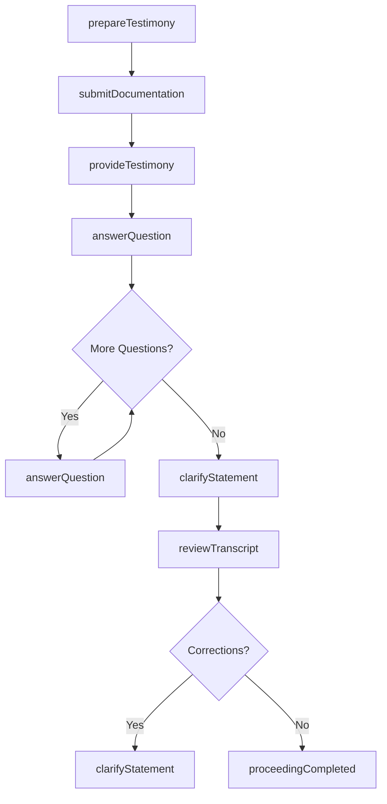
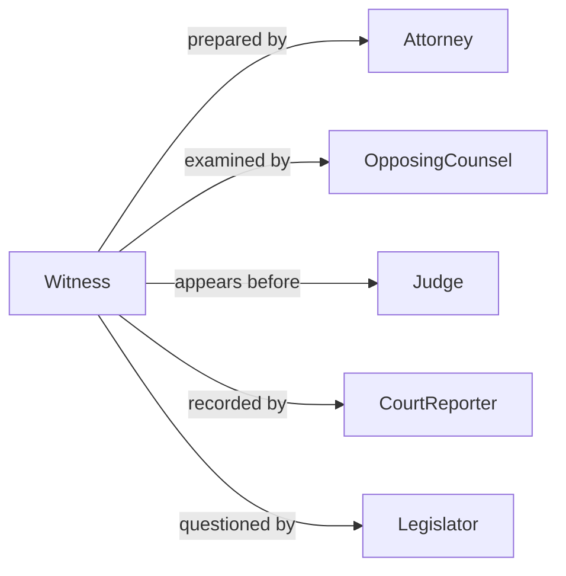

# Testify Legal Legislative Proceedings

> Business-as-Code definition for testimony in legal and legislative proceedings. Models preparation, delivery, and documentation of sworn statements provided in courts, hearings, and legislative sessions.

## Overview

Testifying in legal or legislative proceedings involves providing sworn statements based on expertise, observations, or evidence. This definition exposes actions for preparing testimony, responding to questions, submitting documentation, and tracking proceeding outcomes.

## Actors

| Actor | Description |
|-------|-------------|
| Attorney | Requests testimony and prepares witness |
| Judge | Presides over court proceedings and rules on objections |
| OpposingCounsel | Cross-examines witness and challenges testimony |
| CourtReporter | Records official transcript of proceedings |
| Jury | Evaluates testimony and evidence in trials |
| Legislator | Questions witness in legislative hearings |

## Roles

| Role | Description |
|------|-------------|
| Witness | Individual providing sworn testimony |
| ExpertWitness | Specialist offering professional opinion |
| FactWitness | Person testifying to observed events |
| SubjectMatterExpert | Authority testifying on technical matters |

## Entities

| Entity | Description |
|--------|-------------|
| Testimony | Sworn statement provided in proceeding |
| Proceeding | Legal or legislative session requiring testimony |
| Subpoena | Legal order to appear and testify |
| Exhibit | Documentary evidence referenced in testimony |
| Transcript | Official record of testimony provided |
| CrossExamination | Opposing party's questioning of witness |

## Actions

| Action | Description |
|--------|-------------|
| prepareTestimony | Review facts and organize statement |
| submitDocumentation | Provide supporting evidence and exhibits |
| provideTestimony | Deliver sworn statement on record |
| answerQuestion | Respond to direct or cross-examination |
| clarifyStatement | Provide additional detail or correction |
| reviewTranscript | Verify accuracy of official record |
| followUpProceeding | Participate in subsequent sessions |

## Events

| Event | Description |
|-------|-------------|
| testimonyPrepared | Statement has been organized and reviewed |
| documentationSubmitted | Supporting evidence has been provided |
| testimonyProvided | Sworn statement has been delivered |
| questionAnswered | Response has been given under oath |
| statementClarified | Additional detail has been provided |
| transcriptReviewed | Official record has been verified |
| proceedingCompleted | Testimony session has concluded |

## Searches

| Search | Description |
|--------|-------------|
| findProceedings | Retrieve proceedings by case, date, or type |
| getTestimonies | List testimonies by witness or proceeding |
| getExhibits | Find documentary evidence by exhibit number |
| getTranscripts | Retrieve official records of testimony |

## Workflow



## Actor Relationships



## Usage

### Calling Actions

```typescript
import { testifyLegalLegislativeProceedings } from '@headlessly/testify-legal-legislative-proceedings'

const testimony = testifyLegalLegislativeProceedings()

// Prepare testimony for a court case
await testimony.prepareTestimony({
  proceedingId: 'case_2026_12345',
  witnessId: 'wit_001',
  subjectMatter: 'expert_technical_analysis',
  preparationMaterials: ['case_documents', 'technical_reports']
})

// Submit supporting documentation
await testimony.submitDocumentation({
  proceedingId: 'case_2026_12345',
  exhibits: [
    { number: 'A', type: 'report', title: 'Technical Analysis Report' },
    { number: 'B', type: 'diagram', title: 'System Architecture Diagram' }
  ]
})

// Provide testimony during proceeding
await testimony.provideTestimony({
  proceedingId: 'case_2026_12345',
  witnessId: 'wit_001',
  statementType: 'direct_examination',
  duration: 120
})
```

### Event-Driven Automation

```typescript
// Log all questions answered for transcript review
testimony.questionAnswered(async ({ proceedingId, question, answer }) => {
  await logEntry({
    proceeding: proceedingId,
    type: 'qa_pair',
    question,
    answer,
    timestamp: new Date()
  })
})

// Notify attorney when clarification is needed
testimony.statementClarified(async ({ proceedingId, clarification }) => {
  await notify({
    to: 'attorney',
    message: `Clarification provided in ${proceedingId}: ${clarification}`
  })
})
```
