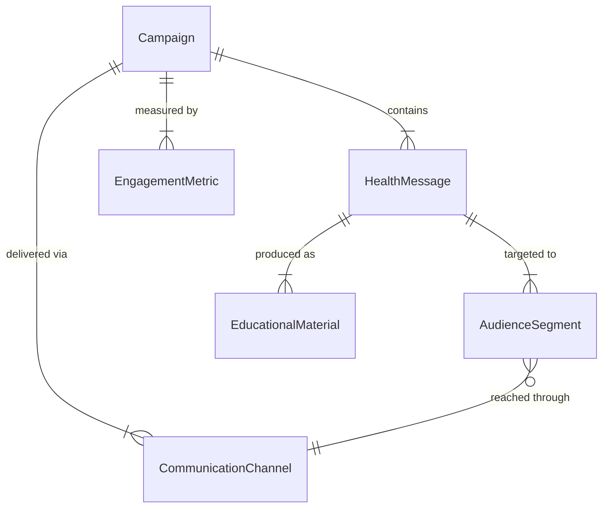
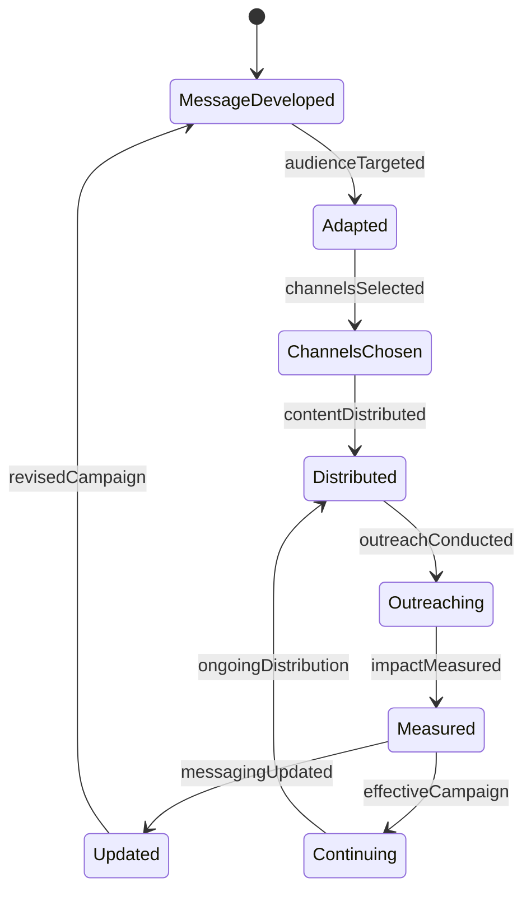
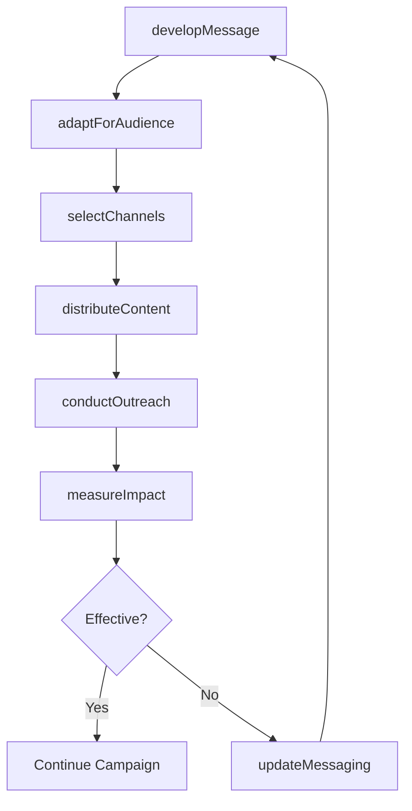
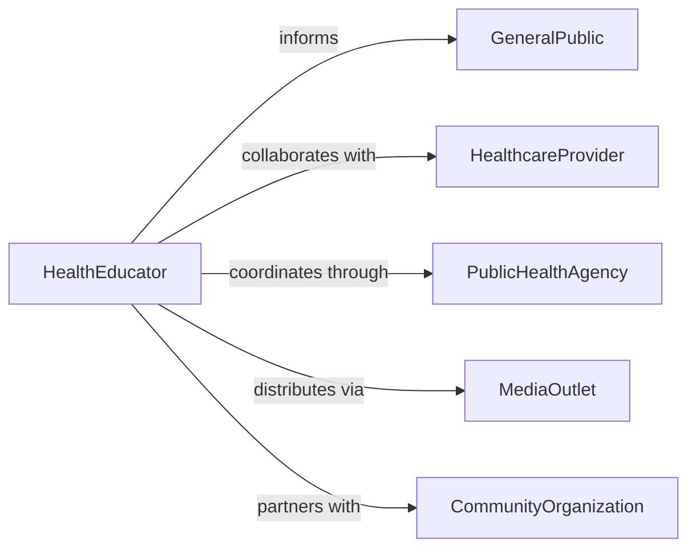

# Communicate Health Wellness Information Public

> Business-as-Code definition for public health education and outreach. Models content creation, multichannel dissemination, and impact measurement for community health messaging.

## Overview

Communicating health and wellness information to the public involves developing evidence-based content, adapting messages for diverse audiences, delivering information through multiple channels, and measuring public awareness and behavior change. This definition exposes actions for health communication campaigns, events for tracking message reach and engagement, and searches for monitoring public health literacy and campaign effectiveness across government health departments, hospitals, nonprofits, and wellness organizations.

## Actors

| Actor | Description |
|-------|-------------|
| GeneralPublic | Community members receiving health information |
| HealthcareProvider | Medical professionals contributing expertise |
| PublicHealthAgency | Government organization coordinating campaigns |
| MediaOutlet | Broadcast, print, and digital publishers |
| CommunityOrganization | Local groups facilitating health education |
| Translator | Ensures messaging in multiple languages |

## Roles

| Role | Description |
|------|-------------|
| HealthEducator | Develops and delivers public health content |
| CommunicationsSpecialist | Manages messaging and media relations |
| ContentCreator | Produces educational materials and campaigns |
| OutreachCoordinator | Engages community partners and audiences |

## Entities

| Entity | Description |
|--------|-------------|
| HealthMessage | Core information for public dissemination |
| Campaign | Coordinated effort to address health topic |
| AudienceSegment | Targeted population with specific needs |
| CommunicationChannel | Medium for message delivery |
| EducationalMaterial | Brochure, video, or other content artifact |
| EngagementMetric | Measurement of public reach and response |

## Actions

| Action | Description |
|--------|-------------|
| developMessage | Create evidence-based health content |
| adaptForAudience | Tailor messaging for specific populations |
| selectChannels | Choose appropriate delivery methods |
| distributeContent | Share health information through selected media |
| conductOutreach | Engage directly with community members |
| measureImpact | Evaluate reach, awareness, and behavior change |
| updateMessaging | Refine content based on feedback and data |

## Events

| Event | Description |
|-------|-------------|
| messageDeveloped | Health content has been created |
| audienceTargeted | Messaging has been customized for population |
| channelsSelected | Delivery methods have been chosen |
| contentDistributed | Information has been shared publicly |
| outreachConducted | Direct community engagement has occurred |
| impactMeasured | Campaign effectiveness has been evaluated |
| messagingUpdated | Content has been refined based on results |

## Searches

| Search | Description |
|--------|-------------|
| findCampaigns | List health communication efforts by topic or date |
| getMetrics | Retrieve engagement and impact measurements |
| getAudiences | Find targeted population segments |
| getMaterials | Retrieve educational content by format or language |

## Entity Relationships



## State Diagram



## Workflow



## Actor Relationships



## Usage

### Calling Actions

```typescript
import { communicateHealthWellnessInformationPublic } from '@headlessly/communicate-health-wellness-information-public'

const healthComm = communicateHealthWellnessInformationPublic()

// Develop health message for campaign
const message = await healthComm.developMessage({
  topic: 'diabetes-prevention',
  evidenceBase: ['CDC-guidelines', 'peer-reviewed-studies'],
  keyPoints: ['healthy-eating', 'physical-activity', 'regular-screening']
})

// Adapt for specific audience segments
await healthComm.adaptForAudience({
  messageId: message.id,
  audiences: [
    { segment: 'seniors', adaptations: ['large-print', 'simplified-language'] },
    { segment: 'spanish-speakers', adaptations: ['translation', 'cultural-relevance'] }
  ]
})

// Select channels and distribute
await healthComm.selectChannels({
  campaignId: 'diabetes-prevention-2026',
  channels: ['social-media', 'community-radio', 'clinic-posters', 'text-messages']
})

await healthComm.distributeContent({
  campaignId: 'diabetes-prevention-2026',
  materials: ['infographic', 'video', 'fact-sheet'],
  startDate: '2026-02-15'
})
```

### Event-Driven Automation

```typescript
// Measure impact monthly and adjust messaging
healthComm.contentDistributed(async ({ campaignId }) => {
  setTimeout(async () => {
    const metrics = await healthComm.measureImpact({
      campaignId,
      indicators: ['reach', 'engagement', 'awareness', 'behavior-change']
    })

    if (metrics.awareness < 0.3) {
      await healthComm.updateMessaging({
        campaignId,
        adjustments: ['increase-frequency', 'add-channels', 'simplify-message']
      })
    }
  }, 30 * 24 * 60 * 60 * 1000) // 30 days
})

// Alert when high engagement is detected
healthComm.impactMeasured(async ({ campaignId, metrics }) => {
  if (metrics.engagement > 0.5) {
    await notify({
      to: 'communications-team',
      message: `Campaign ${campaignId} achieving high engagement - consider expanding reach`
    })
  }
})
```
