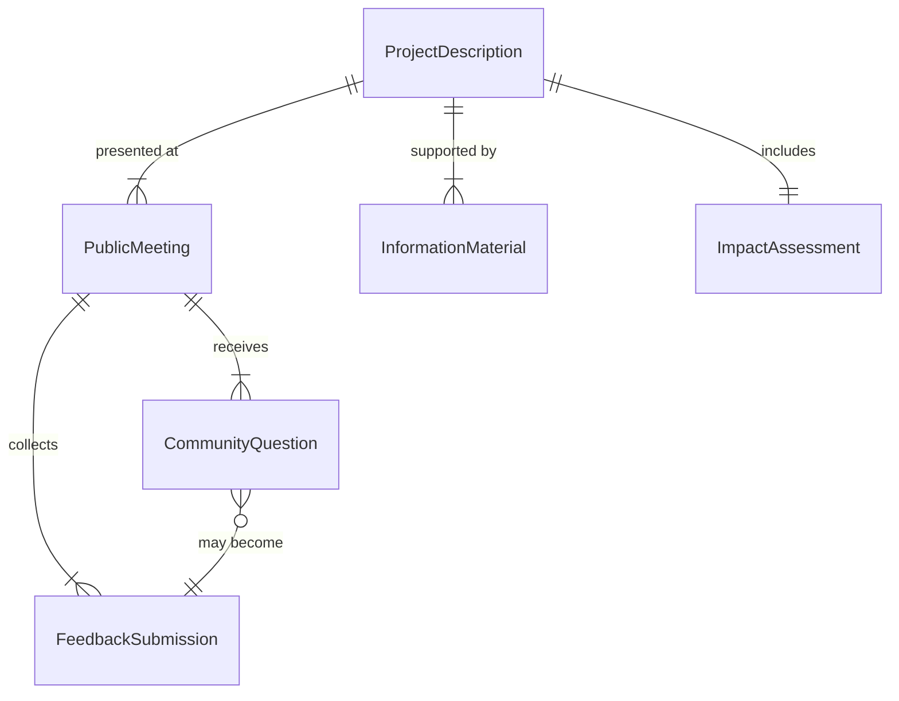
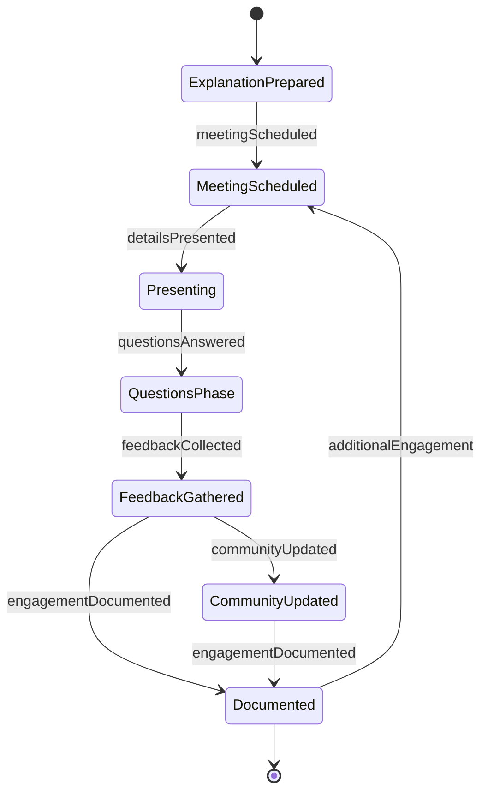
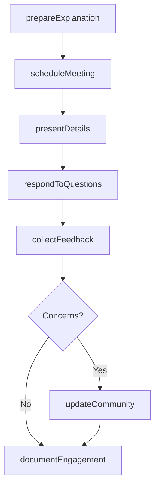
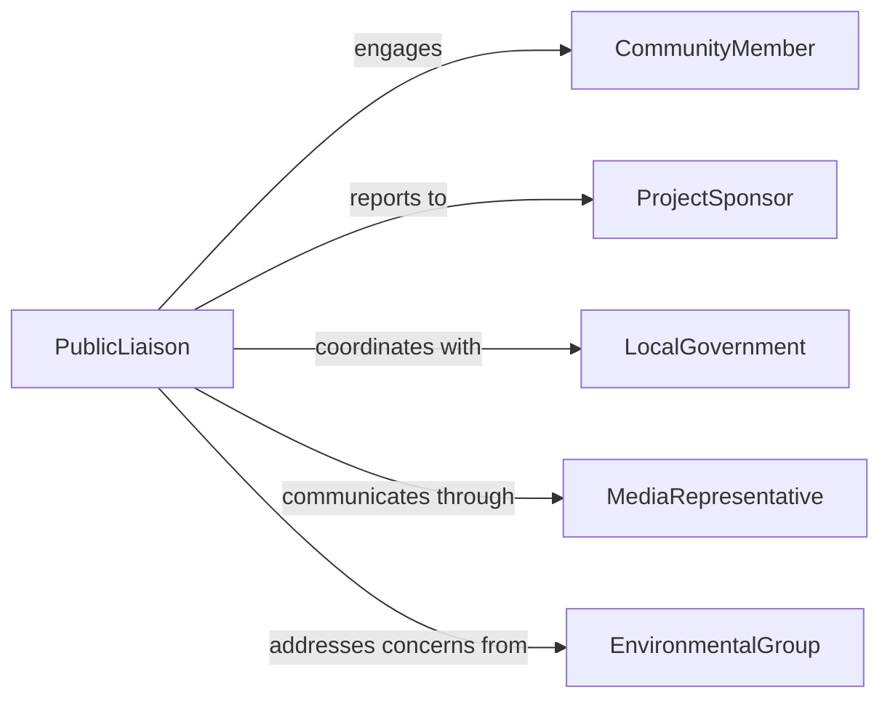

# Explain Project Details General Public

> Business-as-Code definition for public engagement and transparency communication. Models stakeholder outreach, accessible explanation, and feedback collection for infrastructure and community projects.

## Overview

Explaining project details to the general public involves translating technical information into accessible language, conducting public meetings and presentations, responding to community concerns, and maintaining transparent communication throughout project lifecycles. This definition exposes actions for public engagement and information sharing, events for tracking community involvement and sentiment, and searches for monitoring public inquiries and feedback across government infrastructure, urban development, environmental, and community service projects.

## Actors

| Actor | Description |
|-------|-------------|
| CommunityMember | Resident affected by or interested in project |
| ProjectSponsor | Organization funding and overseeing initiative |
| LocalGovernment | Municipal authority approving and regulating project |
| MediaRepresentative | Journalist covering project for public awareness |
| EnvironmentalGroup | Organization monitoring project impacts |
| BusinessOwner | Local commercial stakeholder affected by project |

## Roles

| Role | Description |
|------|-------------|
| PublicLiaison | Primary contact for community engagement |
| TechnicalExplainer | Translates complex information for lay audiences |
| MeetingFacilitator | Conducts public forums and presentations |
| FeedbackCoordinator | Collects and responds to public input |

## Entities

| Entity | Description |
|--------|-------------|
| ProjectDescription | Comprehensive overview of initiative |
| PublicMeeting | Scheduled community engagement event |
| InformationMaterial | Brochure, website, or visual aid |
| CommunityQuestion | Public inquiry requiring response |
| ImpactAssessment | Analysis of project effects on community |
| FeedbackSubmission | Public comment or concern |

## Actions

| Action | Description |
|--------|-------------|
| prepareExplanation | Create accessible project description |
| scheduleMeeting | Arrange public forum or presentation |
| presentDetails | Deliver project information to community |
| respondToQuestions | Answer public inquiries and concerns |
| collectFeedback | Gather community input and reactions |
| updateCommunity | Share project status and changes |
| documentEngagement | Record public interaction and sentiment |

## Events

| Event | Description |
|-------|-------------|
| explanationPrepared | Accessible project description has been created |
| meetingScheduled | Public forum has been arranged |
| detailsPresented | Project information has been delivered |
| questionsAnswered | Public inquiries have been addressed |
| feedbackCollected | Community input has been gathered |
| communityUpdated | Project status has been shared |
| engagementDocumented | Public interaction has been recorded |

## Searches

| Search | Description |
|--------|-------------|
| findMeetings | List scheduled public forums by date or location |
| getQuestions | Retrieve community inquiries by topic or status |
| getFeedback | Find public comments by sentiment or theme |
| getMaterials | Access information resources by project or format |

## Entity Relationships



## State Diagram



## Workflow



## Actor Relationships



## Usage

### Calling Actions

```typescript
import { explainProjectDetailsGeneralPublic } from '@headlessly/explain-project-details-general-public'

const publicEngagement = explainProjectDetailsGeneralPublic()

// Prepare explanation for infrastructure project
const explanation = await publicEngagement.prepareExplanation({
  projectId: 'bridge-renovation-2026',
  topics: ['timeline', 'traffic-impacts', 'safety-improvements', 'budget'],
  audience: 'general-public',
  formats: ['infographic', 'FAQ', 'video']
})

// Schedule and conduct public meeting
const meeting = await publicEngagement.scheduleMeeting({
  projectId: 'bridge-renovation-2026',
  date: '2026-03-15',
  time: '18:00',
  location: 'Community Center Auditorium',
  notificationMethods: ['mail', 'email', 'social-media', 'local-news']
})

await publicEngagement.presentDetails({
  meetingId: meeting.id,
  presenters: ['project-manager', 'engineer', 'public-liaison'],
  duration: 90,
  qaSectionIncluded: true
})

// Collect and respond to feedback
await publicEngagement.collectFeedback({
  meetingId: meeting.id,
  methods: ['verbal-comments', 'written-forms', 'online-survey'],
  anonymous: true
})
```

### Event-Driven Automation

```typescript
// Auto-respond to common questions
publicEngagement.questionsAnswered(async ({ question, projectId }) => {
  await updateFAQ({
    projectId,
    question: question.text,
    answer: question.response,
    category: question.topic
  })
})

// Alert project team when negative feedback threshold is reached
publicEngagement.feedbackCollected(async ({ projectId, feedback }) => {
  const negativeSentiment = feedback.filter(f => f.sentiment === 'negative').length
  const total = feedback.length

  if (negativeSentiment / total > 0.4) {
    await notify({
      to: 'project-sponsor',
      message: `High negative sentiment for ${projectId} - review and response needed`,
      priority: 'high'
    })
  }
})
```
