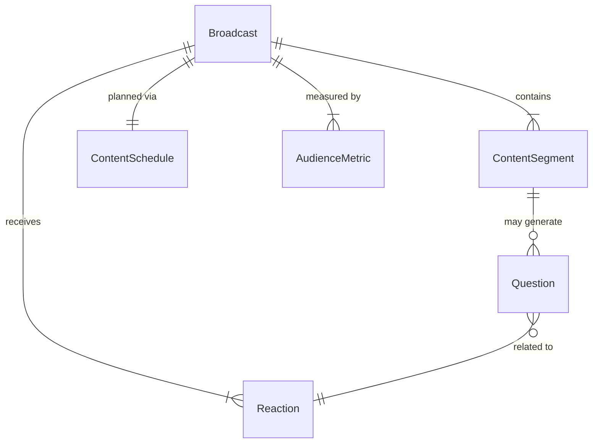
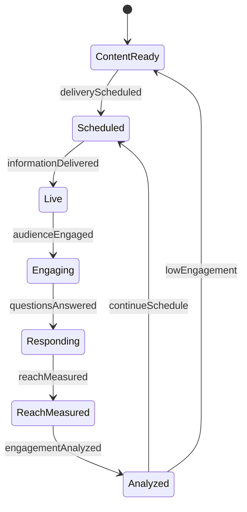
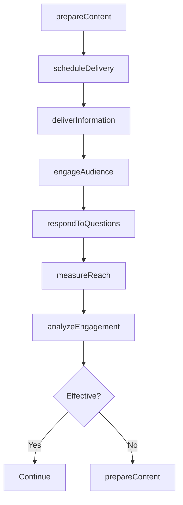
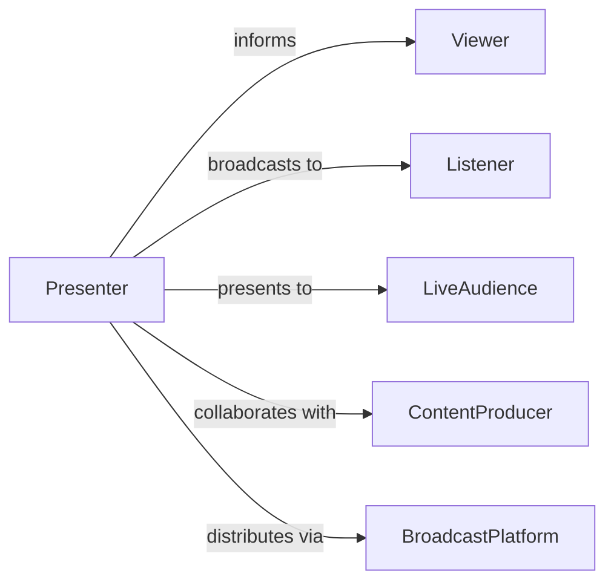

# Inform Viewers Listeners Audiences

> Business-as-Code definition for broadcast and performance communication. Models content delivery, audience engagement, and information dissemination across media and live presentation channels.

## Overview

Informing viewers, listeners, or audiences involves preparing content for broadcast or performance, delivering information through appropriate media channels, engaging with audience questions and reactions, and measuring reach and comprehension. This definition exposes actions for content creation and delivery, events for tracking audience engagement and feedback, and searches for monitoring viewership, listenership, and attendance metrics across television, radio, podcasts, live events, and digital streaming platforms.

## Actors

| Actor | Description |
|-------|-------------|
| Viewer | Individual watching video or television content |
| Listener | Individual receiving audio content |
| LiveAudience | In-person attendee at presentation or performance |
| ContentProducer | Creates and manages broadcast materials |
| BroadcastPlatform | Distribution channel for content delivery |
| Sponsor | Organization funding content production |

## Roles

| Role | Description |
|------|-------------|
| Presenter | Delivers information to audiences |
| ContentDirector | Oversees production and messaging |
| TechnicalOperator | Manages broadcast equipment and streaming |
| AudienceEngagementSpecialist | Facilitates interaction and feedback |

## Entities

| Entity | Description |
|--------|-------------|
| ContentSegment | Discrete portion of broadcast or presentation |
| Broadcast | Scheduled transmission of content |
| AudienceMetric | Measurement of reach and engagement |
| Question | Audience inquiry requiring response |
| Reaction | Audience feedback or sentiment |
| ContentSchedule | Planned delivery timeline |

## Actions

| Action | Description |
|--------|-------------|
| prepareContent | Create and review material for delivery |
| scheduleDelivery | Arrange timing for broadcast or presentation |
| deliverInformation | Present content to audiences |
| engageAudience | Facilitate interaction and participation |
| respondToQuestions | Address audience inquiries |
| measureReach | Evaluate audience size and composition |
| analyzeEngagement | Assess audience attention and comprehension |

## Events

| Event | Description |
|-------|-------------|
| contentPrepared | Material has been created and reviewed |
| deliveryScheduled | Broadcast or presentation has been planned |
| informationDelivered | Content has been presented to audiences |
| audienceEngaged | Interaction has been facilitated |
| questionsAnswered | Audience inquiries have been addressed |
| reachMeasured | Audience size has been evaluated |
| engagementAnalyzed | Attention and comprehension have been assessed |

## Searches

| Search | Description |
|--------|-------------|
| findBroadcasts | List scheduled or completed content deliveries |
| getMetrics | Retrieve viewership, listenership, or attendance data |
| getQuestions | Find audience inquiries by topic or status |
| getReactions | Access audience feedback and sentiment |

## Entity Relationships



## State Diagram



## Workflow



## Actor Relationships



## Usage

### Calling Actions

```typescript
import { informViewersListenersAudiences } from '@headlessly/inform-viewers-listeners-audiences'

const broadcast = informViewersListenersAudiences()

// Prepare content for broadcast
const content = await broadcast.prepareContent({
  title: 'Monthly Economic Update',
  type: 'live-stream',
  topics: ['employment-data', 'inflation-trends', 'market-outlook'],
  duration: 45,
  presenters: ['chief-economist', 'policy-analyst']
})

// Schedule delivery across multiple channels
await broadcast.scheduleDelivery({
  contentId: content.id,
  channels: ['website-stream', 'youtube', 'facebook-live'],
  broadcastDate: '2026-03-01',
  broadcastTime: '14:00'
})

// Deliver and engage with audience
await broadcast.deliverInformation({
  contentId: content.id,
  interactiveElements: ['live-poll', 'Q&A-session']
})

const metrics = await broadcast.measureReach({
  contentId: content.id,
  platforms: ['website', 'youtube', 'facebook'],
  includeDemographics: true
})
```

### Event-Driven Automation

```typescript
// Auto-respond to common questions during live broadcasts
broadcast.audienceEngaged(async ({ contentId, questions }) => {
  for (const q of questions) {
    const autoResponse = await matchToFAQ(q.text)
    if (autoResponse) {
      await broadcast.respondToQuestions({
        contentId,
        questionId: q.id,
        response: autoResponse,
        method: 'text-overlay'
      })
    }
  }
})

// Alert when engagement drops below threshold
broadcast.engagementAnalyzed(async ({ contentId, metrics }) => {
  if (metrics.attentionScore < 0.6) {
    await notify({
      to: 'content-director',
      message: `Low engagement for ${contentId} - consider adjusting delivery approach`
    })
  }
})
