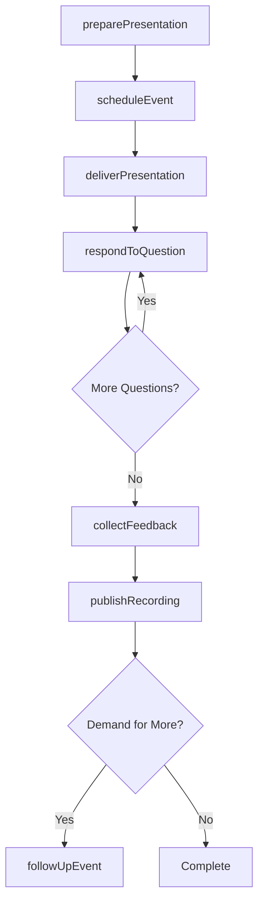
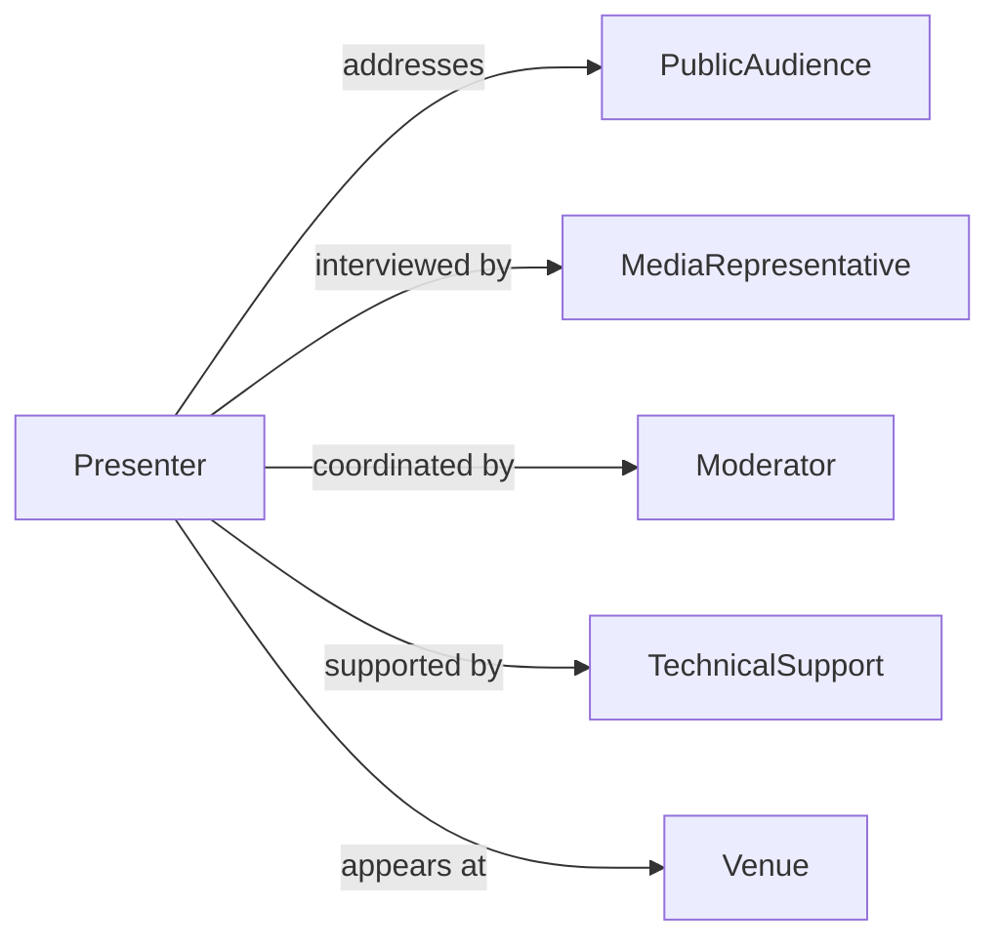

# Present Information Public

> Business-as-Code definition for public presentations and briefings. Models formal information delivery through speeches, town halls, press conferences, and public forums.

## Overview

Presenting information to the public involves delivering structured communications through formal presentations, briefings, and community forums. This definition exposes actions for preparing presentations, scheduling events, delivering content, and collecting feedback.

## Actors

| Actor | Description |
|-------|-------------|
| PublicAudience | Community members attending presentations |
| MediaRepresentative | Journalist covering public briefing |
| Moderator | Facilitates question and answer sessions |
| TechnicalSupport | Manages audiovisual and presentation technology |
| Venue | Facility hosting public presentation |
| Translator | Provides real-time language interpretation |

## Roles

| Role | Description |
|------|-------------|
| Presenter | Individual delivering public presentation |
| SpeakersBureau | Coordinates public speaking engagements |
| CommunicationsDirector | Oversees public messaging strategy |
| EventCoordinator | Manages logistics of public presentations |

## Entities

| Entity | Description |
|--------|-------------|
| Presentation | Structured delivery of information to public |
| Event | Scheduled public briefing or forum |
| Content | Information materials being presented |
| Question | Inquiry from public audience |
| Feedback | Public response to presentation |
| Recording | Audio or video capture of presentation |

## Actions

| Action | Description |
|--------|-------------|
| preparePresentation | Develop content and materials for delivery |
| scheduleEvent | Set date, time, and venue for public briefing |
| deliverPresentation | Formally present information to public |
| respondToQuestion | Answer inquiries from audience |
| collectFeedback | Gather public response to presentation |
| publishRecording | Release audio or video of presentation |
| followUpEvent | Conduct additional sessions based on demand |

## Events

| Event | Description |
|-------|-------------|
| presentationPrepared | Content has been developed for delivery |
| eventScheduled | Public briefing has been set |
| presentationDelivered | Information has been formally presented |
| questionResponded | Audience inquiry has been answered |
| feedbackCollected | Public response has been gathered |
| recordingPublished | Presentation capture has been released |
| followUpScheduled | Additional session has been planned |

## Searches

| Search | Description |
|--------|-------------|
| findPresentations | Retrieve presentations by topic, date, or presenter |
| getEvents | List scheduled public briefings by venue or type |
| getQuestions | Find audience inquiries by topic or presentation |
| getFeedback | Retrieve public responses by event or rating |

## Workflow



## Actor Relationships



## Usage

### Calling Actions

```typescript
import { presentInformationPublic } from '@headlessly/present-information-public'

const presentation = presentInformationPublic()

// Prepare a public presentation
const prep = await presentation.preparePresentation({
  topic: 'City Budget Overview FY2026',
  format: 'town_hall',
  materials: ['slides', 'handouts', 'video'],
  duration: 90
})

// Schedule the event
const event = await presentation.scheduleEvent({
  presentationId: prep.id,
  date: '2026-03-15',
  time: '18:00',
  venue: 'City Hall Auditorium',
  capacity: 200
})

// Deliver the presentation
await presentation.deliverPresentation({
  eventId: event.id,
  presenterId: 'pres_123',
  attendees: 175,
  recordingEnabled: true
})
```

### Event-Driven Automation

```typescript
// Publish recording automatically after event
presentation.presentationDelivered(async ({ eventId, recordingEnabled }) => {
  if (recordingEnabled) {
    await presentation.publishRecording({
      eventId,
      platforms: ['website', 'youtube', 'social_media']
    })
  }
})

// Schedule follow-up based on feedback demand
presentation.feedbackCollected(async ({ eventId, feedback }) => {
  const demandForMore = feedback.filter(f => f.requestFollowUp).length
  if (demandForMore > 50) {
    await presentation.followUpEvent({
      originalEventId: eventId,
      type: 'deep_dive_session'
    })
  }
})
```
