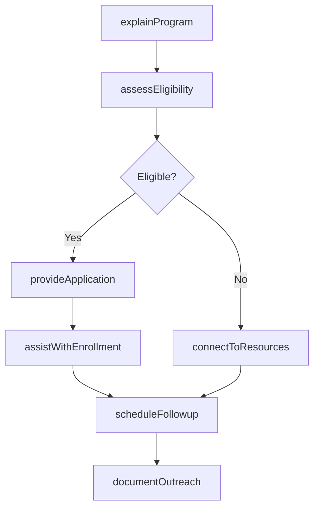
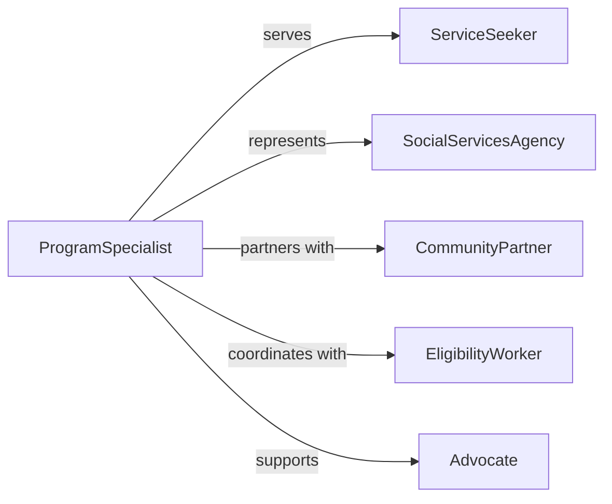

# Present Social Services Program Information

> Business-as-Code definition for public assistance program education and enrollment support. Models eligibility explanation, application assistance, and resource navigation for social services.

## Overview

Presenting social services program information to the public involves explaining eligibility requirements, describing available benefits, guiding application processes, connecting individuals to appropriate programs, and providing ongoing support for enrollment and participation. This definition exposes actions for program education and enrollment assistance, events for tracking public awareness and access, and searches for monitoring program utilization and barriers across government assistance, community support, and nonprofit service programs.

## Actors

| Actor | Description |
|-------|-------------|
| ServiceSeeker | Individual seeking social assistance |
| SocialServicesAgency | Government or nonprofit providing programs |
| CommunityPartner | Local organization facilitating access |
| EligibilityWorker | Staff determining program qualification |
| Funder | Entity providing resources for programs |
| Advocate | Representative supporting client rights |

## Roles

| Role | Description |
|------|-------------|
| ProgramSpecialist | Expert in specific service offerings |
| IntakeCoordinator | Manages initial client contact and assessment |
| EnrollmentNavigator | Guides clients through application process |
| OutreachWorker | Engages hard-to-reach populations |

## Entities

| Entity | Description |
|--------|-------------|
| ProgramDescription | Comprehensive information about service |
| EligibilityCriteria | Requirements for program participation |
| ApplicationForm | Document for requesting benefits |
| EnrollmentSession | Scheduled assistance appointment |
| ResourceDirectory | Catalog of available programs |
| AccessBarrier | Obstacle preventing program participation |

## Actions

| Action | Description |
|--------|-------------|
| explainProgram | Describe benefits and eligibility requirements |
| assessEligibility | Determine if individual qualifies for services |
| provideApplication | Distribute and explain required forms |
| assistWithEnrollment | Support client through application process |
| connectToResources | Link individual to appropriate programs |
| scheduleFollowup | Arrange ongoing support appointments |
| documentOutreach | Record information sharing and assistance provided |

## Events

| Event | Description |
|-------|-------------|
| programExplained | Service information has been delivered |
| eligibilityAssessed | Qualification status has been determined |
| applicationProvided | Required forms have been distributed |
| enrollmentAssisted | Client has received application support |
| resourcesConnected | Individual has been linked to programs |
| followupScheduled | Ongoing support has been arranged |
| outreachDocumented | Information sharing has been recorded |

## Searches

| Search | Description |
|--------|-------------|
| findPrograms | List available services by category or eligibility |
| getSessions | Retrieve scheduled enrollment assistance appointments |
| getBarriers | Identify obstacles preventing program access |
| getOutreach | Find documented information sharing activities |

## Workflow



## Actor Relationships



## Usage

### Calling Actions

```typescript
import { presentSocialServicesProgramInformation } from '@headlessly/present-social-services-program-information'

const socialServices = presentSocialServicesProgramInformation()

// Explain program to service seeker
await socialServices.explainProgram({
  programId: 'snap-benefits',
  audience: 'low-income-families',
  topics: ['eligibility', 'benefit-amounts', 'application-process', 'recertification'],
  deliveryMethod: 'in-person-presentation',
  languagePreference: 'spanish'
})

// Assess eligibility and provide application
const eligibility = await socialServices.assessEligibility({
  programId: 'snap-benefits',
  clientId: 'client-234',
  householdInfo: {
    size: 4,
    monthlyIncome: 2800,
    state: 'CA'
  }
})

if (eligibility.qualified) {
  await socialServices.provideApplication({
    programId: 'snap-benefits',
    clientId: 'client-234',
    format: 'digital',
    assistance: 'in-person'
  })

  await socialServices.assistWithEnrollment({
    programId: 'snap-benefits',
    clientId: 'client-234',
    support: ['form-completion', 'document-gathering', 'submission']
  })
}
```

### Event-Driven Automation

```typescript
// Auto-schedule follow-up when application is submitted
socialServices.enrollmentAssisted(async ({ clientId, programId }) => {
  await socialServices.scheduleFollowup({
    clientId,
    programId,
    followupDate: addDays(new Date(), 14),
    purpose: 'application-status-check'
  })
})

// Alert outreach team when barriers are identified
socialServices.eligibilityAssessed(async ({ clientId, qualified }) => {
  if (!qualified) {
    const alternatives = await socialServices.connectToResources({
      clientId,
      needsCategories: ['food-assistance', 'utility-support']
    })

    if (alternatives.length === 0) {
      await notify({
        to: 'outreach-team',
        message: `Client ${clientId} not eligible for requested program and no alternatives found`
      })
    }
  }
})
