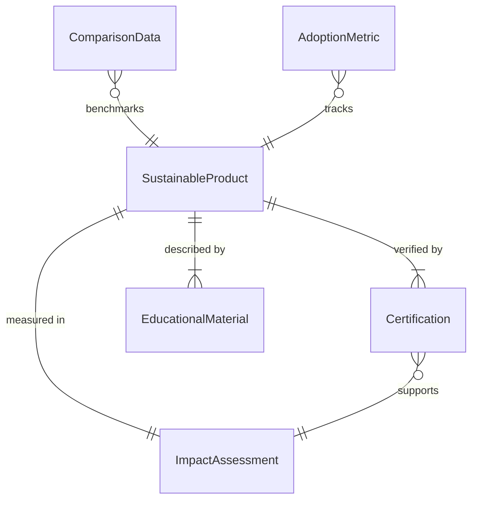
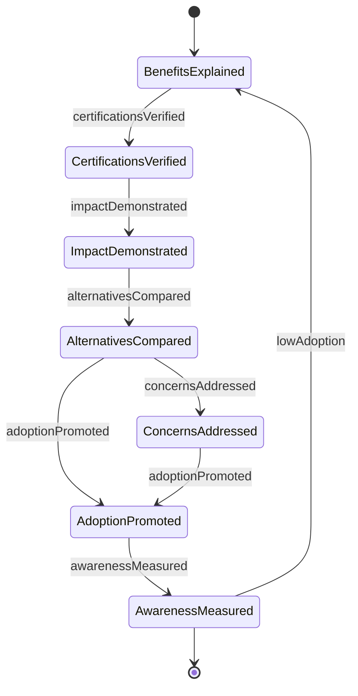
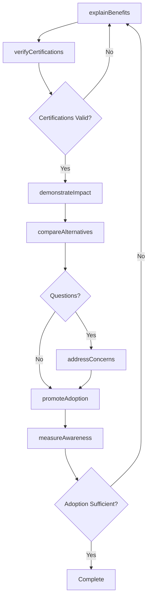
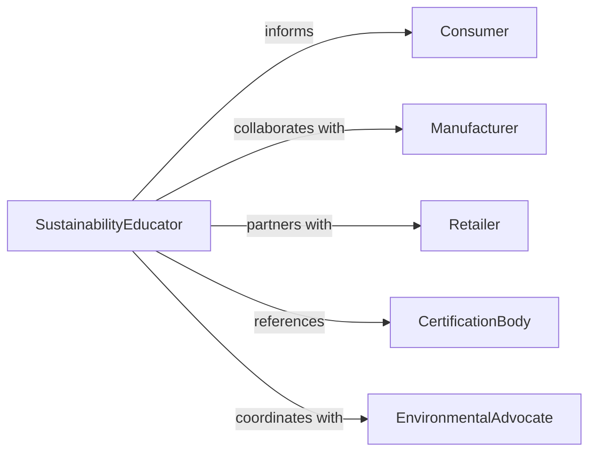

# Present Sustainable Products Services Information

> Business-as-Code definition for eco-friendly product education and promotion. Models sustainability messaging, certification communication, and environmental impact transparency.

## Overview

Presenting sustainable products or services information to the public involves communicating environmental benefits, explaining certifications and standards, demonstrating lifecycle impacts, addressing greenwashing concerns, and educating consumers on responsible purchasing decisions. This definition exposes actions for sustainability education and marketing, events for tracking consumer awareness and adoption, and searches for monitoring green product interest and market penetration across retail, manufacturing, energy, and service industries.

## Actors

| Actor | Description |
|-------|-------------|
| Consumer | Individual making purchasing decisions |
| Manufacturer | Producer of sustainable products |
| Retailer | Seller of eco-friendly goods and services |
| CertificationBody | Organization verifying sustainability claims |
| EnvironmentalAdvocate | Promotes responsible consumption |
| Regulator | Government authority enforcing environmental standards |

## Roles

| Role | Description |
|------|-------------|
| SustainabilityEducator | Informs public about environmental choices |
| ProductSpecialist | Explains features and benefits of green products |
| ImpactAnalyst | Quantifies environmental footprint |
| ConsumerAdvocate | Supports informed decision-making |

## Entities

| Entity | Description |
|--------|-------------|
| SustainableProduct | Eco-friendly good or service |
| Certification | Third-party verification of sustainability claims |
| ImpactAssessment | Analysis of environmental footprint |
| EducationalMaterial | Content explaining sustainability benefits |
| ComparisonData | Contrasts conventional and sustainable options |
| AdoptionMetric | Measurement of consumer uptake |

## Actions

| Action | Description |
|--------|-------------|
| explainBenefits | Communicate environmental advantages |
| verifyCertifications | Confirm authenticity of sustainability claims |
| demonstrateImpact | Show lifecycle environmental footprint |
| compareAlternatives | Contrast sustainable and conventional options |
| addressConcerns | Respond to greenwashing or cost questions |
| promoteAdoption | Encourage sustainable purchasing behavior |
| measureAwareness | Evaluate consumer knowledge and interest |

## Events

| Event | Description |
|-------|-------------|
| benefitsExplained | Environmental advantages have been communicated |
| certificationsVerified | Sustainability claims have been confirmed |
| impactDemonstrated | Lifecycle footprint has been shown |
| alternativesCompared | Sustainable and conventional options have been contrasted |
| concernsAddressed | Consumer questions have been answered |
| adoptionPromoted | Sustainable behavior has been encouraged |
| awarenessMeasured | Consumer knowledge has been evaluated |

## Searches

| Search | Description |
|--------|-------------|
| findProducts | List sustainable offerings by category or certification |
| getCertifications | Retrieve verified sustainability credentials |
| getImpacts | Access lifecycle environmental footprint data |
| getAdoption | Monitor consumer uptake rates |

## Entity Relationships



## State Diagram



## Workflow



## Actor Relationships



## Usage

### Calling Actions

```typescript
import { presentSustainableProductsServicesInformation } from '@headlessly/present-sustainable-products-services-information'

const greenMarketing = presentSustainableProductsServicesInformation()

// Explain sustainable product benefits
await greenMarketing.explainBenefits({
  productId: 'solar-panel-system',
  benefits: [
    'reduces-carbon-emissions',
    'lowers-energy-costs',
    'increases-property-value',
    'supports-grid-independence'
  ],
  audience: 'homeowners',
  deliveryChannels: ['website', 'showroom', 'webinar']
})

// Verify certifications and demonstrate impact
const certifications = await greenMarketing.verifyCertifications({
  productId: 'solar-panel-system',
  certifications: ['Energy-Star', 'NABCEP', 'ISO-14001']
})

const impact = await greenMarketing.demonstrateImpact({
  productId: 'solar-panel-system',
  metrics: {
    carbonOffset: '6-tons-per-year',
    energyGeneration: '8000-kWh-per-year',
    paybackPeriod: '7-years',
    lifespan: '25-years'
  }
})

// Compare to conventional alternative
await greenMarketing.compareAlternatives({
  sustainableOption: 'solar-panel-system',
  conventionalOption: 'grid-electricity',
  comparisonMetrics: ['cost', 'emissions', 'reliability', 'maintenance']
})
```

### Event-Driven Automation

```typescript
// Auto-address common concerns about cost
greenMarketing.concernsAddressed(async ({ productId, concern }) => {
  if (concern.topic === 'upfront-cost') {
    await provideIncentiveInfo({
      productId,
      incentives: ['federal-tax-credit', 'state-rebate', 'financing-options']
    })
  }
})

// Track adoption trends and adjust messaging
greenMarketing.awarenessMeasured(async ({ productCategory, metrics }) => {
  if (metrics.awareness > 0.7 && metrics.adoption < 0.2) {
    await notify({
      to: 'marketing-team',
      message: `High awareness but low adoption for ${productCategory} - consider addressing barriers`
    })
  }
})
```
