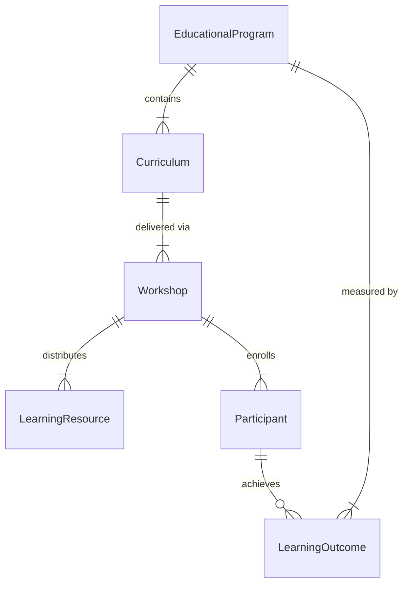
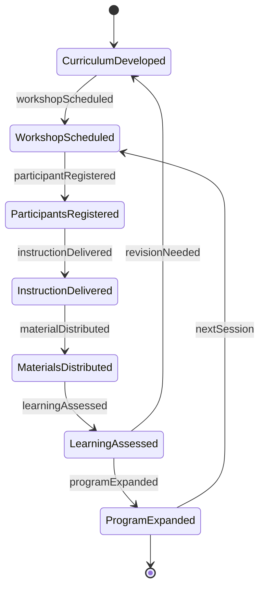
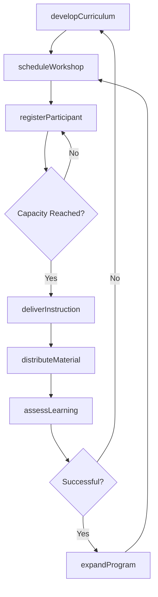
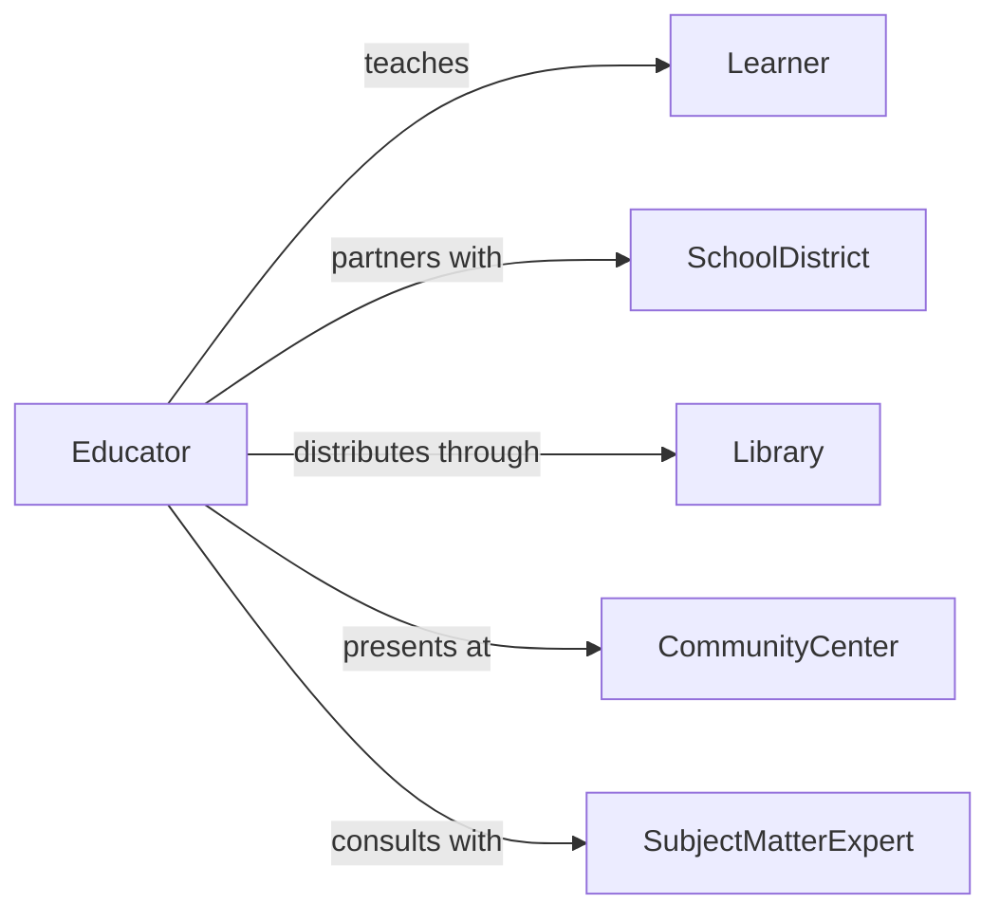

# Provide Educational Information Public

> Business-as-Code definition for public education outreach. Models the development and distribution of instructional materials, workshops, and learning resources designed to inform and educate community members.

## Overview

Providing educational information to the public involves creating learning materials, conducting workshops, and maintaining educational resources accessible to community members. This definition exposes actions for developing curriculum, delivering instruction, distributing materials, and measuring learning outcomes.

## Actors

| Actor | Description |
|-------|-------------|
| Learner | Community member seeking educational information |
| SchoolDistrict | Educational institution partnering on outreach |
| Library | Community resource center distributing materials |
| CommunityCenter | Facility hosting educational programs |
| SubjectMatterExpert | Specialist contributing to curriculum development |
| GrantingAgency | Funder supporting educational initiatives |

## Roles

| Role | Description |
|------|-------------|
| Educator | Delivers instructional content to public |
| CurriculumDeveloper | Creates educational materials and programs |
| OutreachCoordinator | Manages community education initiatives |
| WorkshopFacilitator | Leads hands-on learning sessions |

## Entities

| Entity | Description |
|--------|-------------|
| EducationalProgram | Structured learning initiative for public |
| Curriculum | Organized instructional content and materials |
| Workshop | Interactive learning session |
| LearningResource | Educational material or reference guide |
| Participant | Individual engaged in educational program |
| LearningOutcome | Measurable result of educational activity |

## Actions

| Action | Description |
|--------|-------------|
| developCurriculum | Create structured educational content |
| scheduleWorkshop | Plan interactive learning session |
| deliverInstruction | Teach educational content to public |
| distributeMaterial | Provide learning resources to community |
| registerParticipant | Enroll individual in educational program |
| assessLearning | Measure educational outcomes |
| expandProgram | Scale successful educational initiatives |

## Events

| Event | Description |
|-------|-------------|
| curriculumDeveloped | Educational content has been created |
| workshopScheduled | Learning session has been planned |
| instructionDelivered | Educational content has been taught |
| materialDistributed | Learning resources have been provided |
| participantRegistered | Individual has been enrolled in program |
| learningAssessed | Educational outcomes have been measured |
| programExpanded | Initiative has been scaled |

## Searches

| Search | Description |
|--------|-------------|
| findPrograms | Retrieve educational initiatives by topic or audience |
| getWorkshops | List learning sessions by date, location, or subject |
| getMaterials | Find educational resources by format or category |
| getParticipants | Retrieve enrollees by program or demographics |

## Entity Relationships



## State Diagram



## Workflow



## Actor Relationships



## Usage

### Calling Actions

```typescript
import { provideEducationalInformationPublic } from '@headlessly/provide-educational-information-public'

const education = provideEducationalInformationPublic()

// Develop an educational curriculum
const curriculum = await education.developCurriculum({
  topic: 'Financial Literacy for Seniors',
  targetAudience: 'adults_65_plus',
  modules: [
    'Budget Basics',
    'Avoiding Scams',
    'Investment Fundamentals'
  ],
  format: 'workshop_series'
})

// Schedule a workshop
const workshop = await education.scheduleWorkshop({
  curriculumId: curriculum.id,
  date: '2026-04-10',
  location: 'Community Center',
  capacity: 30,
  duration: 120
})

// Register participants
await education.registerParticipant({
  workshopId: workshop.id,
  participantName: 'Jane Smith',
  contact: 'jane@email.com',
  demographics: { age: 68, zip: '12345' }
})
```

### Event-Driven Automation

```typescript
// Auto-distribute materials after instruction
education.instructionDelivered(async ({ workshopId, participants }) => {
  await education.distributeMaterial({
    workshopId,
    recipients: participants,
    materials: ['workbook', 'reference_guide', 'resource_list']
  })
})

// Expand successful programs
education.learningAssessed(async ({ programId, outcomes }) => {
  const avgScore = outcomes.reduce((sum, o) => sum + o.score, 0) / outcomes.length
  if (avgScore > 85 && outcomes.length > 25) {
    await education.expandProgram({
      programId,
      expansion: ['additional_locations', 'online_version']
    })
  }
})
```
