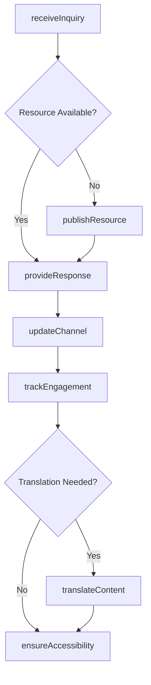
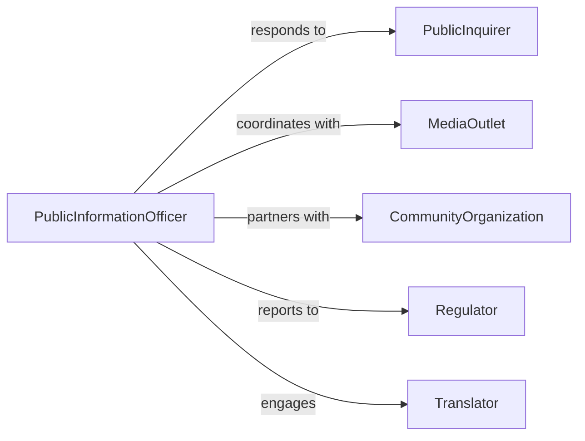

# Provide Information General Public

> Business-as-Code definition for public information dissemination. Models the processes of answering inquiries, distributing resources, and maintaining accessible information channels for community members.

## Overview

Providing information to the general public involves responding to inquiries, distributing educational materials, and maintaining information channels accessible to community members. This definition exposes actions for handling requests, publishing content, managing channels, and tracking engagement.

## Actors

| Actor | Description |
|-------|-------------|
| PublicInquirer | Individual seeking information or assistance |
| MediaOutlet | Organization requesting official information |
| CommunityOrganization | Group seeking partnership or resources |
| Regulator | Government entity requiring public disclosures |
| Translator | Provides language accessibility services |
| AccessibilityProvider | Ensures information reaches disabled community members |

## Roles

| Role | Description |
|------|-------------|
| PublicInformationOfficer | Manages official communication channels |
| CustomerServiceRep | Responds to individual inquiries |
| ContentPublisher | Distributes educational materials |
| CommunicationsCoordinator | Oversees multi-channel information delivery |

## Entities

| Entity | Description |
|--------|-------------|
| Inquiry | Request for information from public member |
| Resource | Educational material or reference document |
| Channel | Communication medium for public outreach |
| Response | Information provided to inquirer |
| Publication | Formally released public information |
| EngagementMetric | Measurement of public information consumption |

## Actions

| Action | Description |
|--------|-------------|
| receiveInquiry | Accept request for information |
| provideResponse | Deliver information to inquirer |
| publishResource | Release educational material publicly |
| updateChannel | Refresh information on communication medium |
| trackEngagement | Monitor public information consumption |
| translateContent | Provide information in multiple languages |
| ensureAccessibility | Make information available to all community members |

## Events

| Event | Description |
|-------|-------------|
| inquiryReceived | Request for information has been logged |
| responseProvided | Information has been delivered to inquirer |
| resourcePublished | Educational material has been released |
| channelUpdated | Communication medium has been refreshed |
| engagementTracked | Public consumption has been measured |
| contentTranslated | Information has been provided in additional language |
| accessibilityEnsured | Information has been made universally available |

## Searches

| Search | Description |
|--------|-------------|
| findInquiries | Retrieve requests by topic, status, or date |
| getResources | List educational materials by category or format |
| getChannels | Find communication media by type or audience |
| getEngagementMetrics | Retrieve consumption data by period or channel |

## Workflow



## Actor Relationships



## Usage

### Calling Actions

```typescript
import { provideInformationGeneralPublic } from '@headlessly/provide-information-general-public'

const publicInfo = provideInformationGeneralPublic()

// Receive and respond to a public inquiry
const inquiry = await publicInfo.receiveInquiry({
  channel: 'email',
  topic: 'hours_of_operation',
  inquirerId: 'pub_789'
})

await publicInfo.provideResponse({
  inquiryId: inquiry.id,
  response: 'Our offices are open Monday-Friday, 9 AM to 5 PM',
  format: 'email',
  attachments: ['hours_schedule.pdf']
})

// Publish a new resource
await publicInfo.publishResource({
  title: 'Community Services Guide 2026',
  category: 'services',
  format: 'pdf',
  channels: ['website', 'social_media', 'email_newsletter']
})
```

### Event-Driven Automation

```typescript
// Auto-track engagement when responses are provided
publicInfo.responseProvided(async ({ inquiryId, topic, channel }) => {
  await publicInfo.trackEngagement({
    topic,
    channel,
    interactionType: 'inquiry_response',
    timestamp: new Date()
  })
})

// Auto-translate high-demand resources
publicInfo.resourcePublished(async ({ resourceId, category }) => {
  const highDemand = ['services', 'emergency', 'health']
  if (highDemand.includes(category)) {
    await publicInfo.translateContent({
      resourceId,
      languages: ['spanish', 'mandarin', 'vietnamese']
    })
  }
})
```
