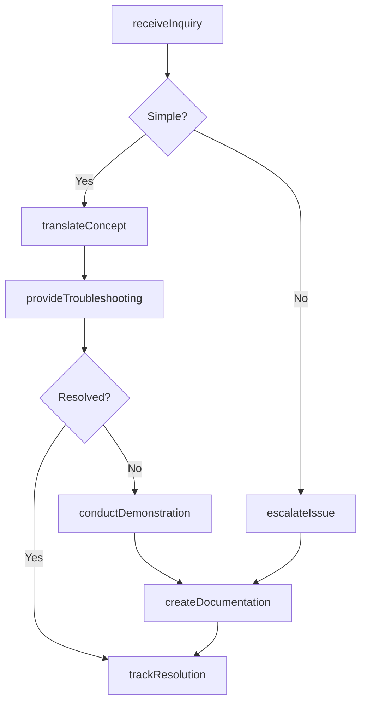
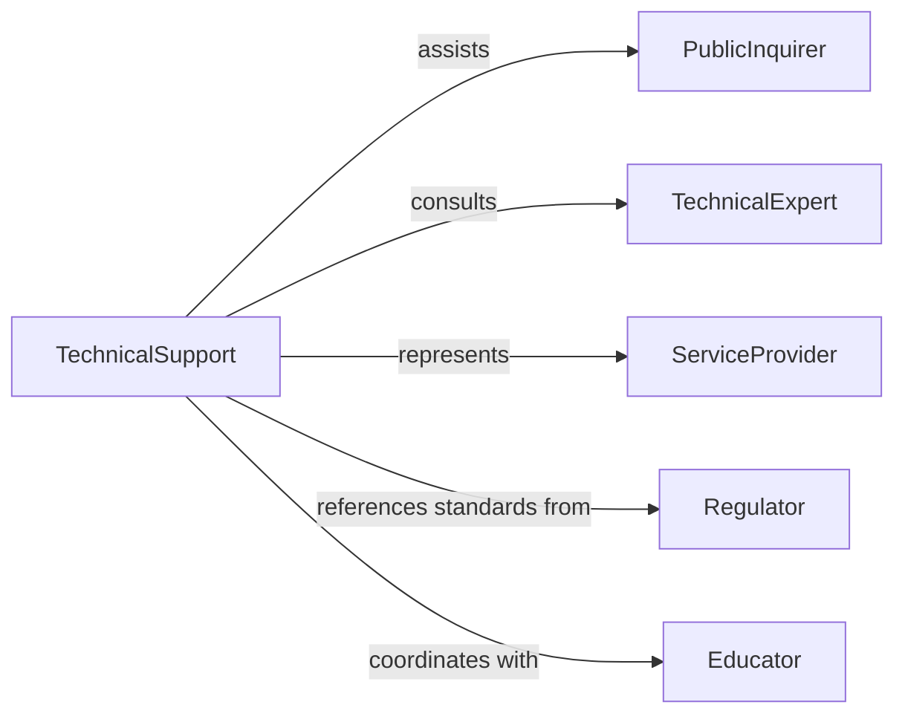

# Provide Technical Information Assistance Public

> Business-as-Code definition for expert public support and technical education. Models complex information translation, troubleshooting guidance, and accessible expertise delivery.

## Overview

Providing technical information or assistance to the public involves translating complex concepts into accessible language, offering troubleshooting guidance, responding to technical inquiries, conducting demonstrations, and maintaining helpdesks or support centers. This definition exposes actions for technical communication and assistance, events for tracking public inquiries and resolution, and searches for monitoring common issues and knowledge gaps across government agencies, utilities, technology companies, and professional services.

## Actors

| Actor | Description |
|-------|-------------|
| PublicInquirer | Individual seeking technical assistance |
| TechnicalExpert | Subject matter specialist providing information |
| ServiceProvider | Organization delivering technical solutions |
| Regulator | Authority establishing technical standards |
| Educator | Instructor offering technical training |
| SupportVendor | Third-party assistance provider |

## Roles

| Role | Description |
|------|-------------|
| TechnicalSupport | Resolves specific technical problems |
| InformationSpecialist | Explains complex technical topics |
| HelpDeskAgent | Triages and routes technical inquiries |
| TrainingCoordinator | Conducts technical education sessions |

## Entities

| Entity | Description |
|--------|-------------|
| TechnicalInquiry | Public request for specialized information |
| SupportTicket | Tracked assistance request |
| KnowledgeArticle | Documented technical guidance |
| Demonstration | Live or recorded technical walkthrough |
| Troubleshooting | Systematic problem-solving guidance |
| TechnicalSpecification | Detailed product or system information |

## Actions

| Action | Description |
|--------|-------------|
| receiveInquiry | Accept technical question from public |
| translateConcept | Explain complex topic in accessible terms |
| provideTroubleshooting | Offer systematic problem-solving guidance |
| conductDemonstration | Show technical process or feature |
| createDocumentation | Develop reference materials |
| escalateIssue | Route complex questions to specialists |
| trackResolution | Monitor inquiry outcome and satisfaction |

## Events

| Event | Description |
|-------|-------------|
| inquiryReceived | Technical question has been submitted |
| conceptTranslated | Complex topic has been explained |
| troubleshootingProvided | Problem-solving guidance has been delivered |
| demonstrationConducted | Technical walkthrough has been shown |
| documentationCreated | Reference material has been developed |
| issueEscalated | Complex question has been routed to specialist |
| resolutionTracked | Inquiry outcome has been monitored |

## Searches

| Search | Description |
|--------|-------------|
| findInquiries | List technical questions by topic or status |
| getArticles | Retrieve knowledge base content |
| getDemonstrations | Access recorded technical walkthroughs |
| getCommonIssues | Identify frequently asked questions |

## Workflow



## Actor Relationships



## Usage

### Calling Actions

```typescript
import { provideTechnicalInformationAssistancePublic } from '@headlessly/provide-technical-information-assistance-public'

const techSupport = provideTechnicalInformationAssistancePublic()

// Receive and process technical inquiry
const inquiry = await techSupport.receiveInquiry({
  topic: 'solar-inverter-error-code',
  urgency: 'high',
  inquirerType: 'homeowner',
  contactMethod: 'phone',
  preferredLanguage: 'english'
})

// Translate technical concept
await techSupport.translateConcept({
  inquiryId: inquiry.id,
  technicalTerm: 'grid-synchronization-fault',
  laymanExplanation: 'Your solar system cannot safely connect to the power grid due to voltage mismatch',
  analogies: ['like-plugs-not-matching']
})

// Provide troubleshooting guidance
const troubleshooting = await techSupport.provideTroubleshooting({
  inquiryId: inquiry.id,
  steps: [
    'Check circuit breaker is on',
    'Verify grid power is stable',
    'Reset inverter using shutdown procedure',
    'Monitor for 15 minutes'
  ],
  expectedOutcome: 'inverter-reconnects-automatically',
  escalationCriteria: 'error-persists-after-reset'
})

// Conduct demonstration if needed
if (!troubleshooting.resolved) {
  await techSupport.conductDemonstration({
    inquiryId: inquiry.id,
    format: 'video-call',
    topics: ['inverter-reset-procedure', 'status-indicator-interpretation']
  })
}
```

### Event-Driven Automation

```typescript
// Auto-escalate complex or unresolved issues
techSupport.troubleshootingProvided(async ({ inquiryId, resolved }) => {
  if (!resolved) {
    const inquiry = await techSupport.findInquiries({ id: inquiryId })
    if (inquiry.complexity === 'high') {
      await techSupport.escalateIssue({
        inquiryId,
        specialist: 'senior-technical-engineer',
        priority: 'urgent'
      })
    }
  }
})

// Create documentation for common issues
techSupport.resolutionTracked(async ({ inquiryId, topic }) => {
  const commonIssues = await techSupport.getCommonIssues({ topic })
  if (commonIssues.frequency > 10) {
    await techSupport.createDocumentation({
      topic,
      format: 'FAQ',
      content: commonIssues.resolutionSteps
    })
  }
})
