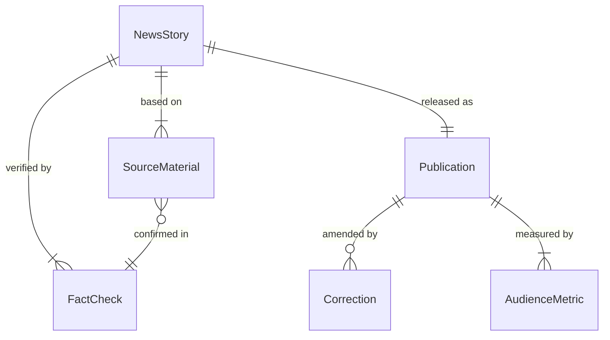
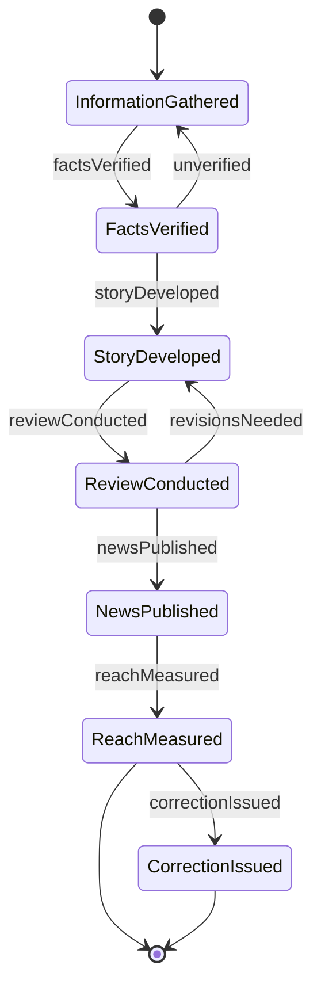
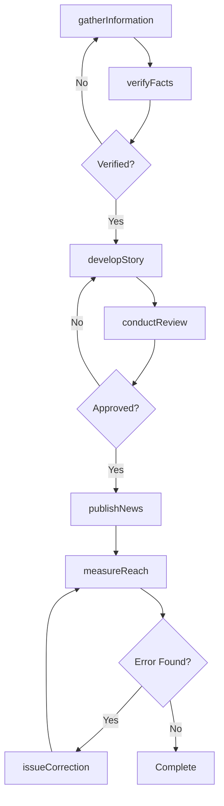
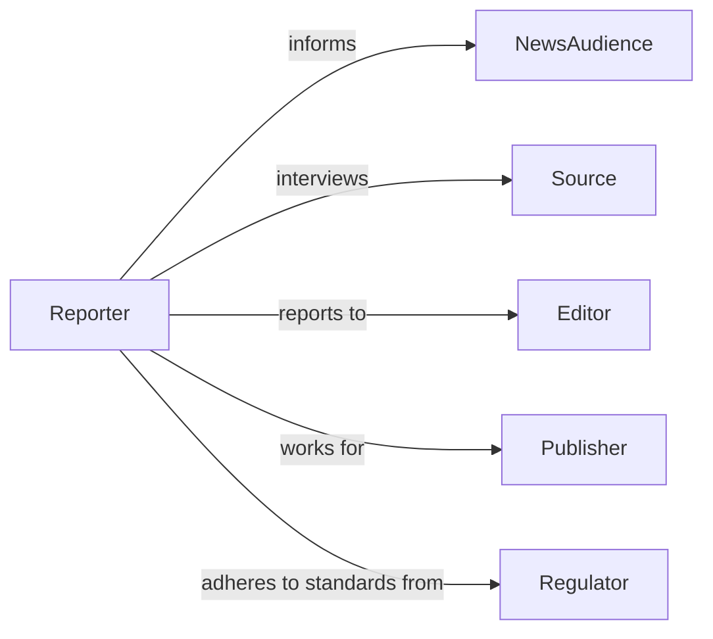

# Report News Public

> Business-as-Code definition for journalism and news dissemination. Models story development, fact verification, editorial oversight, and multichannel news distribution.

## Overview

Reporting news to the public involves gathering information, verifying facts, developing stories, conducting editorial review, publishing across multiple channels, and correcting errors when identified. This definition exposes actions for the complete news reporting lifecycle, events for tracking story development and publication, and searches for monitoring coverage topics and audience engagement across print, broadcast, digital, and social media news organizations.

## Actors

| Actor | Description |
|-------|-------------|
| NewsAudience | Public consuming news content |
| Source | Individual providing information for stories |
| Editor | Oversees story development and publication |
| Publisher | Organization distributing news content |
| Advertiser | Provides revenue supporting news operations |
| Regulator | Authority enforcing journalistic standards |

## Roles

| Role | Description |
|------|-------------|
| Reporter | Gathers and writes news stories |
| FactChecker | Verifies accuracy of information |
| Photographer | Captures visual content for stories |
| Anchor | Presents news in broadcast format |

## Entities

| Entity | Description |
|--------|-------------|
| NewsStory | Reported account of events |
| SourceMaterial | Information gathered from interviews and documents |
| FactCheck | Verification of story claims |
| Publication | Completed news article or segment |
| Correction | Amendment to previously published information |
| AudienceMetric | Measurement of story reach and engagement |

## Actions

| Action | Description |
|--------|-------------|
| gatherInformation | Collect facts and source materials |
| verifyFacts | Confirm accuracy of reported information |
| developStory | Write and structure news content |
| conductReview | Editorial evaluation of story quality and accuracy |
| publishNews | Distribute story through media channels |
| measureReach | Evaluate audience size and engagement |
| issueCorrection | Publish amendment to inaccurate information |

## Events

| Event | Description |
|-------|-------------|
| informationGathered | Facts and source materials have been collected |
| factsVerified | Accuracy of information has been confirmed |
| storyDeveloped | News content has been written |
| reviewConducted | Editorial evaluation has been completed |
| newsPublished | Story has been distributed to public |
| reachMeasured | Audience engagement has been evaluated |
| correctionIssued | Amendment has been published |

## Searches

| Search | Description |
|--------|-------------|
| findStories | List news content by topic, date, or reporter |
| getSources | Retrieve source materials for verification |
| getMetrics | Access audience reach and engagement data |
| getCorrections | Find amendments to published stories |

## Entity Relationships



## State Diagram



## Workflow



## Actor Relationships



## Usage

### Calling Actions

```typescript
import { reportNewsPublic } from '@headlessly/report-news-public'

const newsroom = reportNewsPublic()

// Gather information for breaking news story
const sources = await newsroom.gatherInformation({
  topic: 'city-council-budget-vote',
  methods: ['interviews', 'documents', 'public-records'],
  sources: [
    { type: 'official', name: 'Council Member Smith' },
    { type: 'expert', name: 'Budget Analyst Johnson' },
    { type: 'document', name: 'Proposed Budget FY2026' }
  ]
})

// Verify facts before publication
const verification = await newsroom.verifyFacts({
  storyId: 'budget-vote-2026',
  claims: [
    'Budget increased by 12%',
    'Vote passed 7-2',
    'New spending on infrastructure'
  ],
  verificationMethods: ['official-records', 'multiple-sources', 'document-review']
})

// Develop and publish story
const story = await newsroom.developStory({
  storyId: 'budget-vote-2026',
  headline: 'City Council Approves 12% Budget Increase',
  content: verifiedContent,
  byline: 'Reporter Jane Doe',
  multimedia: ['council-photo', 'budget-infographic']
})

await newsroom.conductReview({
  storyId: story.id,
  editorId: 'editor-789',
  reviewCriteria: ['accuracy', 'balance', 'clarity', 'legal-compliance']
})

await newsroom.publishNews({
  storyId: story.id,
  channels: ['website', 'mobile-app', 'social-media'],
  publishTime: 'immediate'
})
```

### Event-Driven Automation

```typescript
// Auto-measure reach after publication
newsroom.newsPublished(async ({ storyId }) => {
  setTimeout(async () => {
    await newsroom.measureReach({
      storyId,
      metrics: ['pageviews', 'time-on-page', 'social-shares', 'comments']
    })
  }, 3600000) // 1 hour
})

// Alert editors when corrections are needed
newsroom.factsVerified(async ({ storyId, claims }) => {
  const unverified = claims.filter(c => !c.verified)
  if (unverified.length > 0) {
    await notify({
      to: 'editor',
      message: `Story ${storyId} has ${unverified.length} unverified claims requiring review`,
      priority: 'high'
    })
  }
})
