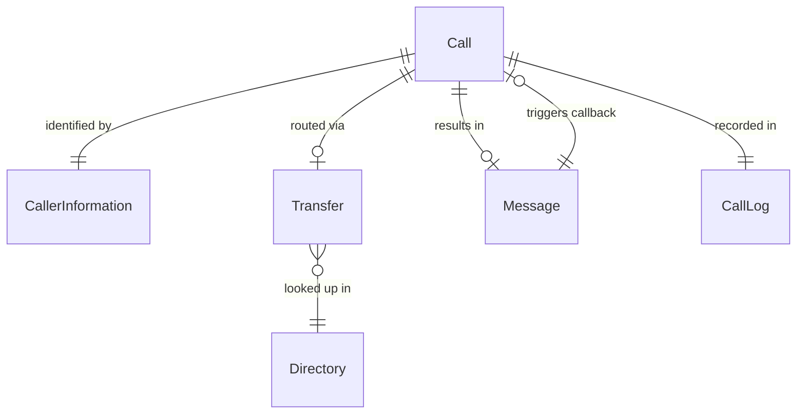
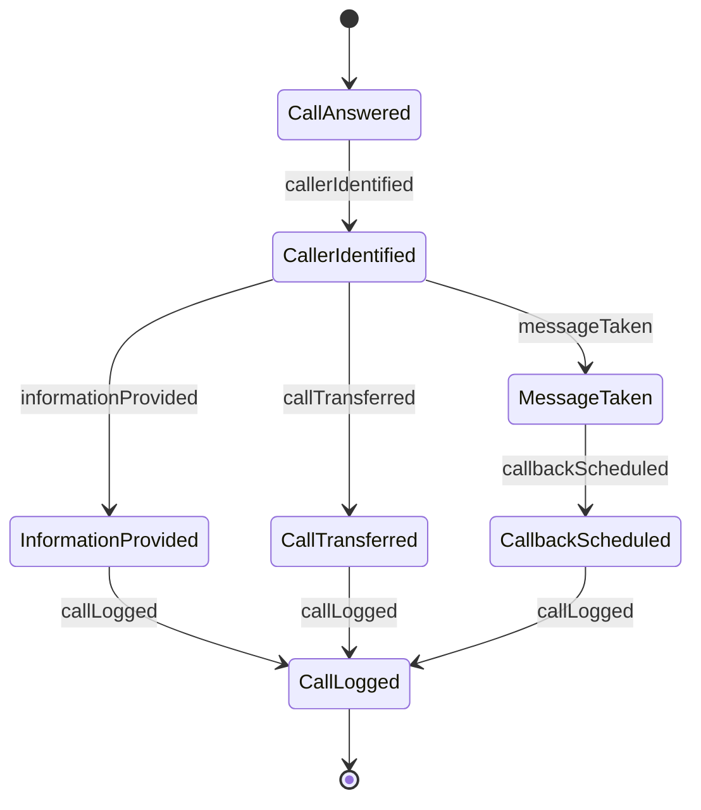
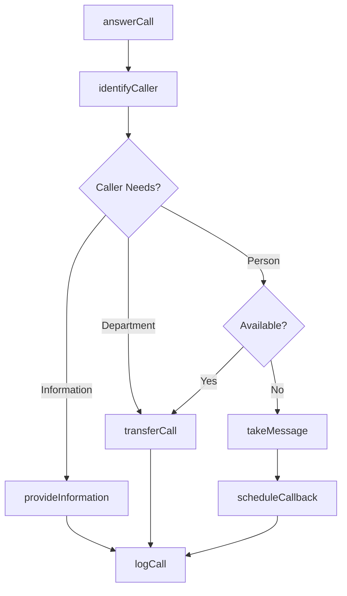
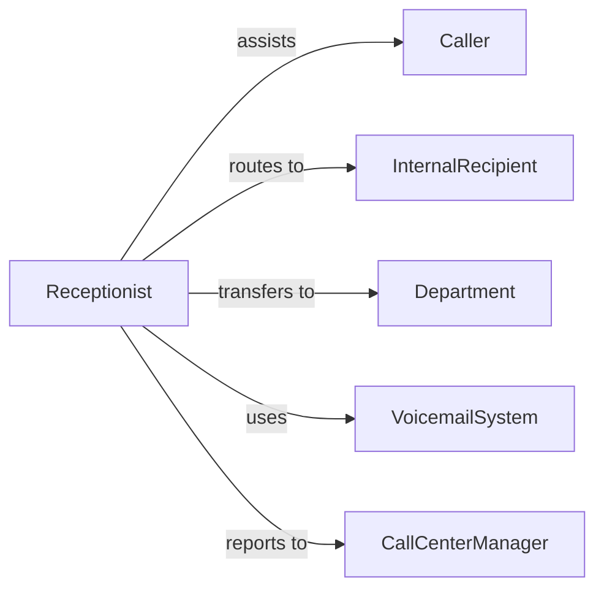

# Answer Telephones Direct Calls Provide

> Business-as-Code definition for telephone reception and call management. Models answering, screening, routing, and information delivery through phone systems.

## Overview

Answering telephones involves receiving incoming calls, identifying caller needs, directing calls to appropriate parties, and providing information over the phone. This definition exposes actions for call handling, routing, message taking, and call tracking.

## Actors

| Actor | Description |
|-------|-------------|
| Caller | Individual or organization making phone contact |
| InternalRecipient | Staff member being sought by caller |
| Department | Business unit handling specific call types |
| VoicemailSystem | Automated message recording service |
| PhoneCarrier | Telecommunications service provider |
| CallCenterManager | Oversees phone operations and quality |

## Roles

| Role | Description |
|------|-------------|
| Receptionist | Answers and routes incoming calls |
| Operator | Manages switchboard and call transfers |
| CallAgent | Handles specific types of phone inquiries |
| PhoneCoordinator | Oversees phone system operations |

## Entities

| Entity | Description |
|--------|-------------|
| Call | Incoming telephone contact event |
| CallerInformation | Details about individual making contact |
| Message | Communication left for unavailable recipient |
| Transfer | Routing of call to another party |
| CallLog | Record of telephone activity |
| Directory | List of internal extensions and departments |

## Actions

| Action | Description |
|--------|-------------|
| answerCall | Receive incoming telephone contact |
| identifyCaller | Determine who is calling and their needs |
| provideInformation | Deliver information directly to caller |
| transferCall | Route to appropriate recipient or department |
| takeMessage | Record communication for unavailable party |
| scheduleCallback | Arrange return phone contact |
| logCall | Record telephone activity details |

## Events

| Event | Description |
|-------|-------------|
| callAnswered | Incoming contact has been received |
| callerIdentified | Caller information has been determined |
| informationProvided | Information has been delivered to caller |
| callTransferred | Contact has been routed to recipient |
| messageTaken | Communication has been recorded |
| callbackScheduled | Return contact has been arranged |
| callLogged | Telephone activity has been documented |

## Searches

| Search | Description |
|--------|-------------|
| findCalls | Retrieve call records by date, caller, or type |
| getMessages | List messages by recipient or priority |
| getTransfers | Find call routing by department or recipient |
| getCallLogs | Retrieve telephone activity by period or agent |

## Entity Relationships



## State Diagram



## Workflow



## Actor Relationships



## Usage

### Calling Actions

```typescript
import { answerTelephonesDirectCallsProvide } from '@headlessly/answer-telephones-direct-calls-provide'

const phoneSystem = answerTelephonesDirectCallsProvide()

// Answer an incoming call
const call = await phoneSystem.answerCall({
  phoneNumber: '+1-555-123-4567',
  timestamp: new Date(),
  line: 'main_reception'
})

// Identify the caller
const caller = await phoneSystem.identifyCaller({
  callId: call.id,
  callerName: 'Sarah Johnson',
  organization: 'Acme Corp',
  purpose: 'speak_with_sales'
})

// Transfer the call
await phoneSystem.transferCall({
  callId: call.id,
  transferTo: 'sales_department',
  extension: '205',
  notes: 'Interested in Widget Pro pricing'
})
```

### Event-Driven Automation

```typescript
// Auto-log all answered calls
phoneSystem.callAnswered(async ({ callId, phoneNumber, timestamp }) => {
  await phoneSystem.logCall({
    callId,
    phoneNumber,
    timestamp,
    status: 'answered'
  })
})

// Schedule callbacks for missed transfers
phoneSystem.callTransferred(async ({ callId, transferTo, outcome }) => {
  if (outcome === 'no_answer') {
    await phoneSystem.takeMessage({
      callId,
      recipient: transferTo,
      urgency: 'normal'
    })
    await phoneSystem.scheduleCallback({
      callId,
      scheduledTime: addHours(new Date(), 2)
    })
  }
})
```
