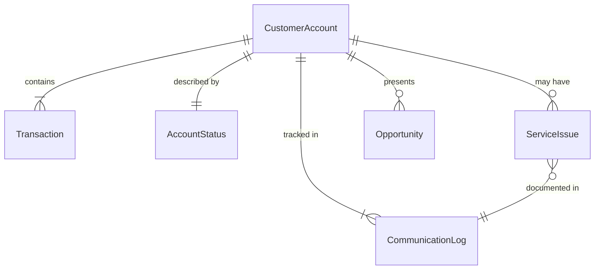
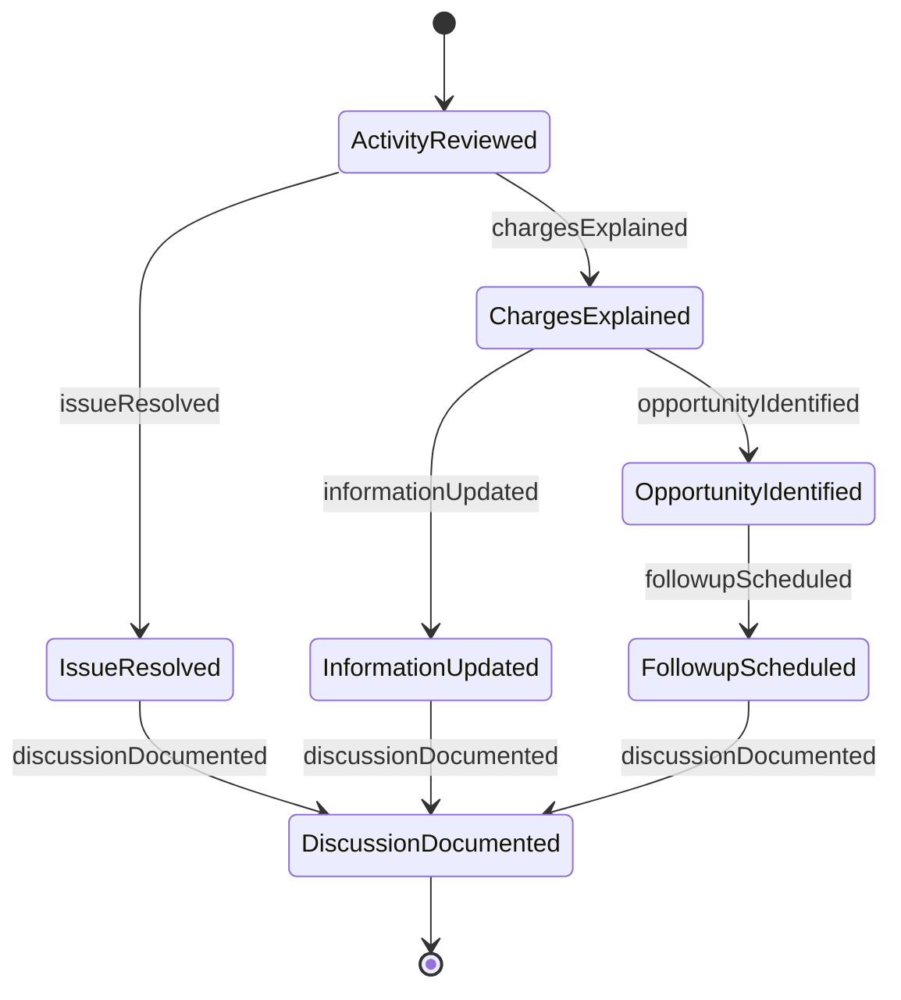
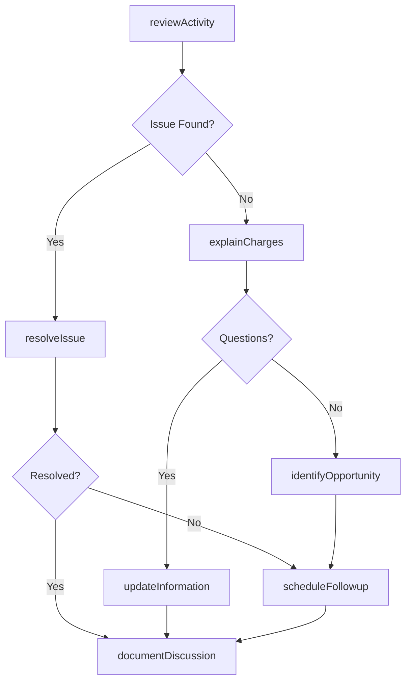
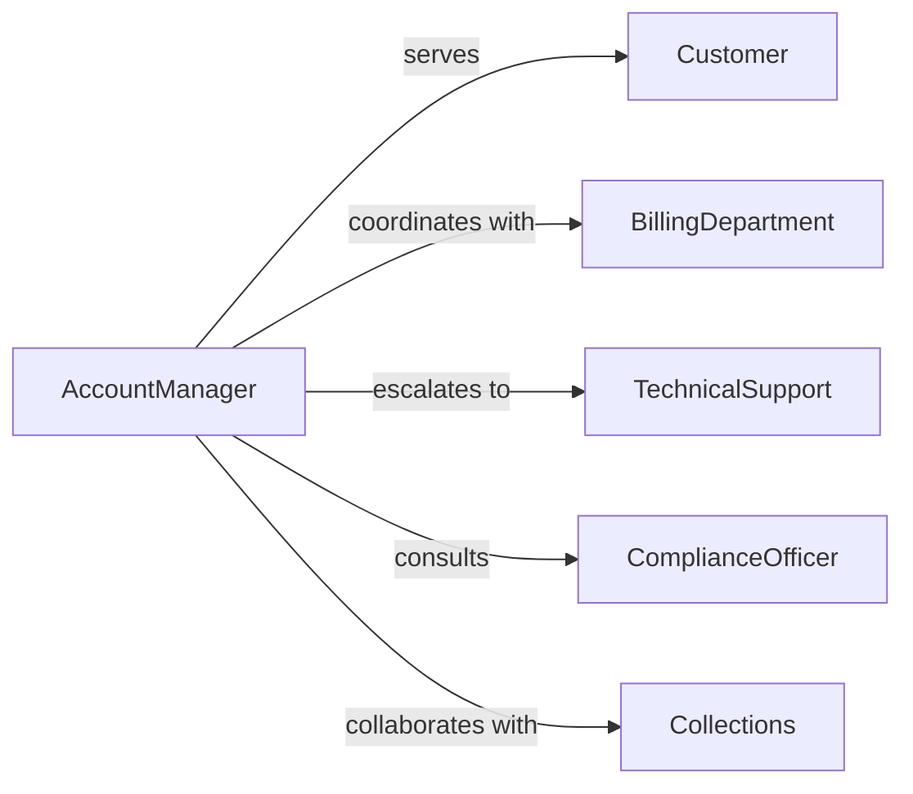

# Discuss Account Status Activity Customers

> Business-as-Code definition for customer account management and relationship communication. Models account review, transaction discussion, issue resolution, and proactive outreach workflows.

## Overview

Discussing account status or activity with customers involves reviewing transaction history, explaining account features, addressing billing questions, identifying opportunities for service improvements, and maintaining regular communication about account health. This definition exposes actions for account discussion and management, events for tracking customer interactions and satisfaction, and searches for monitoring account status and engagement patterns across banking, financial services, telecommunications, utilities, and subscription-based businesses.

## Actors

| Actor | Description |
|-------|-------------|
| Customer | Individual or organization holding account |
| AccountManager | Primary relationship contact for customer |
| BillingDepartment | Processes payments and invoices |
| TechnicalSupport | Resolves service or product issues |
| ComplianceOfficer | Ensures regulatory adherence |
| Collections | Manages overdue accounts |

## Roles

| Role | Description |
|------|-------------|
| CustomerServiceRepresentative | Handles account inquiries and support |
| RelationshipManager | Maintains strategic customer partnerships |
| AccountAnalyst | Reviews account activity and trends |
| RetentionSpecialist | Addresses customer concerns to prevent churn |

## Entities

| Entity | Description |
|--------|-------------|
| CustomerAccount | Record of customer relationship and transactions |
| Transaction | Individual account activity entry |
| AccountStatus | Current standing and health indicators |
| ServiceIssue | Problem or concern requiring resolution |
| Opportunity | Potential for service enhancement or upsell |
| CommunicationLog | Record of customer interactions |

## Actions

| Action | Description |
|--------|-------------|
| reviewActivity | Examine recent account transactions and usage |
| explainCharges | Clarify billing items and account fees |
| resolveIssue | Address customer concerns or problems |
| identifyOpportunity | Recognize potential for service improvements |
| updateInformation | Modify account details or preferences |
| scheduleFollowup | Arrange future communication |
| documentDiscussion | Record customer interaction details |

## Events

| Event | Description |
|-------|-------------|
| activityReviewed | Account transactions have been examined |
| chargesExplained | Billing items have been clarified |
| issueResolved | Customer concern has been addressed |
| opportunityIdentified | Service improvement potential has been recognized |
| informationUpdated | Account details have been modified |
| followupScheduled | Future communication has been arranged |
| discussionDocumented | Customer interaction has been recorded |

## Searches

| Search | Description |
|--------|-------------|
| findAccounts | List customer accounts by status or activity |
| getTransactions | Retrieve account activity by date or type |
| getIssues | Find open or resolved customer concerns |
| getOpportunities | Access service enhancement recommendations |

## Entity Relationships



## State Diagram



## Workflow



## Actor Relationships



## Usage

### Calling Actions

```typescript
import { discussAccountStatusActivityCustomers } from '@headlessly/discuss-account-status-activity-customers'

const accountService = discussAccountStatusActivityCustomers()

// Review recent account activity with customer
const activity = await accountService.reviewActivity({
  accountId: 'account-456',
  period: 'last-30-days',
  includeTransactions: true,
  includeBilling: true
})

// Explain specific charges
await accountService.explainCharges({
  accountId: 'account-456',
  transactionIds: ['txn-123', 'txn-124'],
  explanationDetails: [
    'Monthly service fee per plan terms',
    'Overage charges for exceeding data limit'
  ]
})

// Identify opportunity for plan upgrade
const opportunity = await accountService.identifyOpportunity({
  accountId: 'account-456',
  opportunityType: 'plan-upgrade',
  reasoning: 'Customer consistently exceeding current plan limits',
  estimatedBenefit: { costSavings: 25, improvedService: true }
})

// Document the discussion
await accountService.documentDiscussion({
  accountId: 'account-456',
  discussionDate: new Date(),
  topics: ['billing-inquiry', 'service-optimization'],
  outcome: 'customer-satisfied',
  nextSteps: ['schedule-follow-up-next-month']
})
```

### Event-Driven Automation

```typescript
// Auto-schedule follow-up for high-value accounts
accountService.discussionDocumented(async ({ accountId, topics }) => {
  const account = await accountService.findAccounts({ id: accountId })
  if (account.tier === 'premium') {
    await accountService.scheduleFollowup({
      accountId,
      followupDate: addDays(new Date(), 30),
      purpose: 'regular-account-review'
    })
  }
})

// Alert retention team when issues are unresolved
accountService.issueResolved(async ({ accountId, resolved }) => {
  if (!resolved) {
    const issues = await accountService.getIssues({ accountId, status: 'open' })
    if (issues.length > 2) {
      await notify({
        to: 'retention-specialist',
        message: `Account ${accountId} has ${issues.length} unresolved issues - churn risk`,
        priority: 'high'
      })
    }
  }
})
```
