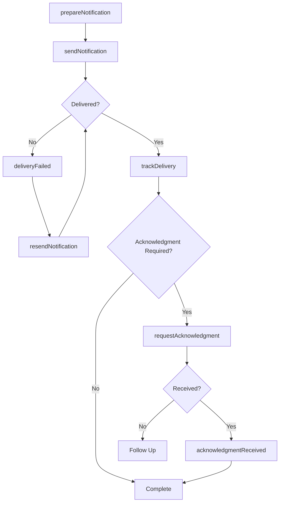

# Inform Individuals Organizations Status Findings

> Business-as-Code definition for communicating status updates and findings to external individuals or organizations. Models the complete notification lifecycle from preparation through confirmation.

## Overview

Status and findings communication involves preparing, distributing, and confirming delivery of formal updates to external parties. This definition exposes actions for notification management, events for automation workflows, and searches for tracking delivery and engagement.

## Actors

| Actor | Description |
|-------|-------------|
| Client | Receives status updates on projects or services |
| Regulatory Agency | Receives compliance and audit findings |
| Partner Organization | Receives joint initiative status reports |
| Stakeholder | Receives project progress and milestone updates |
| Legal Authority | Receives investigation findings and disclosures |
| Insurance Company | Receives claim status and damage assessments |

## Roles

| Role | Description |
|------|-------------|
| Communications Specialist | Prepares and distributes status notifications |
| Compliance Officer | Ensures regulatory findings are properly communicated |
| Project Manager | Delivers project status updates to stakeholders |
| Account Manager | Keeps clients informed of service status |

## Entities

| Entity | Description |
|--------|-------------|
| StatusUpdate | A notification of current state or progress |
| Finding | A documented result from an investigation or audit |
| Notification | A formal message sent to external parties |
| DeliveryReceipt | Confirmation of message receipt |
| Response | Reply or acknowledgment from recipient |
| Template | Standardized format for status communications |

## Actions

| Action | Description |
|--------|-------------|
| prepareNotification | Draft a status update or findings report |
| sendNotification | Deliver notification to individuals or organizations |
| trackDelivery | Monitor delivery status and confirmations |
| resendNotification | Redeliver undelivered or unread notifications |
| requestAcknowledgment | Require formal confirmation of receipt |
| updateStatus | Modify existing status information |
| scheduleNotification | Set future delivery of status updates |

## Events

| Event | Description |
|-------|-------------|
| notificationPrepared | Status update has been drafted |
| notificationSent | Notification has been delivered |
| deliveryConfirmed | Recipient has received the notification |
| acknowledgmentReceived | Recipient has formally acknowledged receipt |
| responseReceived | Recipient has replied to the notification |
| deliveryFailed | Notification could not be delivered |
| notificationScheduled | Future notification has been queued |

## Searches

| Search | Description |
|--------|-------------|
| findNotifications | List notifications by recipient, status, or date |
| getDeliveryStatus | Retrieve delivery confirmation details |
| getResponses | Find replies and acknowledgments from recipients |
| getPendingNotifications | List scheduled or undelivered notifications |

## Workflow



## Actor Relationships

```mermaid
graph LR
    CS[Communications Specialist]

    CS -->|sends to| Client
    CS -->|reports to| Regulatory Agency
    CS -->|coordinates with| Partner Organization
    CS -->|updates| Stakeholder
    CS -->|discloses to| Legal Authority
```

## Usage

### Calling Actions

```typescript
import { informIndividualsOrganizationsStatusFindings } from '@headlessly/inform-individuals-organizations-status-findings'

const notifications = informIndividualsOrganizationsStatusFindings()

// Prepare a project status update
const notification = await notifications.prepareNotification({
  type: 'status_update',
  recipient: { type: 'Client', id: 'client-789' },
  subject: 'Q1 Implementation Status',
  content: {
    status: 'On Track',
    milestones: [
      { name: 'Phase 1', completed: true },
      { name: 'Phase 2', progress: 75 }
    ]
  }
})

// Send the notification
await notifications.sendNotification({
  notificationId: notification.id,
  deliveryMethods: ['email', 'portal'],
  requireAcknowledgment: true
})

// Track delivery status
const status = await notifications.trackDelivery({
  notificationId: notification.id
})
```

### Event-Driven Automation

```typescript
// Retry failed deliveries
notifications.deliveryFailed(async ({ notificationId, reason }) => {
  await wait({ minutes: 30 })
  await notifications.resendNotification({ notificationId })
})

// Alert on missing acknowledgments
notifications.notificationSent(async ({ notificationId, requireAcknowledgment }) => {
  if (requireAcknowledgment) {
    await wait({ days: 3 })
    const status = await notifications.getDeliveryStatus({ notificationId })
    if (!status.acknowledged) {
      await alert({
        to: 'account-manager',
        message: `No acknowledgment received for ${notificationId}`
      })
    }
  }
})
```
