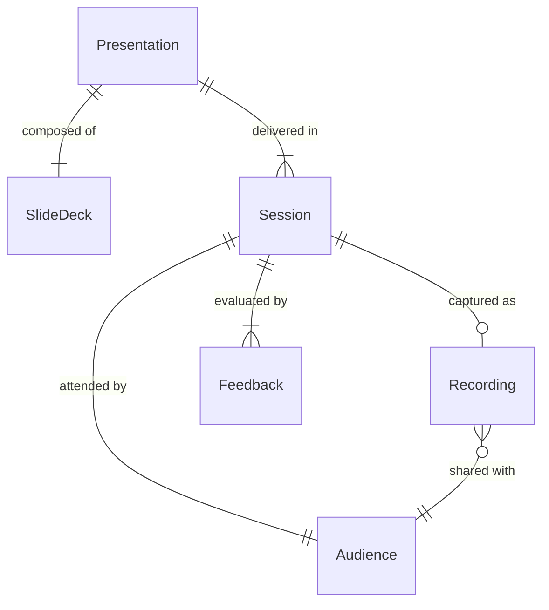
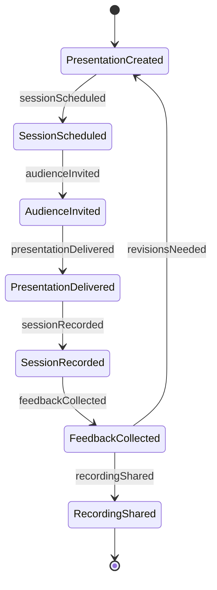
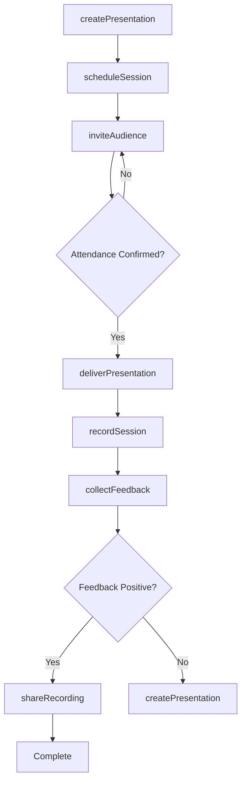

# Present Business-related Information Audiences

> Business-as-Code definition for delivering business presentations to external audiences. Models the complete presentation lifecycle from preparation through delivery and follow-up.

## Overview

Business presentation delivery involves creating, scheduling, and delivering formal presentations to clients, investors, partners, and other external stakeholders. This definition exposes actions for presentation management, events for workflow automation, and searches for tracking engagement and outcomes.

## Actors

| Actor | Description |
|-------|-------------|
| Client | Attends presentations on proposals, results, or services |
| Investor | Receives financial performance and strategic updates |
| Prospect | Attends sales presentations and product demonstrations |
| Partner Organization | Participates in joint initiative presentations |
| Industry Conference | Hosts presentations at external events |
| Media | Covers announcements and press briefings |

## Roles

| Role | Description |
|------|-------------|
| Presenter | Delivers the presentation to the audience |
| Executive Sponsor | Provides strategic content and approval |
| Content Developer | Creates presentation materials and visuals |
| Audience Manager | Coordinates attendance and logistics |

## Entities

| Entity | Description |
|--------|-------------|
| Presentation | A prepared set of business information for delivery |
| Slide Deck | Visual content organized for presentation |
| Audience | Group of attendees for a presentation |
| Session | Scheduled time and venue for presentation delivery |
| Recording | Captured video or audio of the presentation |
| Feedback | Audience responses and evaluation data |

## Actions

| Action | Description |
|--------|-------------|
| createPresentation | Develop a new business presentation |
| scheduleSession | Set date, time, and venue for delivery |
| inviteAudience | Notify and register attendees |
| deliverPresentation | Execute the live or virtual presentation |
| recordSession | Capture video or audio of the delivery |
| collectFeedback | Gather audience responses and evaluations |
| shareRecording | Distribute presentation recording to stakeholders |

## Events

| Event | Description |
|-------|-------------|
| presentationCreated | New presentation materials have been prepared |
| sessionScheduled | Presentation delivery has been scheduled |
| audienceInvited | Attendees have been notified |
| presentationDelivered | Presentation has been completed |
| sessionRecorded | Recording is available for distribution |
| feedbackCollected | Audience responses have been gathered |
| recordingShared | Recording has been distributed to stakeholders |

## Searches

| Search | Description |
|--------|-------------|
| findPresentations | List presentations by topic, audience, or date |
| getAttendees | Retrieve audience registration and attendance |
| getFeedback | Find evaluation data and audience responses |
| getRecordings | List available presentation recordings |

## Entity Relationships



## State Diagram



## Workflow



## Actor Relationships

```mermaid
graph LR
    P[Presenter]

    P -->|presents to| Client
    P -->|reports to| Investor
    P -->|demonstrates for| Prospect
    P -->|collaborates with| Partner Organization
    P -->|speaks at| Industry Conference
```

## Usage

### Calling Actions

```typescript
import { presentBusinessRelatedInformationAudiences } from '@headlessly/present-business-related-information-audiences'

const presentations = presentBusinessRelatedInformationAudiences()

// Create a quarterly business review presentation
const presentation = await presentations.createPresentation({
  title: 'Q4 2025 Business Review',
  type: 'client_review',
  content: {
    slides: [
      { title: 'Executive Summary', content: '...' },
      { title: 'Performance Metrics', content: '...' },
      { title: 'Strategic Initiatives', content: '...' }
    ]
  }
})

// Schedule and invite audience
const session = await presentations.scheduleSession({
  presentationId: presentation.id,
  date: '2026-01-15',
  time: '14:00',
  venue: { type: 'virtual', platform: 'Zoom' }
})

await presentations.inviteAudience({
  sessionId: session.id,
  attendees: [
    { email: 'cfo@client.com', role: 'Executive' },
    { email: 'director@client.com', role: 'Decision Maker' }
  ]
})

// Deliver and record
await presentations.deliverPresentation({
  sessionId: session.id,
  record: true
})
```

### Event-Driven Automation

```typescript
// Share recording after positive feedback
presentations.feedbackCollected(async ({ sessionId, feedback }) => {
  const avgScore = feedback.reduce((acc, f) => acc + f.score, 0) / feedback.length
  if (avgScore >= 4.0) {
    await presentations.shareRecording({
      sessionId,
      recipients: ['marketing-team', 'sales-team']
    })
  }
})

// Follow up on low attendance
presentations.presentationDelivered(async ({ sessionId }) => {
  const attendees = await presentations.getAttendees({ sessionId })
  if (attendees.attendanceRate < 0.5) {
    await notify({
      to: 'audience-manager',
      message: `Low attendance (${attendees.attendanceRate * 100}%) for session ${sessionId}`
    })
  }
})
```
