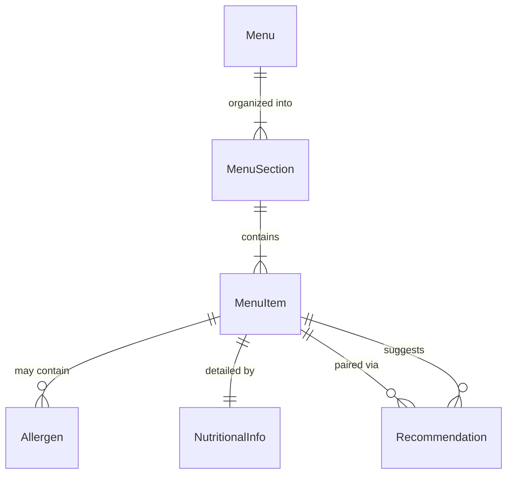
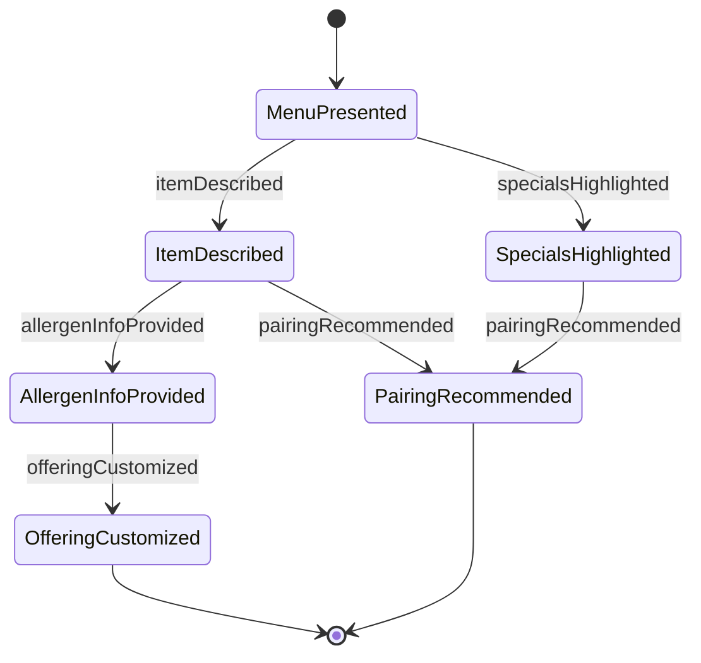
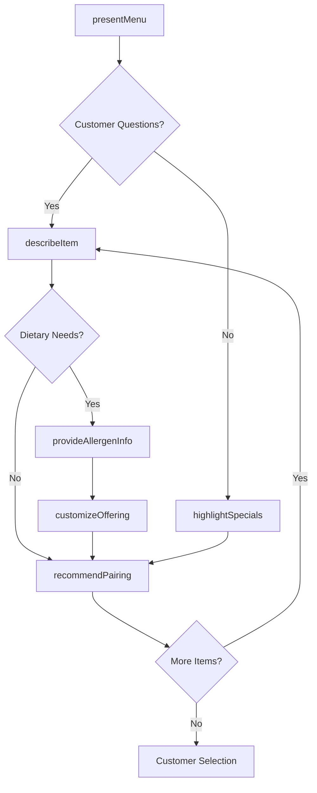

# Present Food Beverage Information Menus

> Business-as-Code definition for presenting food and beverage offerings to customers. Models the complete menu presentation lifecycle from preparation through customer interaction and feedback.

## Overview

Food and beverage menu presentation involves creating, maintaining, and presenting menu information to customers in restaurants, cafes, catering services, and hospitality venues. This definition exposes actions for menu management, events for workflow automation, and searches for tracking customer preferences and dietary requirements.

## Actors

| Actor | Description |
|-------|-------------|
| Customer | Views menus and makes food and beverage selections |
| Catering Client | Receives menu proposals for events |
| Event Planner | Reviews menu options for hosted functions |
| Dietary Consultant | Advises on nutritional and allergen information |
| Food Supplier | Provides ingredient availability for menu planning |
| Health Inspector | Reviews menu compliance with regulations |

## Roles

| Role | Description |
|------|-------------|
| Server | Presents menus and answers customer questions |
| Sommelier | Recommends and presents beverage pairings |
| Catering Manager | Proposes menu packages to clients |
| Menu Designer | Creates and updates menu content and presentation |

## Entities

| Entity | Description |
|--------|-------------|
| Menu | Collection of food and beverage offerings |
| MenuItem | Individual dish or beverage with details |
| MenuSection | Category grouping of related items |
| Allergen | Ingredient that may cause allergic reactions |
| NutritionalInfo | Calorie and dietary content data |
| Recommendation | Suggested pairings or popular selections |

## Actions

| Action | Description |
|--------|-------------|
| presentMenu | Display menu to customer or client |
| describeItem | Explain ingredients, preparation, and flavors |
| recommendPairing | Suggest complementary food and beverage combinations |
| highlightSpecials | Emphasize featured or seasonal items |
| provideAllergenInfo | Disclose allergen content and dietary details |
| customizeOffering | Modify items to accommodate dietary restrictions |
| updateMenu | Refresh menu content based on availability |

## Events

| Event | Description |
|-------|-------------|
| menuPresented | Menu has been shown to customer |
| itemDescribed | Detailed information has been provided |
| pairingRecommended | Complementary items have been suggested |
| specialsHighlighted | Featured items have been emphasized |
| allergenInfoProvided | Allergen details have been disclosed |
| offeringCustomized | Menu item has been modified for customer |
| menuUpdated | Menu content has been refreshed |

## Searches

| Search | Description |
|--------|-------------|
| findMenuItems | List items by category, dietary type, or price |
| getAllergenInfo | Retrieve allergen content for menu items |
| getRecommendations | Find suggested pairings and popular items |
| getSpecials | List current featured and seasonal offerings |

## Entity Relationships



## State Diagram



## Workflow



## Actor Relationships

```mermaid
graph LR
    S[Server]

    S -->|presents to| Customer
    S -->|proposes to| Catering Client
    S -->|coordinates with| Event Planner
    S -->|consults| Dietary Consultant
    S -->|checks availability with| Food Supplier
```

## Usage

### Calling Actions

```typescript
import { presentFoodBeverageInformationMenus } from '@headlessly/present-food-beverage-information-menus'

const menus = presentFoodBeverageInformationMenus()

// Present menu to a customer
const presentation = await menus.presentMenu({
  customerId: 'guest-456',
  menuType: 'dinner',
  sections: ['appetizers', 'entrees', 'desserts', 'beverages']
})

// Describe a specific menu item
await menus.describeItem({
  itemId: 'item-789',
  details: {
    ingredients: ['wild salmon', 'asparagus', 'lemon butter'],
    preparation: 'pan-seared',
    servingSize: '8 oz',
    accompaniments: ['seasonal vegetables', 'herb rice']
  }
})

// Provide allergen information
await menus.provideAllergenInfo({
  itemId: 'item-789',
  allergens: ['fish', 'dairy']
})

// Recommend pairing
await menus.recommendPairing({
  itemId: 'item-789',
  pairing: { type: 'wine', name: 'Chardonnay', vintage: '2023' }
})
```

### Event-Driven Automation

```typescript
// Track allergen disclosure compliance
menus.menuPresented(async ({ customerId, menuType }) => {
  const preferences = await getCustomerPreferences({ customerId })
  if (preferences.allergyAlerts) {
    await menus.provideAllergenInfo({
      customerId,
      allergens: preferences.allergyAlerts
    })
  }
})

// Suggest popular items
menus.itemDescribed(async ({ itemId, customerId }) => {
  const recommendations = await menus.getRecommendations({ itemId })
  if (recommendations.length > 0) {
    await menus.recommendPairing({
      customerId,
      pairings: recommendations
    })
  }
})
```
