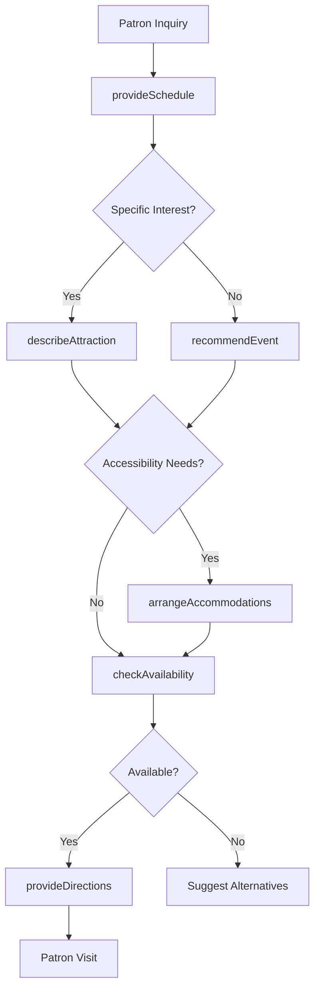

# Provide Attraction Event Information Patrons

> Business-as-Code definition for delivering attraction and event information to patrons. Models the complete information delivery lifecycle from inquiry through engagement and feedback.

## Overview

Attraction and event information delivery involves providing schedules, details, and guidance to patrons at museums, theme parks, theaters, stadiums, and entertainment venues. This definition exposes actions for information management, events for workflow automation, and searches for tracking patron engagement and preferences.

## Actors

| Actor | Description |
|-------|-------------|
| Patron | Requests information about attractions and events |
| Tour Group | Receives coordinated schedules and itineraries |
| Event Organizer | Provides content for featured events |
| Accessibility Advocate | Requests accommodation information |
| Ticket Holder | Seeks details on purchased event access |
| Media Partner | Covers featured attractions and events |

## Roles

| Role | Description |
|------|-------------|
| Guest Services Representative | Answers patron inquiries and provides information |
| Tour Guide | Delivers detailed attraction and event commentary |
| Event Coordinator | Manages event schedules and communications |
| Information Specialist | Maintains and updates attraction databases |

## Entities

| Entity | Description |
|--------|-------------|
| Attraction | A venue, exhibit, or feature available to patrons |
| Event | A scheduled performance, show, or activity |
| Schedule | Timing and availability of attractions and events |
| Ticket | Access credential for specific events or attractions |
| Accommodation | Accessibility services and special arrangements |
| Recommendation | Suggested attractions based on patron interests |

## Actions

| Action | Description |
|--------|-------------|
| provideSchedule | Share timing and availability information |
| describeAttraction | Explain features, history, and highlights |
| recommendEvent | Suggest events based on patron interests |
| checkAvailability | Verify capacity and access for attractions |
| provideDirections | Give navigation guidance within venue |
| arrangeAccommodations | Set up accessibility and special services |
| updateInformation | Refresh attraction and event details |

## Events

| Event | Description |
|-------|-------------|
| scheduleProvided | Timing information has been shared with patron |
| attractionDescribed | Detailed information has been delivered |
| eventRecommended | Suggestion has been made to patron |
| availabilityChecked | Capacity status has been verified |
| directionsProvided | Navigation guidance has been given |
| accommodationsArranged | Special services have been set up |
| informationUpdated | Attraction or event details have been refreshed |

## Searches

| Search | Description |
|--------|-------------|
| findAttractions | List attractions by type, location, or availability |
| getEventSchedule | Retrieve timing for upcoming events |
| getRecommendations | Find suggested attractions for patron profile |
| checkCapacity | Verify available space for attractions or events |

## Workflow



## Actor Relationships

```mermaid
graph LR
    GSR[Guest Services Representative]

    GSR -->|informs| Patron
    GSR -->|coordinates| Tour Group
    GSR -->|receives content from| Event Organizer
    GSR -->|arranges services with| Accessibility Advocate
    GSR -->|verifies access for| Ticket Holder
```

## Usage

### Calling Actions

```typescript
import { provideAttractionEventInformationPatrons } from '@headlessly/provide-attraction-event-information-patrons'

const attractions = provideAttractionEventInformationPatrons()

// Provide daily schedule to patron
const schedule = await attractions.provideSchedule({
  patronId: 'guest-123',
  date: '2026-02-15',
  interests: ['history', 'interactive exhibits']
})

// Describe a specific attraction
await attractions.describeAttraction({
  attractionId: 'exhibit-789',
  details: {
    name: 'Ancient Civilizations Gallery',
    duration: '45 minutes',
    highlights: ['Egyptian artifacts', 'Interactive archaeology'],
    accessibility: ['wheelchair accessible', 'audio guide available']
  }
})

// Recommend events based on interests
const recommendations = await attractions.recommendEvent({
  patronId: 'guest-123',
  interests: ['history'],
  date: '2026-02-15'
})

// Arrange accommodations
await attractions.arrangeAccommodations({
  patronId: 'guest-123',
  needs: ['wheelchair', 'sign language interpreter'],
  eventId: 'tour-456'
})
```

### Event-Driven Automation

```typescript
// Auto-recommend based on patron profile
attractions.scheduleProvided(async ({ patronId, date }) => {
  const profile = await getPatronProfile({ patronId })
  if (profile.interests) {
    await attractions.recommendEvent({
      patronId,
      interests: profile.interests,
      date
    })
  }
})

// Alert on capacity issues
attractions.availabilityChecked(async ({ attractionId, capacity }) => {
  if (capacity.available < capacity.threshold) {
    await notify({
      to: 'event-coordinator',
      message: `Low capacity at ${attractionId}: ${capacity.available} remaining`
    })
  }
})
```
