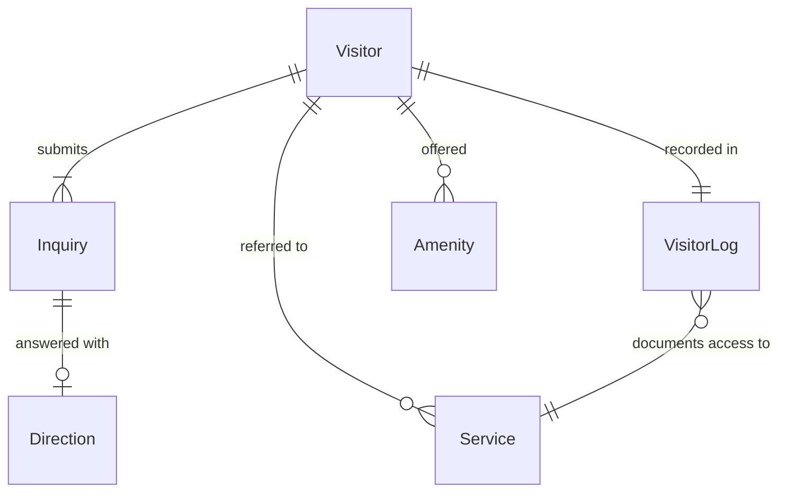
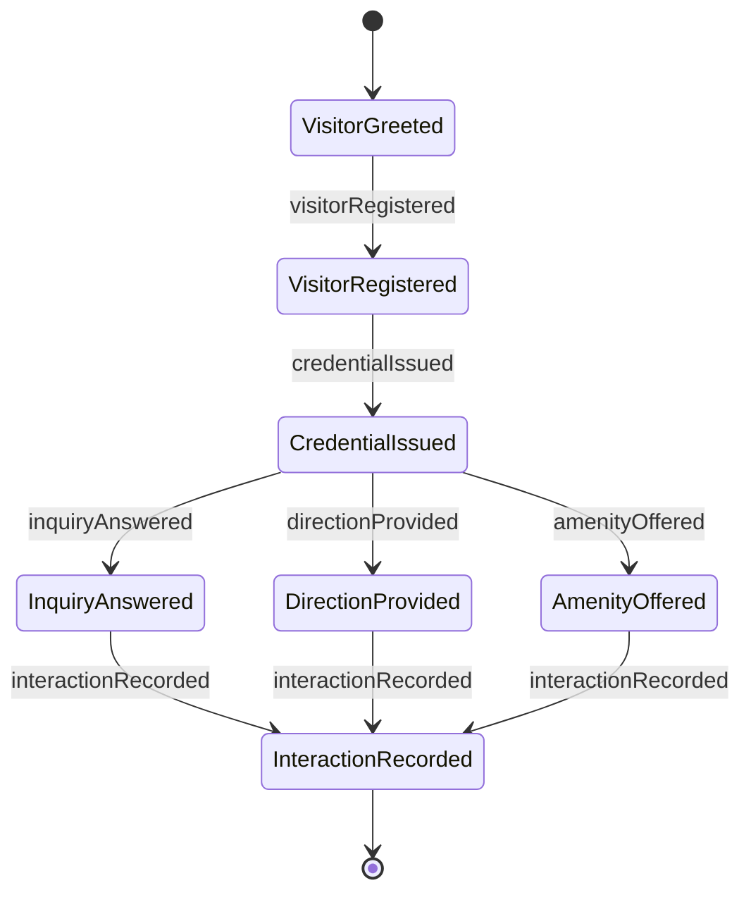
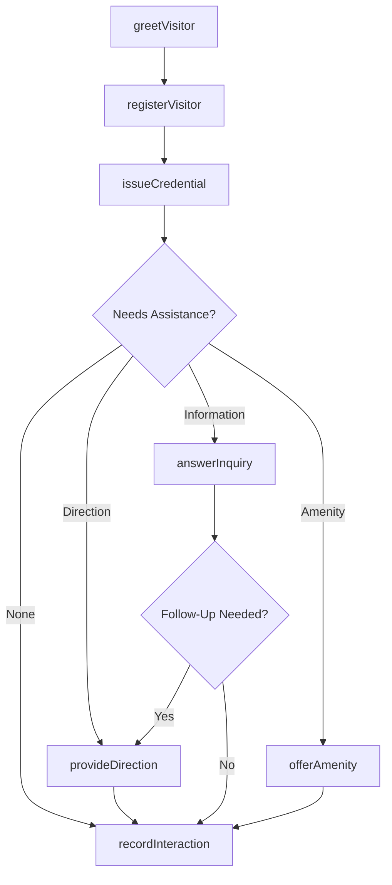
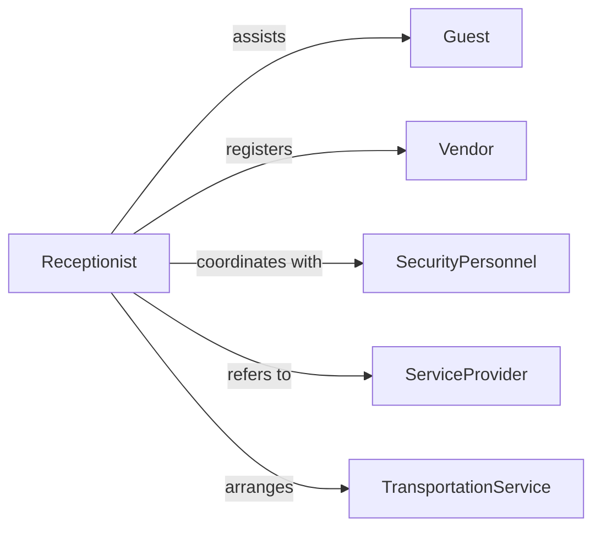

# Provide Basic Information Guests Visitors

> Business-as-Code definition for guest and visitor information services. Models reception, orientation, and basic assistance provided to individuals visiting facilities or seeking services.

## Overview

Providing basic information to guests and visitors involves welcoming arrivals, answering common questions, providing directions, and orienting individuals to facilities and services. This definition exposes actions for greeting, directing, answering inquiries, and tracking visitor interactions.

## Actors

| Actor | Description |
|-------|-------------|
| Guest | Individual visiting facility or seeking services |
| Vendor | External party conducting business on-site |
| Contractor | Third-party worker requiring facility access |
| SecurityPersonnel | Manages access control and safety protocols |
| ServiceProvider | Internal department or staff member being sought |
| TransportationService | Provides shuttle or parking assistance |

## Roles

| Role | Description |
|------|-------------|
| Receptionist | Greets and assists visitors at front desk |
| InformationSpecialist | Provides detailed facility and service information |
| Concierge | Offers enhanced guest services and coordination |
| VisitorCoordinator | Manages visitor registration and tracking |

## Entities

| Entity | Description |
|--------|-------------|
| Visitor | Individual requiring information or assistance |
| Inquiry | Question or request from guest |
| Direction | Guidance to location within facility |
| Service | Offering or capability available to visitors |
| VisitorLog | Record of guest arrivals and departures |
| Amenity | Facility feature available to guests |

## Actions

| Action | Description |
|--------|-------------|
| greetVisitor | Welcome guest and offer assistance |
| answerInquiry | Respond to question about services or facilities |
| provideDirection | Give guidance to specific location |
| registerVisitor | Log guest arrival and purpose |
| issueCredential | Provide temporary access badge or pass |
| offerAmenity | Inform guest of available facility features |
| recordInteraction | Document visitor assistance provided |

## Events

| Event | Description |
|-------|-------------|
| visitorGreeted | Guest has been welcomed |
| inquiryAnswered | Question has been responded to |
| directionProvided | Location guidance has been given |
| visitorRegistered | Guest arrival has been logged |
| credentialIssued | Access badge has been provided |
| amenityOffered | Facility feature has been presented |
| interactionRecorded | Visitor assistance has been documented |

## Searches

| Search | Description |
|--------|-------------|
| findVisitors | Retrieve guest records by date, name, or purpose |
| getInquiries | List questions by topic or frequency |
| getDirections | Find location guidance by destination |
| getAmenities | Retrieve facility features by type or availability |

## Entity Relationships



## State Diagram



## Workflow



## Actor Relationships



## Usage

### Calling Actions

```typescript
import { provideBasicInformationGuestsVisitors } from '@headlessly/provide-basic-information-guests-visitors'

const reception = provideBasicInformationGuestsVisitors()

// Greet and register a visitor
await reception.greetVisitor({
  visitorName: 'John Doe',
  arrivalTime: new Date(),
  purpose: 'business_meeting'
})

const registration = await reception.registerVisitor({
  visitorName: 'John Doe',
  company: 'Acme Corp',
  host: 'Jane Smith',
  expectedDuration: 60
})

// Issue visitor credential
await reception.issueCredential({
  registrationId: registration.id,
  credentialType: 'visitor_badge',
  accessLevel: 'lobby_and_conference_rooms'
})

// Provide directions
await reception.provideDirection({
  registrationId: registration.id,
  destination: 'Conference Room B',
  directions: 'Take elevator to 3rd floor, turn right'
})
```

### Event-Driven Automation

```typescript
// Auto-record all visitor interactions
reception.directionProvided(async ({ registrationId, destination }) => {
  await reception.recordInteraction({
    registrationId,
    interactionType: 'direction',
    detail: `Directed to ${destination}`
  })
})

// Offer amenities to long-duration visitors
reception.visitorRegistered(async ({ registrationId, expectedDuration }) => {
  if (expectedDuration > 120) {
    await reception.offerAmenity({
      registrationId,
      amenities: ['wifi_access', 'refreshments', 'workspace']
    })
  }
})
```
