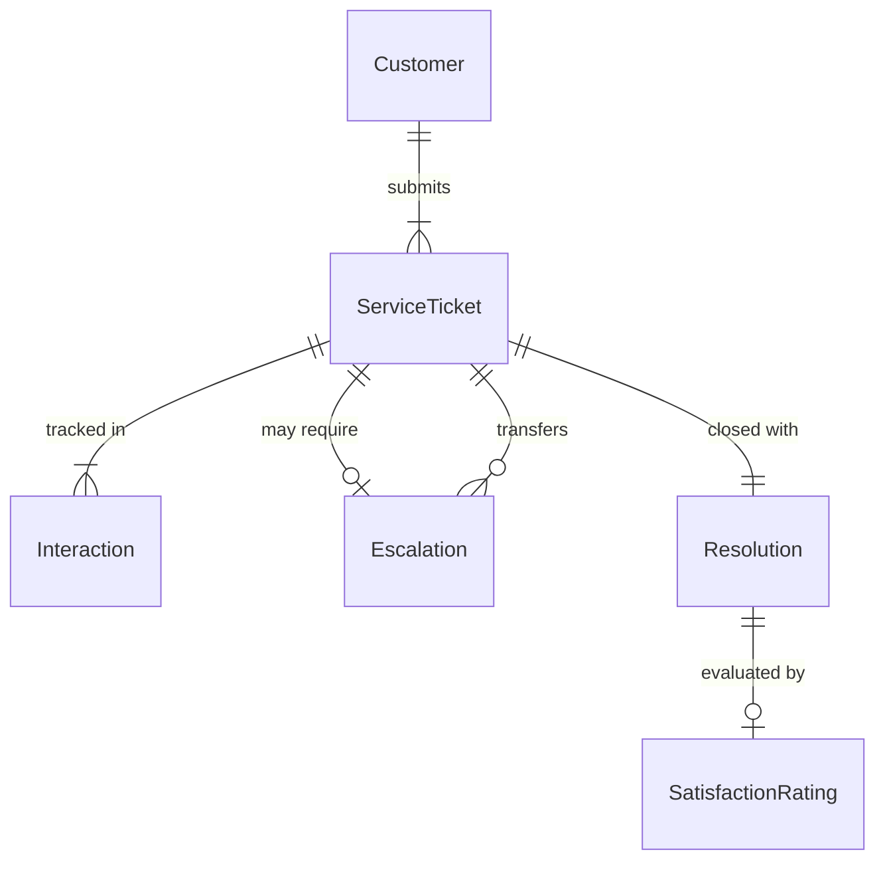
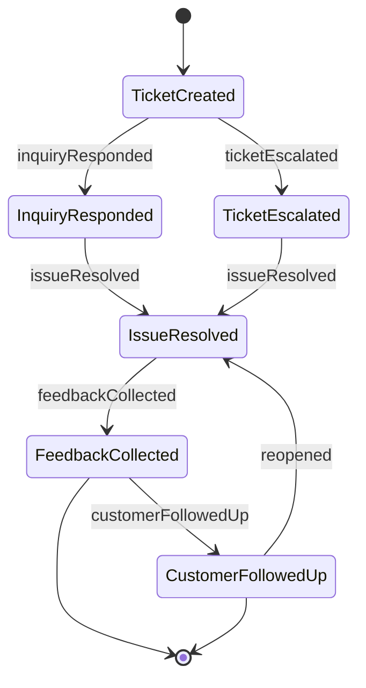
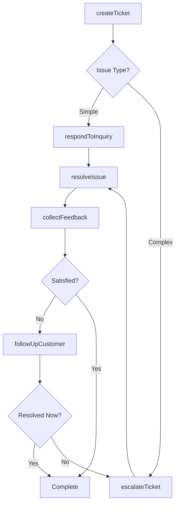
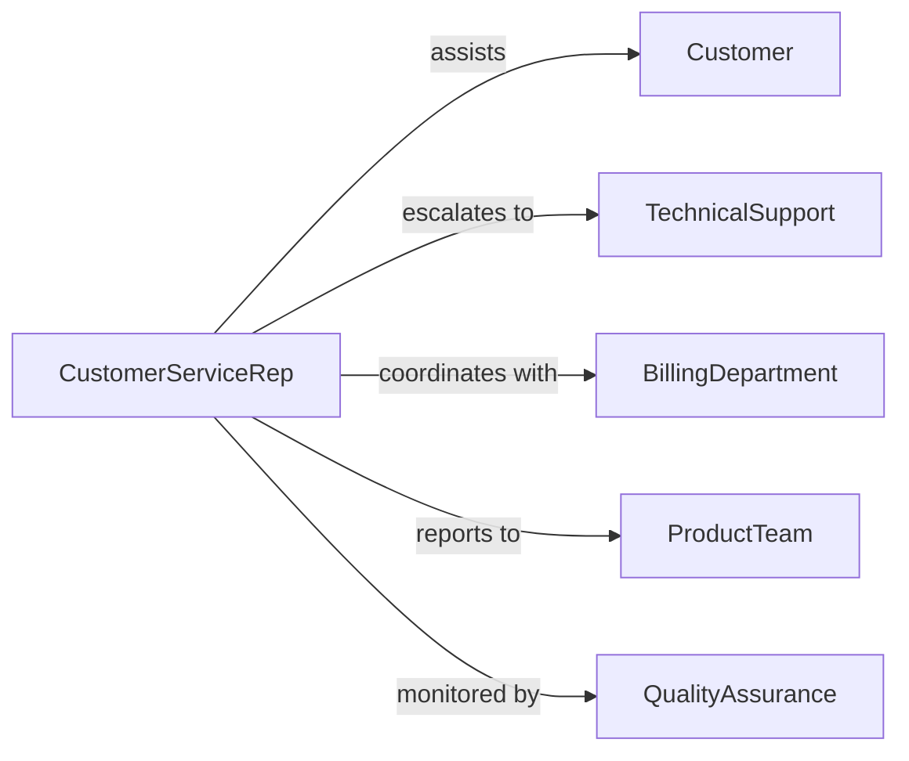

# Provide Customer Service Clients Users

> Business-as-Code definition for customer service operations. Models inquiry handling, issue resolution, account management, and support interactions across multiple channels.

## Overview

Providing customer service involves responding to inquiries, resolving issues, managing accounts, and ensuring customer satisfaction across all interaction channels. This definition exposes actions for ticket management, communication, escalation, and satisfaction tracking.

## Actors

| Actor | Description |
|-------|-------------|
| Customer | Individual or organization using products or services |
| TechnicalSupport | Specialist handling complex technical issues |
| BillingDepartment | Manages payment and account inquiries |
| ProductTeam | Receives feedback and feature requests |
| QualityAssurance | Monitors service quality and compliance |
| ThirdPartyVendor | External provider supporting customer needs |

## Roles

| Role | Description |
|------|-------------|
| CustomerServiceRep | Frontline agent handling customer interactions |
| SupportSpecialist | Advanced agent resolving complex issues |
| AccountManager | Oversees high-value customer relationships |
| ServiceCoordinator | Manages multi-channel support operations |

## Entities

| Entity | Description |
|--------|-------------|
| ServiceTicket | Record of customer inquiry or issue |
| Customer | Individual or organization receiving service |
| Interaction | Communication event between rep and customer |
| Resolution | Solution or outcome to customer issue |
| Escalation | Transfer of ticket to higher-level support |
| SatisfactionRating | Customer feedback on service quality |

## Actions

| Action | Description |
|--------|-------------|
| createTicket | Log new customer inquiry or issue |
| respondToInquiry | Provide information to customer question |
| resolveIssue | Address and close customer problem |
| escalateTicket | Transfer to higher-level support |
| updateAccount | Modify customer information or preferences |
| collectFeedback | Gather customer satisfaction rating |
| followUpCustomer | Contact customer after resolution |

## Events

| Event | Description |
|-------|-------------|
| ticketCreated | Customer inquiry has been logged |
| inquiryResponded | Information has been provided to customer |
| issueResolved | Customer problem has been addressed |
| ticketEscalated | Support request has been transferred |
| accountUpdated | Customer information has been modified |
| feedbackCollected | Satisfaction rating has been gathered |
| customerFollowedUp | Post-resolution contact has been made |

## Searches

| Search | Description |
|--------|-------------|
| findTickets | Retrieve tickets by status, priority, or customer |
| getCustomers | List customers by segment or activity |
| getInteractions | Find communication history by customer or channel |
| getFeedback | Retrieve satisfaction ratings by period or rep |

## Entity Relationships



## State Diagram



## Workflow



## Actor Relationships



## Usage

### Calling Actions

```typescript
import { provideCustomerServiceClientsUsers } from '@headlessly/provide-customer-service-clients-users'

const customerService = provideCustomerServiceClientsUsers()

// Create a support ticket
const ticket = await customerService.createTicket({
  customerId: 'cust_123',
  channel: 'phone',
  category: 'billing_inquiry',
  priority: 'medium',
  description: 'Question about recent invoice charge'
})

// Respond to the inquiry
await customerService.respondToInquiry({
  ticketId: ticket.id,
  response: 'The charge is for annual subscription renewal',
  channel: 'email',
  attachments: ['invoice_breakdown.pdf']
})

// Resolve the issue
await customerService.resolveIssue({
  ticketId: ticket.id,
  resolution: 'Explanation provided, customer satisfied',
  resolutionTime: 15
})
```

### Event-Driven Automation

```typescript
// Auto-escalate high-priority unresolved tickets
customerService.ticketCreated(async ({ ticketId, priority, category }) => {
  if (priority === 'critical' && category === 'service_outage') {
    await customerService.escalateTicket({
      ticketId,
      escalateTo: 'technical_support',
      reason: 'critical_service_issue'
    })
  }
})

// Auto-follow-up on low satisfaction ratings
customerService.feedbackCollected(async ({ ticketId, customerId, rating }) => {
  if (rating <= 2) {
    await customerService.followUpCustomer({
      customerId,
      ticketId,
      message: 'We apologize for your experience. How can we improve?'
    })
  }
})
```
