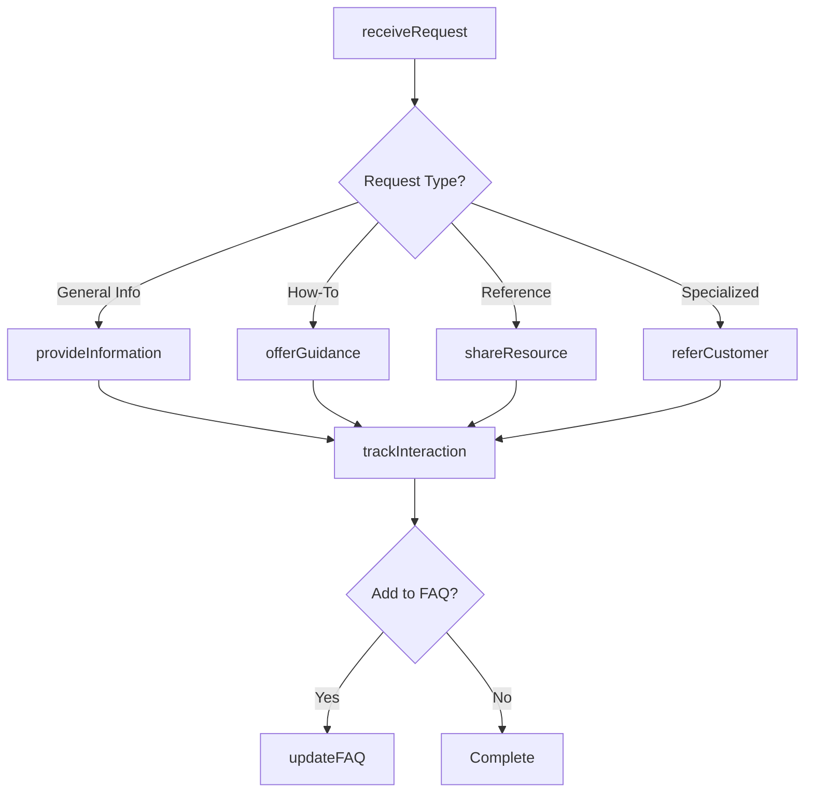
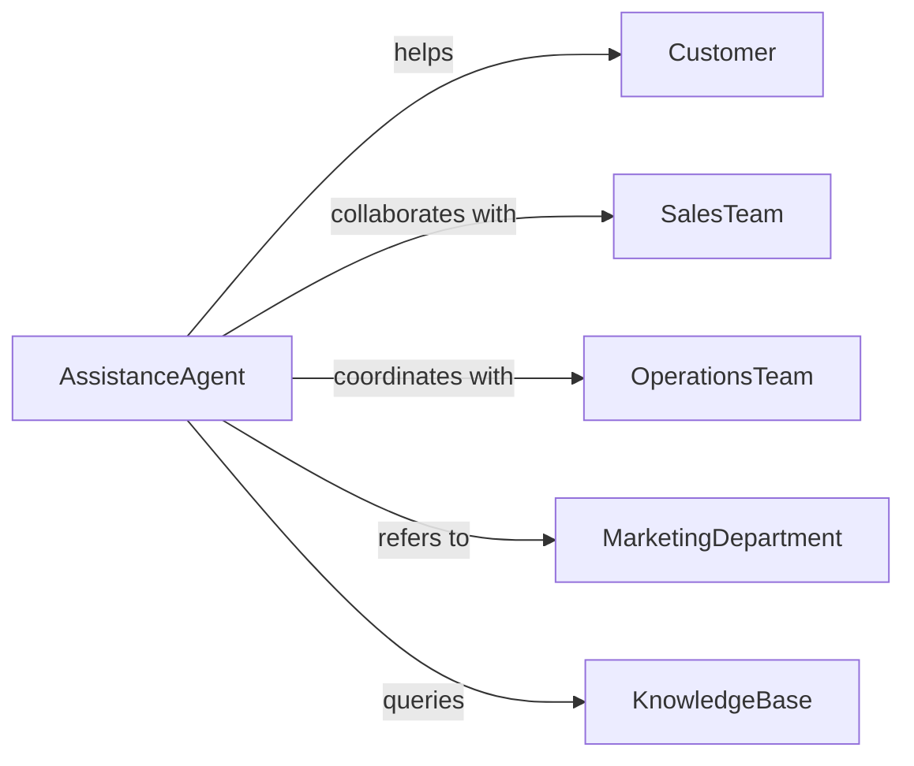

# Provide Customers General Information Assistance

> Business-as-Code definition for general customer assistance. Models help desk operations, FAQ management, and non-technical support across products, services, and business operations.

## Overview

Providing general information and assistance to customers involves answering common questions, guiding through processes, offering product information, and facilitating access to services. This definition exposes actions for inquiry handling, resource provision, guidance delivery, and interaction tracking.

## Actors

| Actor | Description |
|-------|-------------|
| Customer | Individual seeking information or assistance |
| SalesTeam | Provides product and pricing information |
| OperationsTeam | Handles logistics and fulfillment inquiries |
| MarketingDepartment | Supplies promotional and campaign information |
| PartnerOrganization | External entity offering complementary services |
| KnowledgeBase | Central repository of information resources |

## Roles

| Role | Description |
|------|-------------|
| AssistanceAgent | Provides general help and information |
| InformationSpecialist | Delivers detailed product and service guidance |
| CustomerAdvocate | Ensures customer needs are met across touchpoints |
| HelpDeskCoordinator | Manages general assistance operations |

## Entities

| Entity | Description |
|--------|-------------|
| Request | Customer inquiry for information or help |
| Resource | Information document or reference material |
| Guidance | Step-by-step instruction or process walkthrough |
| FAQEntry | Frequently asked question and answer pair |
| Interaction | Communication event with customer |
| Referral | Direction to specialized resource or department |

## Actions

| Action | Description |
|--------|-------------|
| receiveRequest | Accept customer inquiry for assistance |
| provideInformation | Deliver general information to customer |
| offerGuidance | Give step-by-step instructions or process help |
| shareResource | Provide document or reference material |
| referCustomer | Direct to specialized service or department |
| updateFAQ | Add or modify frequently asked question entry |
| trackInteraction | Record customer assistance activity |

## Events

| Event | Description |
|-------|-------------|
| requestReceived | Customer inquiry has been accepted |
| informationProvided | General information has been delivered |
| guidanceOffered | Step-by-step help has been given |
| resourceShared | Document or material has been provided |
| customerReferred | Direction to specialist has been made |
| faqUpdated | FAQ entry has been added or modified |
| interactionTracked | Assistance activity has been recorded |

## Searches

| Search | Description |
|--------|-------------|
| findRequests | Retrieve inquiries by topic, status, or channel |
| getResources | List information materials by category or format |
| getFAQs | Find frequently asked questions by topic |
| getInteractions | Retrieve customer assistance history |

## Workflow



## Actor Relationships



## Usage

### Calling Actions

```typescript
import { provideCustomersGeneralInformationAssistance } from '@headlessly/provide-customers-general-information-assistance'

const assistance = provideCustomersGeneralInformationAssistance()

// Receive a customer request
const request = await assistance.receiveRequest({
  customerId: 'cust_456',
  channel: 'chat',
  topic: 'product_availability',
  message: 'Do you have Widget X in stock?'
})

// Provide information
await assistance.provideInformation({
  requestId: request.id,
  information: 'Widget X is currently in stock with 2-3 day shipping',
  sources: ['inventory_system', 'shipping_schedule']
})

// Share a resource
await assistance.shareResource({
  requestId: request.id,
  customerId: 'cust_456',
  resource: {
    type: 'product_catalog',
    title: 'Widget Product Line Guide',
    format: 'pdf'
  }
})
```

### Event-Driven Automation

```typescript
// Auto-update FAQ for common inquiries
assistance.requestReceived(async ({ topic, channel }) => {
  const recentCount = await countRecentRequests({ topic, days: 7 })
  if (recentCount > 10) {
    await assistance.updateFAQ({
      topic,
      question: `Common inquiry about ${topic}`,
      source: 'auto_generated'
    })
  }
})

// Track all customer interactions
assistance.informationProvided(async ({ requestId, customerId, information }) => {
  await assistance.trackInteraction({
    requestId,
    customerId,
    interactionType: 'information_delivery',
    detail: information
  })
})
```
