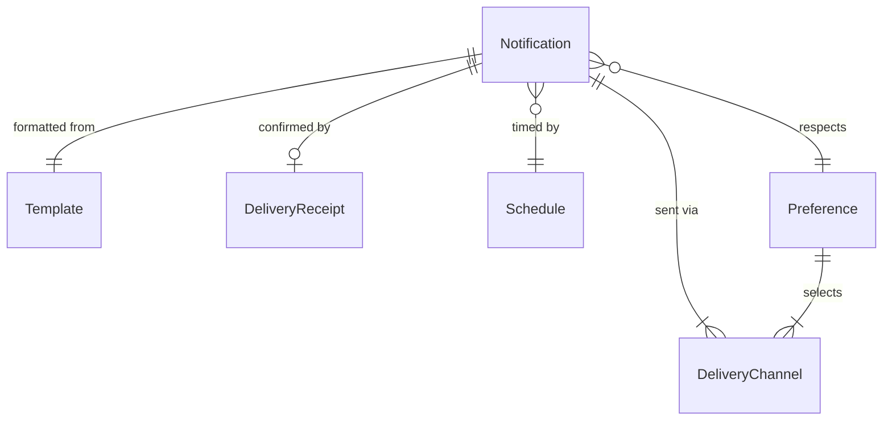
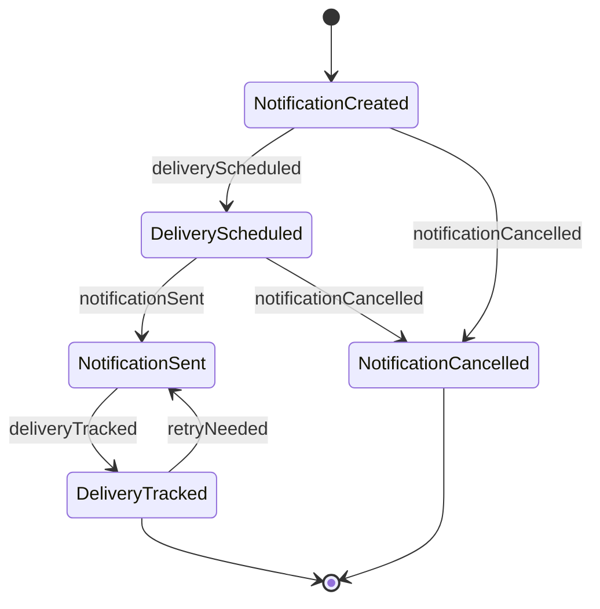
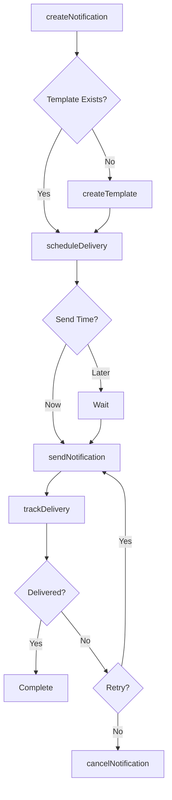
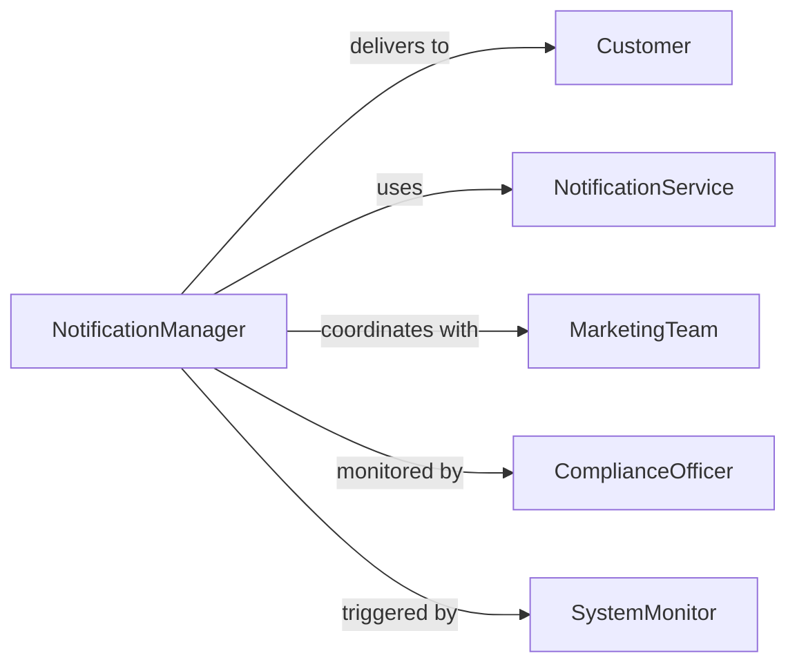

# Provide Notifications Customers Patrons

> Business-as-Code definition for customer notification management. Models alert creation, delivery, tracking, and preference management across email, SMS, push, and other channels.

## Overview

Providing notifications to customers involves creating alerts, managing delivery preferences, sending messages across channels, and tracking engagement. This definition exposes actions for notification creation, scheduling, delivery, and preference management.

## Actors

| Actor | Description |
|-------|-------------|
| Customer | Recipient of notifications and alerts |
| NotificationService | Third-party delivery platform for messages |
| ComplianceOfficer | Ensures notifications meet regulatory requirements |
| MarketingTeam | Requests promotional notification campaigns |
| SystemMonitor | Triggers automated alerts based on events |
| CustomerSupport | Responds to notification-related inquiries |

## Roles

| Role | Description |
|------|-------------|
| NotificationManager | Oversees notification strategy and operations |
| MessageComposer | Creates notification content and templates |
| DeliveryCoordinator | Manages multi-channel notification sending |
| PreferenceAdministrator | Maintains customer communication settings |

## Entities

| Entity | Description |
|--------|-------------|
| Notification | Alert or message sent to customer |
| Template | Reusable notification content structure |
| DeliveryChannel | Medium for sending notifications |
| Preference | Customer settings for receiving notifications |
| Schedule | Timing and frequency rules for alerts |
| DeliveryReceipt | Confirmation of notification receipt or action |

## Actions

| Action | Description |
|--------|-------------|
| createNotification | Generate new alert or message |
| scheduleDelivery | Set timing for notification sending |
| sendNotification | Deliver message through selected channel |
| trackDelivery | Monitor notification receipt and engagement |
| managePreference | Update customer communication settings |
| createTemplate | Build reusable notification content |
| cancelNotification | Stop scheduled or recurring alert |

## Events

| Event | Description |
|-------|-------------|
| notificationCreated | Alert has been generated |
| deliveryScheduled | Notification timing has been set |
| notificationSent | Message has been delivered |
| deliveryTracked | Receipt or engagement has been monitored |
| preferenceManaged | Customer settings have been updated |
| templateCreated | Reusable content has been built |
| notificationCancelled | Scheduled alert has been stopped |

## Searches

| Search | Description |
|--------|-------------|
| findNotifications | Retrieve notifications by customer, type, or status |
| getTemplates | List notification templates by category or usage |
| getPreferences | Find customer communication settings |
| getDeliveryReceipts | Retrieve confirmation of notification delivery |

## Entity Relationships



## State Diagram



## Workflow



## Actor Relationships



## Usage

### Calling Actions

```typescript
import { provideNotificationsCustomersPatrons } from '@headlessly/provide-notifications-customers-patrons'

const notifications = provideNotificationsCustomersPatrons()

// Create a notification template
const template = await notifications.createTemplate({
  name: 'order_shipped',
  subject: 'Your order has shipped',
  body: 'Order {{order_id}} shipped via {{carrier}}. Track: {{tracking_url}}',
  channels: ['email', 'sms']
})

// Create and send a notification
const notification = await notifications.createNotification({
  customerId: 'cust_789',
  templateId: template.id,
  variables: {
    order_id: 'ORD-12345',
    carrier: 'FedEx',
    tracking_url: 'https://track.fedex.com/12345'
  }
})

await notifications.sendNotification({
  notificationId: notification.id,
  channel: 'email',
  priority: 'normal'
})
```

### Event-Driven Automation

```typescript
// Track all notification deliveries
notifications.notificationSent(async ({ notificationId, customerId, channel }) => {
  await notifications.trackDelivery({
    notificationId,
    customerId,
    channel,
    sentAt: new Date()
  })
})

// Respect customer preferences
notifications.notificationCreated(async ({ notificationId, customerId, type }) => {
  const preferences = await getCustomerPreferences({ customerId })
  if (preferences.optOut.includes(type)) {
    await notifications.cancelNotification({
      notificationId,
      reason: 'customer_preference'
    })
  }
})
```
