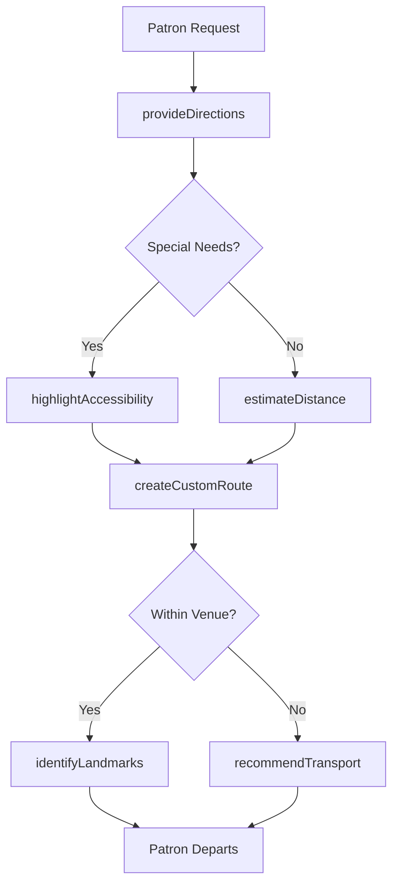

# Provide Patrons Directions Locales Attractions

> Business-as-Code definition for providing navigation guidance to patrons seeking locales and attractions. Models the complete wayfinding lifecycle from inquiry through successful arrival and feedback.

## Overview

Patron wayfinding involves delivering directions, maps, and navigation assistance to help guests reach destinations in hotels, resorts, entertainment venues, tourist areas, and hospitality settings. This definition exposes actions for navigation management, events for workflow automation, and searches for tracking popular routes and accessibility needs.

## Actors

| Actor | Description |
|-------|-------------|
| Patron | Requests directions to destinations |
| Tour Participant | Follows guided routes within venues |
| Convention Attendee | Navigates conference and event facilities |
| Local Business | Provides destination details for referrals |
| Transit Authority | Supplies public transportation connections |
| Accessibility Services | Assists with mobility-aware routing |

## Roles

| Role | Description |
|------|-------------|
| Concierge | Provides comprehensive direction and navigation assistance |
| Front Desk Agent | Offers basic directions and maps to guests |
| Tour Guide | Leads groups along designated routes |
| Information Desk Attendant | Answers wayfinding questions at venues |

## Entities

| Entity | Description |
|--------|-------------|
| Destination | Target location patron wishes to reach |
| Route | Path from current location to destination |
| Map | Visual representation of venue or area layout |
| Landmark | Notable reference point for navigation |
| AccessiblePath | Routes suitable for mobility assistance |
| TransportOption | Public transit or shuttle connections |

## Actions

| Action | Description |
|--------|-------------|
| provideDirections | Give step-by-step navigation instructions |
| createCustomRoute | Plan optimal path based on patron needs |
| identifyLandmarks | Point out reference points along route |
| estimateDistance | Calculate travel time and distance |
| recommendTransport | Suggest best transportation options |
| highlightAccessibility | Identify mobility-friendly routes |
| updateRouteStatus | Alert to closures or construction |

## Events

| Event | Description |
|-------|-------------|
| directionsProvided | Navigation instructions have been given |
| customRouteCreated | Personalized path has been planned |
| landmarksIdentified | Reference points have been noted |
| distanceEstimated | Travel time has been calculated |
| transportRecommended | Transportation option has been suggested |
| accessibilityHighlighted | Accessible route has been identified |
| routeStatusUpdated | Path conditions have been updated |

## Searches

| Search | Description |
|--------|-------------|
| findDestinations | List available locations by category or distance |
| getRoutes | Retrieve navigation paths between points |
| getLandmarks | Find reference points near patron location |
| getAccessibleRoutes | List mobility-friendly navigation options |

## Workflow



## Actor Relationships

```mermaid
graph LR
    C[Concierge]

    C -->|assists| Patron
    C -->|coordinates with| Tour Participant
    C -->|directs| Convention Attendee
    C -->|refers to| Local Business
    C -->|provides connections via| Transit Authority
```

## Usage

### Calling Actions

```typescript
import { providePatronsDirectionsLocalesAttractions } from '@headlessly/provide-patrons-directions-locales-attractions'

const wayfinding = providePatronsDirectionsLocalesAttractions()

// Provide directions to an attraction
const directions = await wayfinding.provideDirections({
  patronId: 'guest-456',
  from: 'hotel-lobby',
  to: { name: 'City Museum', address: '123 Main St' },
  preferences: { mode: 'walking', avoidStairs: true }
})

// Create a custom accessible route
const route = await wayfinding.createCustomRoute({
  patronId: 'guest-456',
  destinations: ['restaurant-789', 'theater-101', 'parking-garage'],
  requirements: ['wheelchair-accessible', 'covered-walkways']
})

// Identify landmarks along route
await wayfinding.identifyLandmarks({
  routeId: route.id,
  landmarks: [
    { name: 'Fountain Plaza', distance: '200 feet' },
    { name: 'Grand Staircase', distance: '500 feet' }
  ]
})

// Recommend transportation
await wayfinding.recommendTransport({
  from: 'hotel-lobby',
  to: 'airport',
  options: [
    { type: 'shuttle', duration: '30 minutes', cost: 0 },
    { type: 'taxi', duration: '20 minutes', cost: 45 }
  ]
})
```

### Event-Driven Automation

```typescript
// Auto-highlight accessibility when needed
wayfinding.directionsProvided(async ({ patronId, routeId }) => {
  const profile = await getPatronProfile({ patronId })
  if (profile.mobilityAssistance) {
    await wayfinding.highlightAccessibility({
      routeId,
      features: ['elevator locations', 'ramp access', 'rest areas']
    })
  }
})

// Alert on route disruptions
wayfinding.customRouteCreated(async ({ routeId }) => {
  const status = await checkRouteStatus({ routeId })
  if (status.closures.length > 0) {
    await wayfinding.updateRouteStatus({
      routeId,
      closures: status.closures,
      alternatives: status.alternatives
    })
  }
})
```
