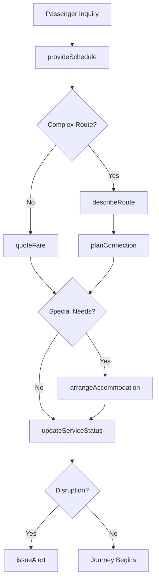

# Provide Transportation Information Passengers Customer

> Business-as-Code definition for delivering transportation information to passengers and customers. Models the complete information delivery lifecycle from inquiry through journey completion and feedback.

## Overview

Transportation information delivery involves providing schedules, routes, fares, and status updates to passengers in airlines, transit systems, rail services, bus companies, and ride-sharing platforms. This definition exposes actions for information management, events for workflow automation, and searches for tracking service status and passenger preferences.

## Actors

| Actor | Description |
|-------|-------------|
| Passenger | Requests transportation schedules and service information |
| Commuter | Uses regular transportation services for daily travel |
| Tourist | Seeks unfamiliar route and fare information |
| Group Coordinator | Plans transportation for multiple travelers |
| Accessibility Advocate | Requires accommodation and service details |
| Connecting Carrier | Provides intermodal transfer information |

## Roles

| Role | Description |
|------|-------------|
| Customer Service Agent | Answers passenger inquiries and provides information |
| Station Attendant | Delivers on-site transportation guidance |
| Dispatcher | Manages real-time service status and updates |
| Information Specialist | Maintains schedule and route databases |

## Entities

| Entity | Description |
|--------|-------------|
| Schedule | Departure and arrival times for services |
| Route | Path and stops for transportation service |
| Fare | Pricing and payment options for travel |
| ServiceStatus | Real-time information on delays or disruptions |
| Connection | Transfer points between services or carriers |
| Accommodation | Accessibility features and special services |

## Actions

| Action | Description |
|--------|-------------|
| provideSchedule | Share departure and arrival times |
| describeRoute | Explain stops, transfers, and journey details |
| quoteFare | Provide pricing and payment options |
| updateServiceStatus | Alert passengers to delays or changes |
| planConnection | Coordinate transfers between services |
| arrangeAccommodation | Set up accessibility and special assistance |
| issueAlert | Send urgent notifications about disruptions |

## Events

| Event | Description |
|-------|-------------|
| scheduleProvided | Timing information has been shared |
| routeDescribed | Journey details have been explained |
| fareQuoted | Pricing information has been provided |
| serviceStatusUpdated | Real-time changes have been communicated |
| connectionPlanned | Transfer details have been coordinated |
| accommodationArranged | Special services have been set up |
| alertIssued | Urgent notification has been sent |

## Searches

| Search | Description |
|--------|-------------|
| findSchedules | List services by route, time, or destination |
| getRouteDetails | Retrieve stops and transfer information |
| getFares | Find pricing for specific routes and services |
| getServiceStatus | Check real-time delays and disruptions |

## Workflow



## Actor Relationships

```mermaid
graph LR
    CSA[Customer Service Agent]

    CSA -->|informs| Passenger
    CSA -->|assists| Commuter
    CSA -->|guides| Tourist
    CSA -->|coordinates with| Group Coordinator
    CSA -->|arranges services for| Accessibility Advocate
```

## Usage

### Calling Actions

```typescript
import { provideTransportationInformationPassengersCustomer } from '@headlessly/provide-transportation-information-passengers-customer'

const transportation = provideTransportationInformationPassengersCustomer()

// Provide schedule information
const schedule = await transportation.provideSchedule({
  passengerId: 'passenger-789',
  from: 'Downtown Station',
  to: 'Airport Terminal',
  date: '2026-02-20',
  time: '14:00'
})

// Describe route with transfers
await transportation.describeRoute({
  routeId: schedule.routeId,
  details: {
    segments: [
      { mode: 'subway', line: 'Red Line', stops: 8, duration: 25 },
      { mode: 'transfer', location: 'Central Hub', duration: 5 },
      { mode: 'rail', line: 'Airport Express', stops: 2, duration: 15 }
    ],
    totalDuration: 45,
    accessibility: ['elevator access', 'wheelchair spaces']
  }
})

// Quote fare and payment options
await transportation.quoteFare({
  routeId: schedule.routeId,
  options: [
    { type: 'single-trip', price: 8.50, payment: ['card', 'mobile'] },
    { type: 'day-pass', price: 15.00, payment: ['card', 'mobile', 'app'] }
  ]
})
```

### Event-Driven Automation

```typescript
// Auto-notify on service disruptions
transportation.serviceStatusUpdated(async ({ routeId, status }) => {
  if (status.delay > 15 || status.cancelled) {
    const passengers = await getAffectedPassengers({ routeId })
    await transportation.issueAlert({
      passengers,
      message: `Service disruption on ${routeId}: ${status.reason}`,
      alternatives: status.alternativeRoutes
    })
  }
})

// Arrange accommodations proactively
transportation.scheduleProvided(async ({ passengerId, routeId }) => {
  const profile = await getPassengerProfile({ passengerId })
  if (profile.mobilityAssistance) {
    await transportation.arrangeAccommodation({
      passengerId,
      routeId,
      services: profile.requiredServices
    })
  }
})
```
