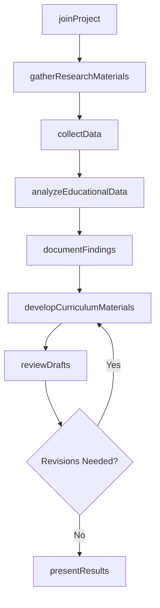
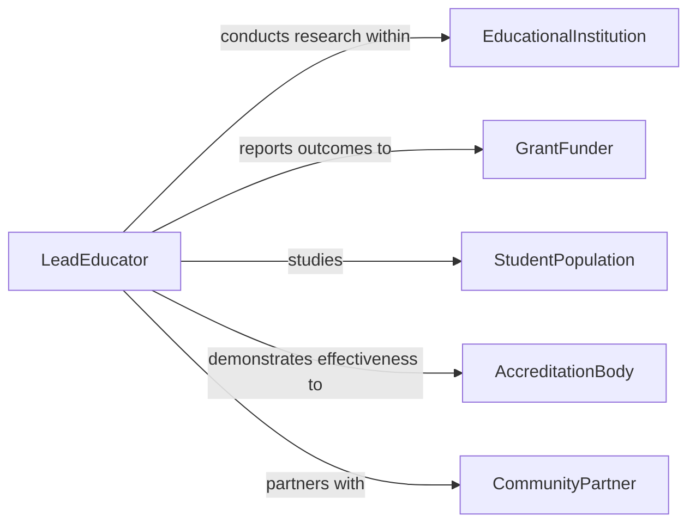

# Assist Other Educational Professionals with Projects or Research

> Business-as-Code definition for assisting other educational professionals with projects or research. Models the support process where educators, instructional designers, and academic staff provide assistance to colleagues on curriculum development, educational research studies, grant-funded projects, and program evaluation initiatives.

## Overview

Assisting other educational professionals with projects or research involves providing subject-matter expertise, gathering instructional data, supporting literature reviews, contributing to curriculum design, and helping evaluate educational outcomes. This definition covers collaborative curriculum development, action research in classrooms, institutional effectiveness studies, and grant-funded educational projects, enabling educators to leverage collective expertise and improve educational practice through shared investigation and project work.

## Actors

| Actor | Description |
|-------|-------------|
| EducationalInstitution | Schools, colleges, or universities hosting projects or research |
| GrantFunder | Organizations providing financial support for educational research |
| StudentPopulation | Learners who are subjects of or participants in educational research |
| AccreditationBody | Organizations that evaluate educational program quality |
| CommunityPartner | External organizations collaborating on educational initiatives |

## Roles

| Role | Description |
|------|-------------|
| LeadEducator | Directs the educational project or research initiative |
| ResearchAssistant | Supports data collection, analysis, and documentation |
| CurriculumSpecialist | Provides expertise in instructional design and content development |
| InstitutionalResearcher | Conducts formal studies on educational outcomes and effectiveness |

## Entities

| Entity | Description |
|--------|-------------|
| EducationalProject | A defined initiative with goals, timeline, and deliverables |
| ResearchStudy | A formal investigation into educational practices or outcomes |
| CurriculumArtifact | Materials, lesson plans, or assessments developed through the project |
| DataCollection | Surveys, assessments, or observations gathered for the research |
| LiteratureReview | A synthesis of existing research relevant to the project |
| ProjectReport | A summary of project activities, findings, and outcomes |
| IRBApproval | Institutional review board authorization for human subjects research |

## Actions

| Action | Description |
|--------|-------------|
| joinProject | Commit to supporting an educational project or research initiative |
| gatherResearchMaterials | Collect literature, data sources, and reference materials |
| collectData | Administer surveys, conduct observations, or gather assessment data |
| analyzeEducationalData | Process and interpret data from educational studies |
| developCurriculumMaterials | Create instructional content as part of the project |
| reviewDrafts | Provide feedback on project reports, papers, or curriculum documents |
| documentFindings | Record and organize research results and project outcomes |
| presentResults | Share project outcomes with stakeholders or at conferences |

## Events

| Event | Description |
|-------|-------------|
| projectJoined | A commitment to support the educational project has been made |
| researchMaterialsGathered | Literature and reference materials have been collected |
| dataCollected | Research data has been gathered from participants |
| educationalDataAnalyzed | Study data has been processed and interpreted |
| curriculumMaterialsDeveloped | Instructional content has been created |
| draftsReviewed | Feedback on project documents has been provided |
| findingsDocumented | Research results have been recorded and organized |

## Searches

| Search | Description |
|--------|-------------|
| findProjects | List educational projects by topic, institution, or status |
| getDataCollections | Retrieve data sets by study, method, or date |
| findMaterials | Locate curriculum artifacts by subject or grade level |
| getReports | Find project reports by initiative or author |
| findStudies | Locate research studies by topic or methodology |

## Workflow



## Actor Relationships



## Usage

### Calling Actions

```typescript
import { assistEducationalProfessionalsProjectsResearch } from '@headlessly/assist-educational-professionals-projects-research'

const eduAssist = assistEducationalProfessionalsProjectsResearch()

// Join a curriculum development project
await eduAssist.joinProject({
  project: 'STEM Literacy Integration Initiative',
  leadEducator: 'dr-harrison',
  role: 'data-collection-support',
  commitment: { hoursPerWeek: 8, duration: '12-weeks' }
})

// Collect classroom observation data
await eduAssist.collectData({
  project: 'STEM Literacy Integration Initiative',
  method: 'classroom-observation',
  participants: { count: 120, gradeLevel: '6th-grade' },
  instruments: ['observation-protocol', 'student-engagement-rubric'],
  schedule: { frequency: 'weekly', sessions: 12 }
})

// Analyze and document findings
await eduAssist.analyzeEducationalData({
  project: 'STEM Literacy Integration Initiative',
  dataSet: 'observation-q1-2026',
  methods: ['descriptive-statistics', 'thematic-analysis'],
  variables: ['student-engagement', 'stem-vocabulary-usage', 'collaborative-problem-solving']
})
```

### Event-Driven Automation

```typescript
// Notify lead when data collection is complete
eduAssist.dataCollected(async ({ project, method, participants }) => {
  await notify({
    to: 'lead-educator',
    message: `Data collection complete for ${project}: ${participants.count} participants via ${method}`
  })
})

// Alert team when findings are documented
eduAssist.findingsDocumented(async ({ project }) => {
  await notify({
    to: 'project-team',
    message: `Research findings documented for ${project} - ready for review`
  })
})
```
