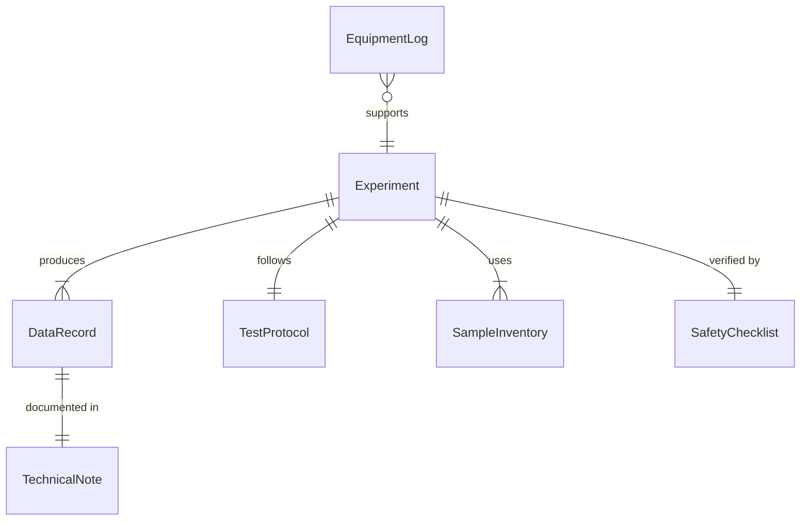
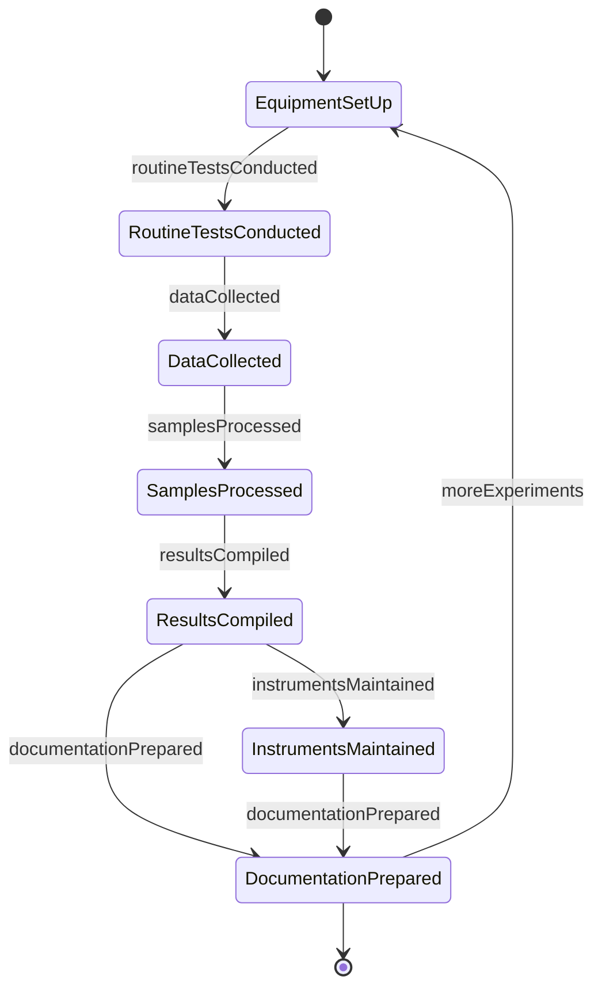
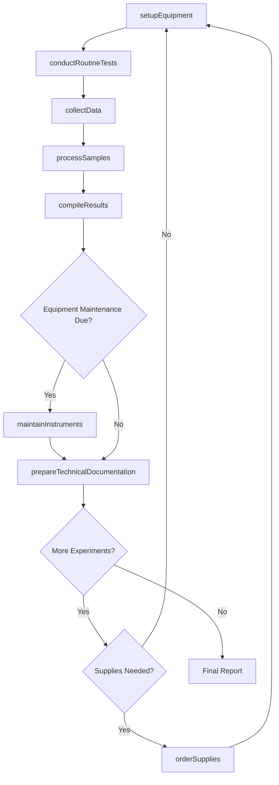
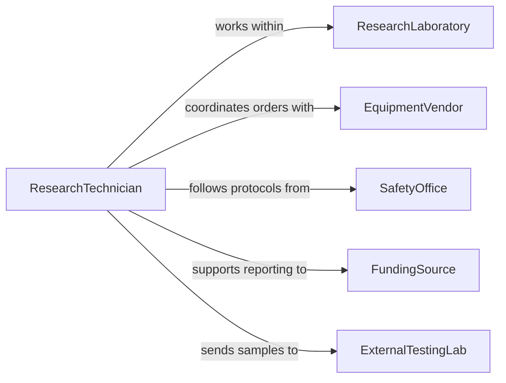

# Assist Engineers or Scientists with Research

> Business-as-Code definition for assisting engineers or scientists with research. Models the technical support process where research technicians, laboratory assistants, and junior professionals help engineers and scientists conduct experiments, collect measurements, maintain equipment, process data, and prepare technical documentation.

## Overview

Assisting engineers or scientists with research involves setting up laboratory or field equipment, collecting and recording experimental data, performing routine tests, maintaining research instruments, processing samples, and helping prepare technical reports and presentations. This definition covers laboratory research support, field data collection, prototype testing assistance, and computational analysis support, enabling research teams to operate efficiently by distributing technical tasks across support personnel.

## Actors

| Actor | Description |
|-------|-------------|
| ResearchLaboratory | The facility where experiments and analyses are conducted |
| EquipmentVendor | Suppliers of research instruments, consumables, and calibration services |
| SafetyOffice | Oversees laboratory safety protocols and compliance |
| FundingSource | Organizations providing grants or contracts for the research |
| ExternalTestingLab | Third-party facilities used for specialized analyses |

## Roles

| Role | Description |
|------|-------------|
| PrincipalEngineer | Leads the engineering research and directs assistant tasks |
| ResearchScientist | Designs experiments and interprets scientific results |
| ResearchTechnician | Performs hands-on laboratory and field work under direction |
| LaboratoryManager | Oversees lab operations, equipment maintenance, and safety |

## Entities

| Entity | Description |
|--------|-------------|
| Experiment | A structured investigation with defined variables and procedures |
| DataRecord | Measurements, observations, and readings from research activities |
| SampleInventory | A catalog of specimens or materials used in research |
| EquipmentLog | Records of instrument usage, calibration, and maintenance |
| TechnicalNote | Documentation of methods, observations, or preliminary findings |
| TestProtocol | A standardized procedure for conducting a specific research task |
| SafetyChecklist | A verification record ensuring proper safety measures are in place |

## Actions

| Action | Description |
|--------|-------------|
| setupEquipment | Prepare and calibrate instruments for experimental use |
| collectData | Record measurements and observations during experiments |
| processSamples | Prepare, catalog, and analyze research specimens |
| maintainInstruments | Perform routine maintenance and calibration on research equipment |
| compileResults | Organize raw data into structured formats for analysis |
| prepareTechnicalDocumentation | Draft lab notes, data summaries, and technical reports |
| conductRoutineTests | Perform standardized tests as part of ongoing research |
| orderSupplies | Procure consumables, reagents, and equipment needed for research |

## Events

| Event | Description |
|-------|-------------|
| equipmentSetUp | Instruments have been prepared and calibrated for use |
| dataCollected | Measurements and observations have been recorded |
| samplesProcessed | Research specimens have been prepared and cataloged |
| instrumentsMaintained | Equipment has been serviced and recalibrated |
| resultsCompiled | Raw data has been organized for analysis |
| documentationPrepared | Technical notes and reports have been drafted |
| routineTestsConducted | Standardized tests have been completed |

## Searches

| Search | Description |
|--------|-------------|
| findExperiments | List experiments by project, researcher, or status |
| getDataRecords | Retrieve measurement data by experiment or date range |
| findSamples | Locate specimens by type, project, or storage location |
| getEquipmentLogs | Find maintenance and calibration records by instrument |
| getProtocols | Retrieve test protocols by method or research area |

## Entity Relationships



## State Diagram



## Workflow



## Actor Relationships



## Usage

### Calling Actions

```typescript
import { assistEngineersScientistsResearch } from '@headlessly/assist-engineers-scientists-research'

const labAssist = assistEngineersScientistsResearch()

// Set up equipment for a materials testing experiment
await labAssist.setupEquipment({
  experiment: 'tensile-strength-composite-2026',
  instruments: [
    { name: 'Universal Testing Machine', calibration: 'verified', range: '0-100kN' },
    { name: 'Strain Gauge System', calibration: 'verified', sensitivity: '0.01mm' }
  ],
  safetyChecklist: 'mechanical-testing-safety-v3'
})

// Collect data during testing
await labAssist.collectData({
  experiment: 'tensile-strength-composite-2026',
  samples: 24,
  measurements: ['load-at-yield', 'elongation-at-break', 'elastic-modulus'],
  recordingMethod: 'automated-data-acquisition'
})

// Compile results for the lead engineer
await labAssist.compileResults({
  experiment: 'tensile-strength-composite-2026',
  format: 'structured-csv',
  summary: true,
  statisticalAnalysis: ['mean', 'standard-deviation', 'confidence-interval']
})
```

### Event-Driven Automation

```typescript
// Alert researcher when data collection completes
labAssist.dataCollected(async ({ experiment, samples }) => {
  await notify({
    to: 'principal-engineer',
    message: `Data collection complete for ${experiment}: ${samples} samples tested`
  })
})

// Schedule maintenance when equipment thresholds are reached
labAssist.routineTestsConducted(async ({ instrument, usageCount }) => {
  if (usageCount % 100 === 0) {
    await labAssist.maintainInstruments({ instrument, type: 'scheduled-calibration' })
  }
})
```
