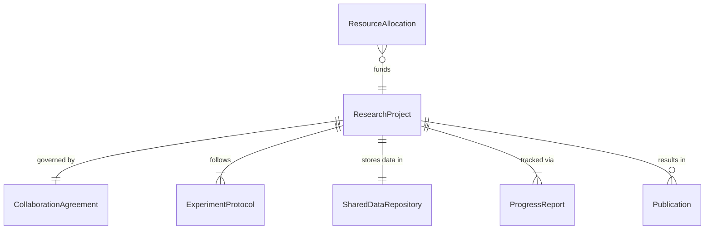
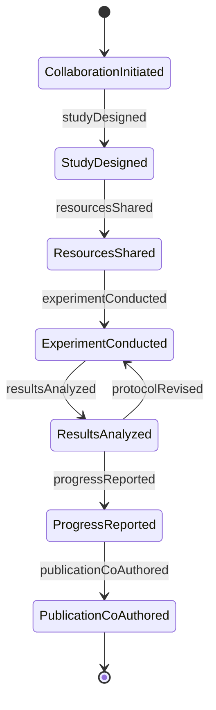
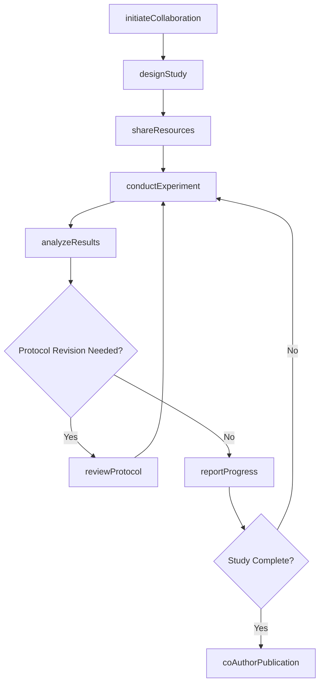
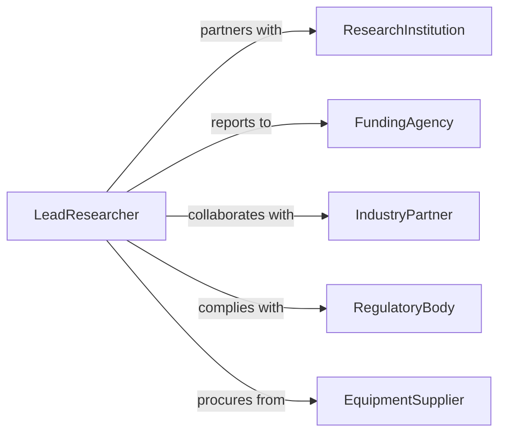

# Collaborate on Research Activities with Scientists or Technical Specialists

> Business-as-Code definition for collaborating on research activities with scientists or technical specialists. Models the interdisciplinary collaboration process where professionals work alongside researchers to design studies, collect data, analyze results, and co-develop findings across scientific and technical domains.

## Overview

Collaborating on research activities with scientists or technical specialists involves coordinating research design, sharing technical expertise, jointly conducting experiments or field work, co-analyzing data, and contributing to shared publications and reports. This definition covers laboratory research partnerships, field study collaborations, cross-functional R&D projects, and multi-institutional research consortia, enabling teams to pool specialized knowledge and resources for more effective scientific investigation.

## Actors

| Actor | Description |
|-------|-------------|
| ResearchInstitution | Universities or labs that host or participate in collaborative research |
| FundingAgency | Organizations providing grants or contracts for the research |
| IndustryPartner | Companies contributing resources, data, or expertise to research |
| RegulatoryBody | Agencies whose requirements shape research protocols |
| EquipmentSupplier | Providers of specialized instruments needed for research activities |

## Roles

| Role | Description |
|------|-------------|
| LeadResearcher | Directs the overall research agenda and collaboration framework |
| TechnicalSpecialist | Contributes domain-specific expertise to the research effort |
| ResearchCoordinator | Manages logistics, scheduling, and communication across collaborators |
| DataScientist | Performs statistical analysis and data interpretation for the team |

## Entities

| Entity | Description |
|--------|-------------|
| ResearchProject | A defined investigation with scope, timeline, and objectives |
| CollaborationAgreement | A formal arrangement defining roles, IP rights, and data sharing |
| ExperimentProtocol | A standardized procedure for conducting research activities |
| SharedDataRepository | A common storage system for research data accessible to all collaborators |
| ProgressReport | A periodic update on research milestones and findings |
| Publication | A co-authored paper or report resulting from the collaboration |
| ResourceAllocation | Assignment of personnel, equipment, or funding to research tasks |

## Actions

| Action | Description |
|--------|-------------|
| initiateCollaboration | Establish a research partnership with scientists or specialists |
| designStudy | Co-develop the research methodology and experimental approach |
| shareResources | Provide equipment, data, or expertise to collaboration partners |
| conductExperiment | Jointly perform research activities according to agreed protocols |
| analyzeResults | Collaboratively interpret data and draw conclusions |
| reportProgress | Communicate research milestones and interim findings to stakeholders |
| coAuthorPublication | Jointly prepare a paper or report documenting research outcomes |
| reviewProtocol | Evaluate and refine experimental methods based on interim results |

## Events

| Event | Description |
|-------|-------------|
| collaborationInitiated | A research partnership has been formally established |
| studyDesigned | The research methodology has been co-developed and approved |
| resourcesShared | Equipment, data, or expertise has been provided to partners |
| experimentConducted | Research activities have been performed according to protocol |
| resultsAnalyzed | Data has been interpreted and conclusions drawn |
| progressReported | Research milestones have been communicated to stakeholders |
| publicationCoAuthored | A joint paper or report has been prepared |

## Searches

| Search | Description |
|--------|-------------|
| findProjects | List research projects by topic, collaborator, or status |
| getAgreements | Retrieve collaboration agreements by partner or project |
| findProtocols | Locate experiment protocols by research area or method |
| getPublications | Find co-authored publications by project or author |
| getProgress | Retrieve progress reports by project or reporting period |

## Entity Relationships



## State Diagram



## Workflow



## Actor Relationships



## Usage

### Calling Actions

```typescript
import { collaborateResearchActivitiesScientistsTechnical } from '@headlessly/collaborate-research-activities-scientists-technical'

const research = collaborateResearchActivitiesScientistsTechnical()

// Initiate a new collaboration
const project = await research.initiateCollaboration({
  title: 'Advanced Battery Electrolyte Characterization',
  partners: ['MIT Materials Lab', 'Argonne National Laboratory'],
  duration: { months: 18 },
  fundingSource: 'DOE-ARPA-E',
  ipArrangement: 'joint-ownership'
})

// Design the study together
await research.designStudy({
  projectId: project.id,
  methodology: 'electrochemical-impedance-spectroscopy',
  sampleSize: 240,
  variables: ['electrolyte-composition', 'temperature', 'cycling-rate'],
  responsibilities: [
    { partner: 'MIT Materials Lab', task: 'sample-synthesis' },
    { partner: 'Argonne National Laboratory', task: 'spectroscopic-analysis' }
  ]
})

// Report progress to funder
await research.reportProgress({
  projectId: project.id,
  period: 'Q1-2026',
  milestones: [
    { milestone: 'sample-preparation', status: 'complete' },
    { milestone: 'initial-characterization', status: 'in-progress', completion: 65 }
  ]
})
```

### Event-Driven Automation

```typescript
// Notify all partners when experiments are completed
research.experimentConducted(async ({ projectId, experiment }) => {
  await notify({
    to: 'collaboration-team',
    message: `Experiment ${experiment} completed - data available for analysis`
  })
})

// Alert funding agency when publications are ready
research.publicationCoAuthored(async ({ projectId, title }) => {
  await notify({
    to: 'funding-agency',
    message: `Publication ready for ${projectId}: ${title}`
  })
})
```
