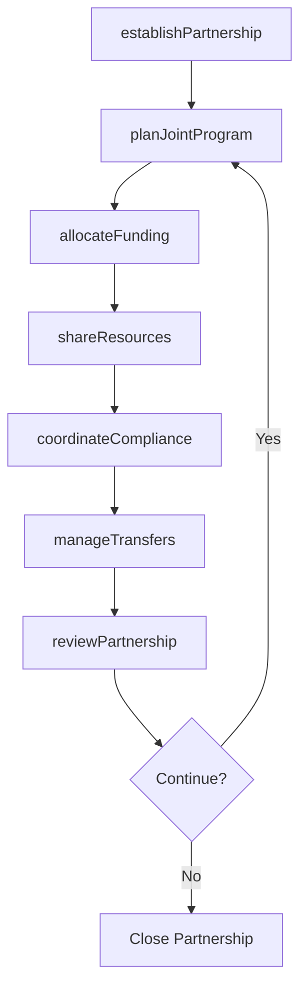
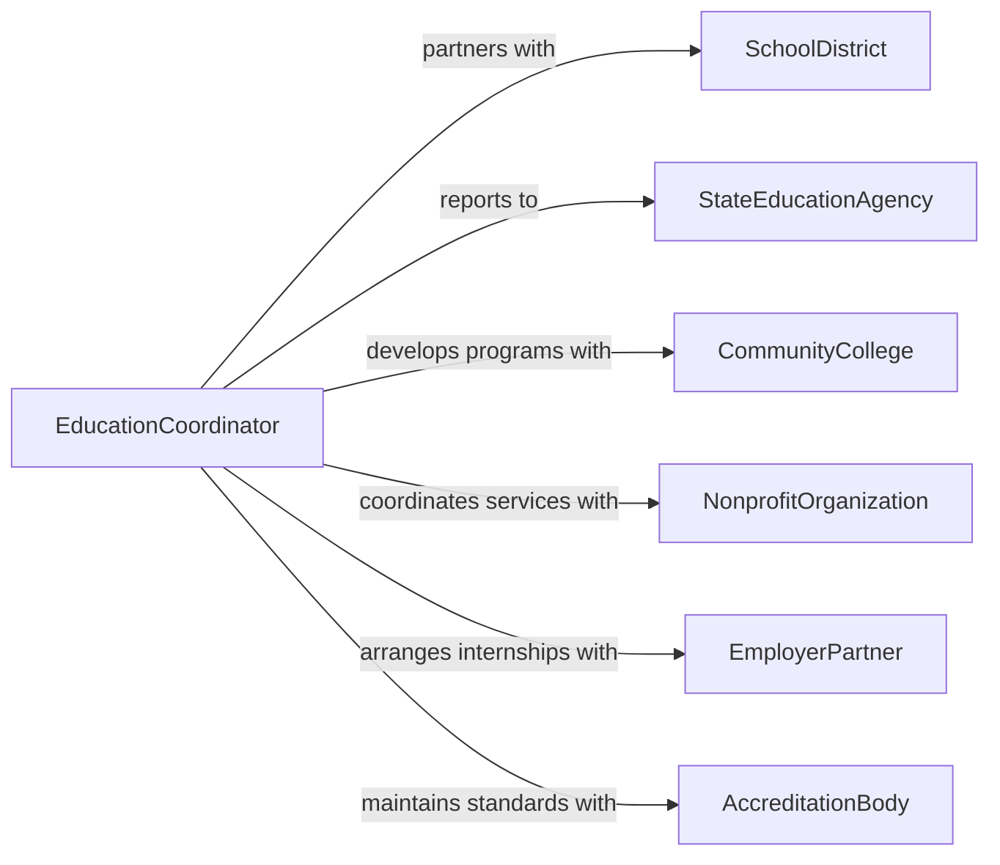

# Collaborate Agencies Institutions Coordinate Education

> Business-as-Code definition for collaborating with other agencies and institutions to coordinate educational matters. Models the inter-organizational communication required to align curricula, share resources, manage student transitions, and coordinate compliance with educational standards.

## Overview

Collaborating with other agencies and institutions to coordinate educational matters involves working across school districts, government agencies, community organizations, and higher education institutions to align programs, share best practices, manage student transfers, and ensure regulatory compliance. This definition covers partnership establishment, joint planning sessions, resource sharing agreements, and coordinated program delivery. It supports activities ranging from K-12 district coordination to workforce development partnerships with community colleges and state agencies.

## Actors

| Actor | Description |
|-------|-------------|
| SchoolDistrict | A local educational authority managing K-12 schools |
| StateEducationAgency | The government body overseeing educational standards and funding |
| CommunityCollege | A post-secondary institution offering vocational and transfer programs |
| NonprofitOrganization | A community group providing supplemental educational services |
| EmployerPartner | A business contributing to workforce development and internship programs |
| AccreditationBody | An organization that evaluates and certifies educational program quality |

## Roles

| Role | Description |
|------|-------------|
| EducationCoordinator | Facilitates inter-agency communication and joint planning |
| CurriculumSpecialist | Aligns course content and standards across partnering institutions |
| GrantManager | Oversees funding agreements and compliance reporting for joint programs |
| ProgramDirector | Manages the delivery of a specific collaborative educational program |

## Entities

| Entity | Description |
|--------|-------------|
| PartnershipAgreement | A formal document outlining roles, responsibilities, and shared goals |
| JointProgram | An educational offering co-delivered by multiple institutions |
| ResourceSharingPlan | An agreement for sharing facilities, staff, or materials |
| ComplianceReport | A document verifying adherence to educational standards and regulations |
| StudentTransferRecord | Documentation supporting a student's transition between institutions |
| FundingAllocation | The distribution of grant or budget funds across partner organizations |

## Actions

| Action | Description |
|--------|-------------|
| establishPartnership | Formalize a collaboration agreement with another agency or institution |
| planJointProgram | Develop the structure, curriculum, and delivery plan for a shared program |
| shareResources | Arrange for the exchange of facilities, staff, or instructional materials |
| coordinateCompliance | Align reporting and standards across partnering organizations |
| manageTransfers | Process student transitions between collaborating institutions |
| reviewPartnership | Evaluate the effectiveness and outcomes of the collaboration |
| allocateFunding | Distribute grant or budget resources among partner organizations |

## Events

| Event | Description |
|-------|-------------|
| partnershipEstablished | A formal collaboration agreement has been signed |
| jointProgramPlanned | The structure and delivery plan for a shared program has been created |
| resourcesShared | Facilities, staff, or materials have been exchanged between partners |
| complianceCoordinated | Reporting and standards have been aligned across organizations |
| transferManaged | A student transition between institutions has been processed |
| partnershipReviewed | The collaboration has been evaluated for effectiveness |
| fundingAllocated | Grant or budget resources have been distributed to partners |

## Searches

| Search | Description |
|--------|-------------|
| findActivePartnerships | List current collaboration agreements by agency or program type |
| getJointPrograms | Retrieve shared educational programs by subject area or institution |
| getComplianceStatus | Check reporting and standards adherence across partner organizations |
| getTransferRecords | Look up student transition records between collaborating institutions |

## Workflow



## Actor Relationships



## Usage

### Calling Actions

```typescript
import { collaborateAgenciesInstitutionsCoordinateEducational } from '@headlessly/collaborate-agencies-institutions-coordinate-educational'

const education = collaborateAgenciesInstitutionsCoordinateEducational()

// Establish a partnership with a community college
const partnership = await education.establishPartnership({
  partner: 'Riverdale Community College',
  type: 'dual-enrollment',
  startDate: '2026-08-01',
  goals: ['Increase college readiness by 20%', 'Offer 10 dual-enrollment courses'],
  signatories: ['superintendent', 'college-president']
})

// Plan a joint STEM program
await education.planJointProgram({
  partnershipId: partnership.id,
  name: 'Advanced Manufacturing Pathway',
  courses: ['intro-to-cad', 'cnc-machining', 'quality-assurance'],
  deliveryModel: 'students-attend-college-campus',
  startSemester: 'Fall 2026'
})

// Allocate grant funding
await education.allocateFunding({
  partnershipId: partnership.id,
  grantId: 'PERKINS-2026-0044',
  allocations: [
    { partner: 'school-district', amount: 75000, purpose: 'transportation-and-supplies' },
    { partner: 'community-college', amount: 125000, purpose: 'lab-equipment-and-instruction' }
  ]
})
```

### Event-Driven Automation

```typescript
// Notify state agency when a new partnership is established
education.partnershipEstablished(async ({ partnershipId, partner, type }) => {
  await notify({
    to: 'state-education-agency',
    message: `New ${type} partnership established with ${partner}`
  })
})

// Auto-generate compliance reports at end of term
education.complianceCoordinated(async ({ partnershipId, reportingPeriod }) => {
  await generateReport({
    type: 'partnership-compliance',
    partnershipId,
    period: reportingPeriod,
    sendTo: ['state-education-agency', 'accreditation-body']
  })
})
```
