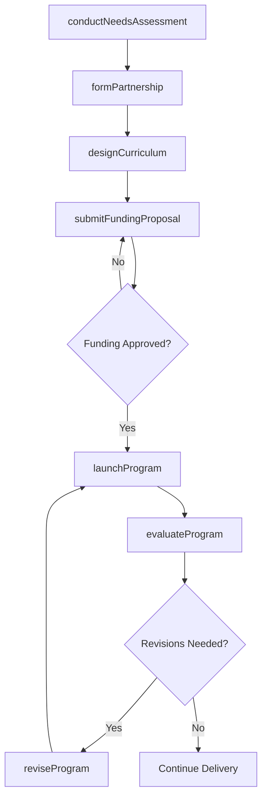
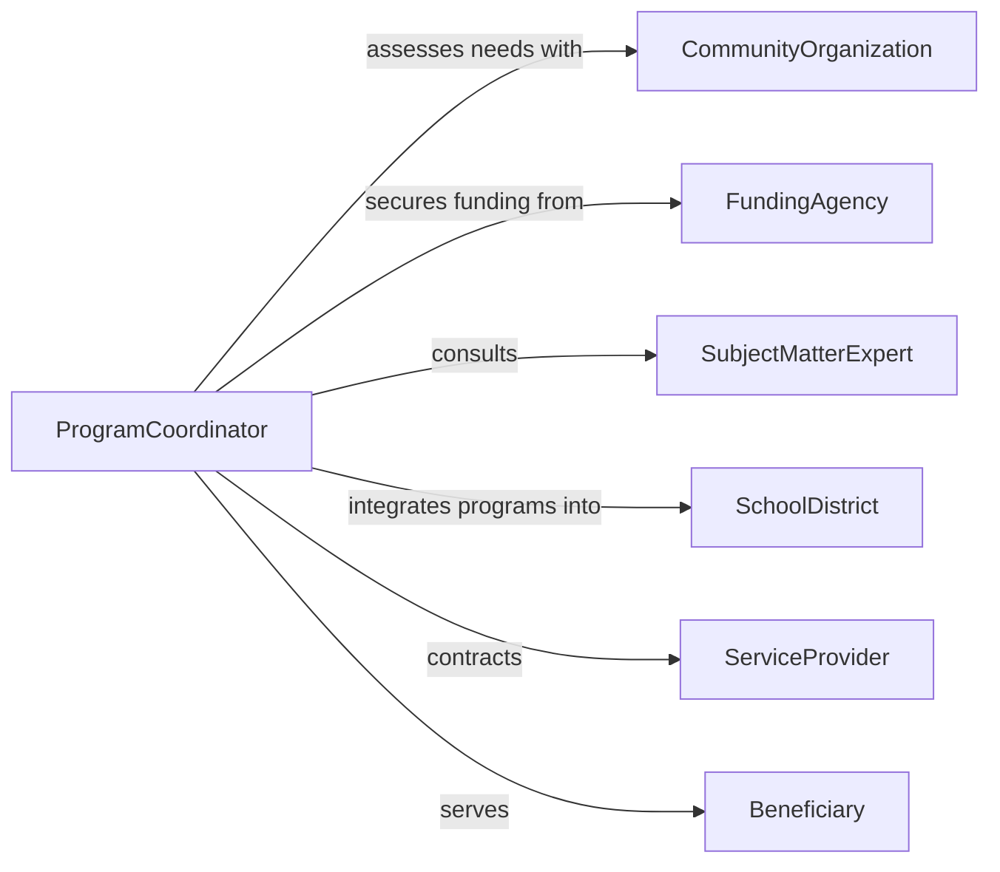

# Collaborate Professionals Develop Education Assistance

> Business-as-Code definition for cross-professional collaboration on education and assistance programs. Models the lifecycle of identifying needs, convening stakeholders, designing curricula, and launching support programs.

## Overview

Collaborating with other professionals to develop education or assistance programs involves partnering across disciplines such as social work, healthcare, workforce development, and community outreach to design and deliver training, tutoring, counseling, or public assistance initiatives. This definition exposes actions for stakeholder engagement, program design, resource coordination, and launch activities.

## Actors

| Actor | Description |
|-------|-------------|
| CommunityOrganization | Nonprofit or civic group that identifies local education and assistance needs |
| FundingAgency | Government or philanthropic body that provides grants and financial support |
| SubjectMatterExpert | Domain specialist contributing expertise to curriculum or program design |
| SchoolDistrict | Public education authority that integrates programs into school systems |
| ServiceProvider | External vendor delivering training materials, technology, or logistics |
| Beneficiary | Individual or group receiving education or assistance services |

## Roles

| Role | Description |
|------|-------------|
| ProgramCoordinator | Leads cross-professional collaboration and manages timelines |
| CurriculumDesigner | Develops educational content, learning objectives, and assessments |
| OutreachSpecialist | Recruits participants and communicates program availability |
| EvaluationAnalyst | Measures program effectiveness and recommends improvements |

## Entities

| Entity | Description |
|--------|-------------|
| Program | A structured education or assistance initiative with defined goals |
| Curriculum | The instructional content, schedule, and learning objectives |
| NeedsAssessment | A study identifying gaps in education or assistance services |
| Partnership | A formal agreement between collaborating professionals or organizations |
| FundingProposal | A request for financial resources to support the program |
| EvaluationReport | A document assessing program outcomes against objectives |

## Actions

| Action | Description |
|--------|-------------|
| conductNeedsAssessment | Survey target populations to identify education or assistance gaps |
| formPartnership | Establish formal collaboration agreements with other professionals |
| designCurriculum | Develop instructional content and learning frameworks |
| submitFundingProposal | Prepare and submit grant applications or budget requests |
| launchProgram | Begin delivery of education or assistance services |
| evaluateProgram | Assess program outcomes and participant satisfaction |
| reviseProgram | Update program components based on evaluation findings |

## Events

| Event | Description |
|-------|-------------|
| needsAssessmentCompleted | A community or population needs study has been finalized |
| partnershipFormed | A collaboration agreement has been signed by all parties |
| curriculumDesigned | Educational content and structure have been approved |
| fundingApproved | Financial resources have been secured for the program |
| programLaunched | Education or assistance services have begun delivery |
| programEvaluated | Outcome assessment has been completed |
| programRevised | Program content or structure has been updated |

## Searches

| Search | Description |
|--------|-------------|
| findPrograms | List programs by type, status, region, or target population |
| getPartners | Retrieve collaborating professionals and organizations for a program |
| getNeedsAssessments | Find needs assessments by community, date, or gap area |
| getEvaluationReports | Retrieve evaluation reports by program, period, or outcome metric |

## Workflow



## Actor Relationships



## Usage

### Calling Actions

```typescript
import { collaborateProfessionalsDevelopEducationAssistance } from '@headlessly/collaborate-professionals-develop-education-assistance'

const programs = collaborateProfessionalsDevelopEducationAssistance()

// Conduct a needs assessment for workforce training
const assessment = await programs.conductNeedsAssessment({
  community: 'Metro County',
  targetPopulation: 'Unemployed adults 25-45',
  focusAreas: ['digital literacy', 'job readiness', 'financial planning']
})

// Form a partnership with local organizations
await programs.formPartnership({
  assessmentId: assessment.id,
  partners: [
    { name: 'County Workforce Board', role: 'funding and referrals' },
    { name: 'Community College District', role: 'classroom space and instructors' }
  ]
})

// Design the curriculum
await programs.designCurriculum({
  assessmentId: assessment.id,
  modules: ['Computer Basics', 'Resume Writing', 'Interview Skills'],
  durationWeeks: 8
})
```

### Event-Driven Automation

```typescript
// Notify partners when funding is approved
programs.fundingApproved(async ({ programId, amount }) => {
  await notify({
    to: 'program-partners',
    message: `Funding of $${amount} approved for program ${programId}. Ready to launch.`
  })
})

// Schedule evaluation after program launch
programs.programLaunched(async ({ programId, startDate }) => {
  await scheduleTask({
    action: 'evaluateProgram',
    programId,
    dueDate: addWeeks(startDate, 12)
  })
})
```
