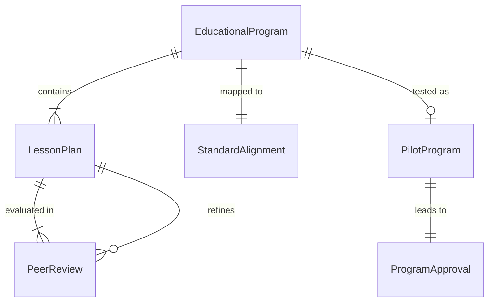
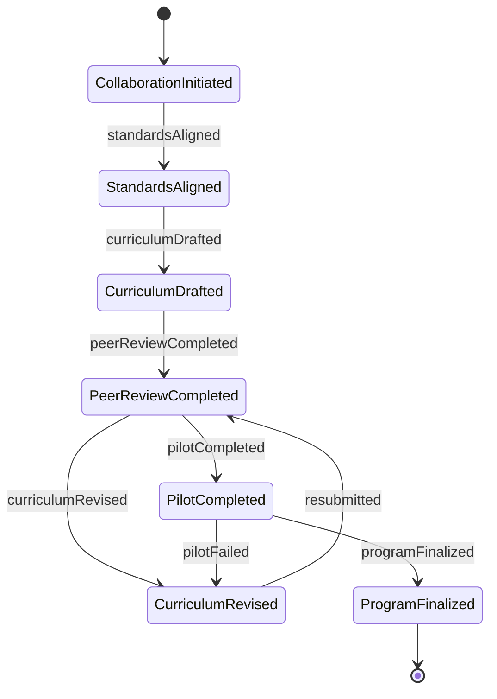
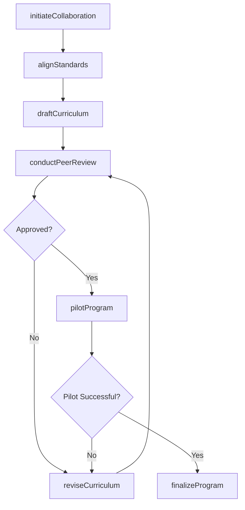
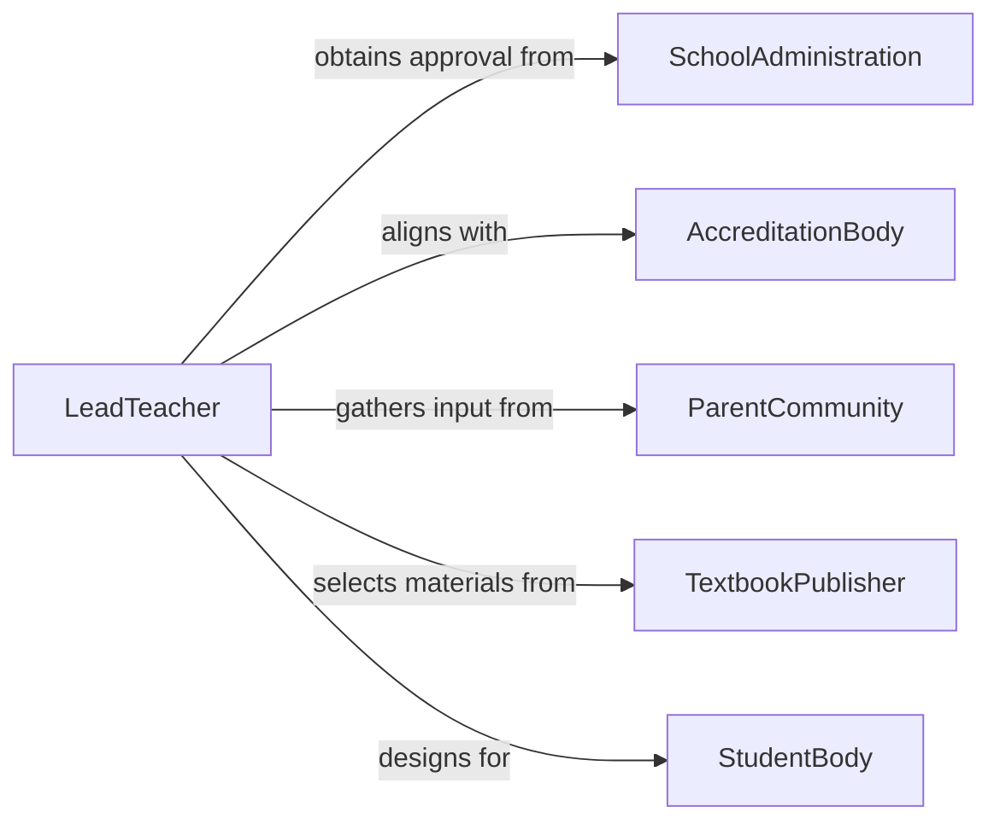

# Collaborate Teaching Professionals Develop Educational

> Business-as-Code definition for teacher-to-teacher collaboration on educational program development. Models the process of co-planning curricula, aligning standards, peer reviewing content, and piloting new instructional programs.

## Overview

Collaborating with other teaching professionals to develop educational programs involves working with fellow educators, instructional coaches, and academic departments to design, review, and refine courses, lesson sequences, and academic initiatives. This definition covers collaborative planning sessions, curriculum alignment, content authoring, peer review, and program piloting.

## Actors

| Actor | Description |
|-------|-------------|
| SchoolAdministration | Principals and academic deans who approve and fund educational programs |
| AccreditationBody | External organization that sets academic standards and requirements |
| ParentCommunity | Parents and guardians providing input on educational priorities |
| TextbookPublisher | Publishers providing instructional materials and digital content |
| StudentBody | Learners whose needs and feedback shape program design |

## Roles

| Role | Description |
|------|-------------|
| LeadTeacher | Coordinates cross-teacher collaboration and maintains program vision |
| InstructionalCoach | Provides pedagogical guidance and supports teachers in content design |
| DepartmentChair | Ensures alignment with departmental standards and graduation requirements |
| ContentAuthor | Writes lesson plans, assessments, and instructional materials |
| PeerReviewer | Evaluates proposed curricula for rigor, clarity, and alignment |

## Entities

| Entity | Description |
|--------|-------------|
| EducationalProgram | A structured set of courses or learning experiences with defined outcomes |
| LessonPlan | A detailed instructional plan for a single class session or unit |
| StandardAlignment | A mapping between program content and academic standards |
| PeerReview | A formal evaluation of proposed curriculum by fellow educators |
| PilotProgram | A trial run of a new educational program with a limited cohort |
| ProgramApproval | Formal authorization to implement a new or revised program |

## Actions

| Action | Description |
|--------|-------------|
| initiateCollaboration | Convene teaching professionals to begin program development |
| alignStandards | Map proposed content to required academic and accreditation standards |
| draftCurriculum | Create initial lesson plans, units, and assessments |
| conductPeerReview | Submit curriculum drafts for evaluation by fellow educators |
| reviseCurriculum | Update content based on peer review feedback |
| pilotProgram | Launch a trial implementation with a selected cohort |
| finalizeProgram | Approve and formalize the program for full-scale delivery |

## Events

| Event | Description |
|-------|-------------|
| collaborationInitiated | Teaching professionals have convened to begin program planning |
| standardsAligned | Curriculum content has been mapped to academic standards |
| curriculumDrafted | Initial lesson plans and assessments have been created |
| peerReviewCompleted | Fellow educators have submitted their evaluation of the curriculum |
| curriculumRevised | Content has been updated based on peer review feedback |
| pilotCompleted | Trial implementation has concluded with results collected |
| programFinalized | The educational program has been approved for full delivery |

## Searches

| Search | Description |
|--------|-------------|
| findPrograms | List educational programs by subject, grade level, or status |
| getCollaborators | Retrieve teaching professionals involved in a program |
| getPeerReviews | Find peer reviews by program, reviewer, or outcome |
| getPilotResults | Retrieve pilot program outcomes and participant feedback |

## Entity Relationships



## State Diagram



## Workflow



## Actor Relationships



## Usage

### Calling Actions

```typescript
import { collaborateTeachingProfessionalsDevelopEducational } from '@headlessly/collaborate-teaching-professionals-develop-educational'

const edu = collaborateTeachingProfessionalsDevelopEducational()

// Initiate a collaborative program for AP Biology
const collab = await edu.initiateCollaboration({
  subject: 'AP Biology',
  gradeLevel: '11-12',
  participants: ['Dr. Martinez', 'Ms. Chen', 'Mr. Okafor'],
  objective: 'Redesign lab-based curriculum for Next Generation Science Standards'
})

// Draft the curriculum
await edu.draftCurriculum({
  collaborationId: collab.id,
  units: [
    { title: 'Molecular Biology', weeks: 4, labs: 3 },
    { title: 'Ecology and Evolution', weeks: 5, labs: 4 },
    { title: 'Human Systems', weeks: 3, labs: 2 }
  ]
})

// Submit for peer review
await edu.conductPeerReview({
  collaborationId: collab.id,
  reviewers: ['Dr. Patel', 'Ms. Thompson'],
  deadline: '2026-03-15'
})
```

### Event-Driven Automation

```typescript
// Notify lead teacher when peer review is complete
edu.peerReviewCompleted(async ({ collaborationId, reviewerId, verdict }) => {
  await notify({
    to: 'lead-teacher',
    message: `Peer review submitted by ${reviewerId}: ${verdict}`
  })
})

// Schedule full rollout after successful pilot
edu.pilotCompleted(async ({ programId, successRate }) => {
  if (successRate >= 0.80) {
    await edu.finalizeProgram({ programId })
  }
})
```
