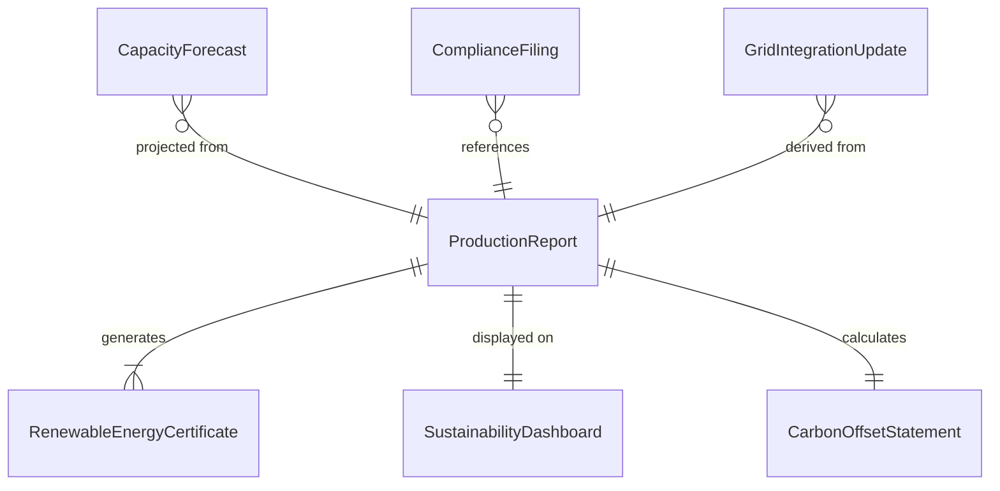
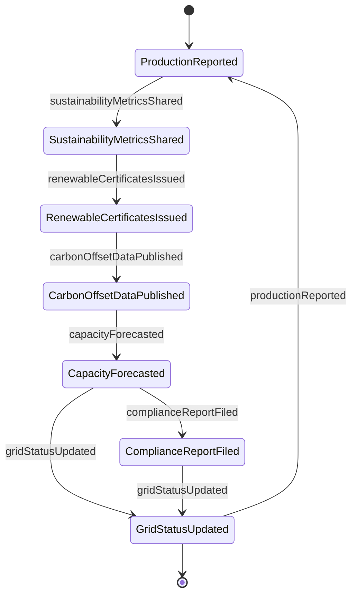
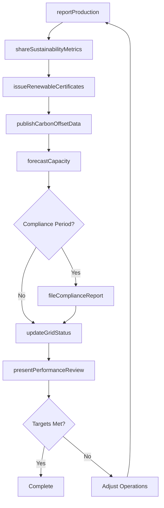
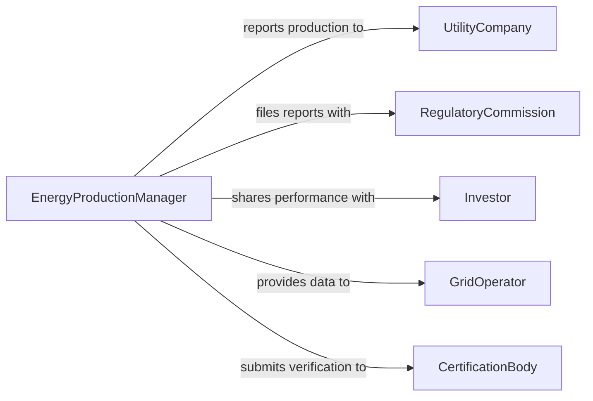

# Communicate Green Energy Production Information

> Business-as-Code definition for communicating green energy production information. Models the reporting and dissemination process where energy professionals share renewable energy output data, grid integration metrics, sustainability performance, and clean energy project updates with internal teams, regulators, and external stakeholders.

## Overview

Communicating green energy production information involves reporting renewable energy output metrics, sharing grid integration data, presenting sustainability performance against targets, and disseminating clean energy project status updates. This definition covers solar and wind farm production reports, renewable energy certificate documentation, carbon offset communications, and utility interconnection status updates, enabling energy organizations to maintain transparency about green energy operations and demonstrate progress toward sustainability commitments.

## Actors

| Actor | Description |
|-------|-------------|
| UtilityCompany | Receives and integrates green energy production data |
| RegulatoryCommission | Requires periodic renewable energy production reporting |
| Investor | Evaluates green energy production performance for investment decisions |
| GridOperator | Manages electricity grid and requires real-time production data |
| CertificationBody | Issues renewable energy certificates based on verified production |

## Roles

| Role | Description |
|------|-------------|
| EnergyProductionManager | Oversees renewable energy output and reporting |
| SustainabilityAnalyst | Analyzes green energy metrics and prepares performance reports |
| GridIntegrationEngineer | Communicates production data to grid operators |
| RegulatoryAffairsSpecialist | Ensures production reports meet regulatory requirements |

## Entities

| Entity | Description |
|--------|-------------|
| ProductionReport | A summary of renewable energy output for a given period |
| RenewableEnergyCertificate | A tradeable certificate representing verified clean energy generation |
| GridIntegrationUpdate | Real-time or periodic data shared with grid operators |
| SustainabilityDashboard | A visual display of green energy performance metrics |
| CarbonOffsetStatement | A report of carbon emissions avoided through green energy production |
| CapacityForecast | A projection of expected green energy output |
| ComplianceFiling | A regulatory submission documenting renewable energy production |

## Actions

| Action | Description |
|--------|-------------|
| reportProduction | Submit renewable energy output data for a reporting period |
| shareSustainabilityMetrics | Distribute green energy performance indicators to stakeholders |
| updateGridStatus | Communicate real-time production data to grid operators |
| issueRenewableCertificates | Generate certificates for verified green energy production |
| publishCarbonOffsetData | Report carbon emissions avoided through clean energy generation |
| forecastCapacity | Project expected green energy output for upcoming periods |
| fileComplianceReport | Submit regulatory filings documenting renewable production |
| presentPerformanceReview | Deliver periodic green energy performance summaries to leadership |

## Events

| Event | Description |
|-------|-------------|
| productionReported | Renewable energy output data has been submitted |
| sustainabilityMetricsShared | Green energy performance indicators have been distributed |
| gridStatusUpdated | Real-time production data has been communicated to grid operators |
| renewableCertificatesIssued | Certificates for verified production have been generated |
| carbonOffsetDataPublished | Avoided emissions data has been reported |
| capacityForecasted | Expected green energy output has been projected |
| complianceReportFiled | Regulatory production filings have been submitted |

## Searches

| Search | Description |
|--------|-------------|
| findReports | List production reports by facility, period, or energy type |
| getCertificates | Retrieve renewable energy certificates by date or facility |
| getForecasts | Find capacity projections by facility or energy source |
| findFilings | Locate compliance filings by regulatory body or period |
| getMetrics | Retrieve sustainability performance data by metric or period |

## Entity Relationships



## State Diagram



## Workflow



## Actor Relationships



## Usage

### Calling Actions

```typescript
import { communicateGreenEnergyProductionInformation } from '@headlessly/communicate-green-energy-production-information'

const greenEnergy = communicateGreenEnergyProductionInformation()

// Report monthly production
await greenEnergy.reportProduction({
  facility: 'Clearwater Solar Farm',
  period: { month: '2026-01', year: 2026 },
  output: { value: 12450, unit: 'MWh' },
  capacityFactor: 0.22,
  energyType: 'solar-photovoltaic'
})

// Issue renewable energy certificates
await greenEnergy.issueRenewableCertificates({
  facility: 'Clearwater Solar Farm',
  production: { value: 12450, unit: 'MWh' },
  certificateType: 'REC',
  vintage: '2026-01'
})

// File quarterly compliance report
await greenEnergy.fileComplianceReport({
  reportingBody: 'State Energy Commission',
  period: 'Q4-2025',
  facilities: ['Clearwater Solar Farm', 'Highland Wind Array'],
  totalOutput: { value: 45200, unit: 'MWh' },
  renewablePortfolioStandard: { target: 30, actual: 34, unit: 'percent' }
})
```

### Event-Driven Automation

```typescript
// Alert investors when production milestones are reached
greenEnergy.productionReported(async ({ facility, output }) => {
  if (output.value > 10000) {
    await notify({
      to: 'investor-relations',
      message: `${facility} produced ${output.value} ${output.unit} this period`
    })
  }
})

// Auto-file compliance when period ends
greenEnergy.carbonOffsetDataPublished(async ({ facility, period }) => {
  await greenEnergy.fileComplianceReport({ facility, period })
})
```
