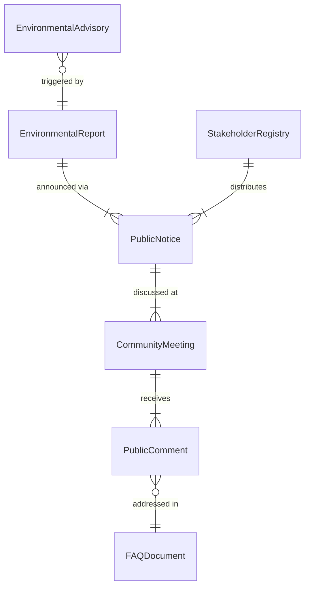
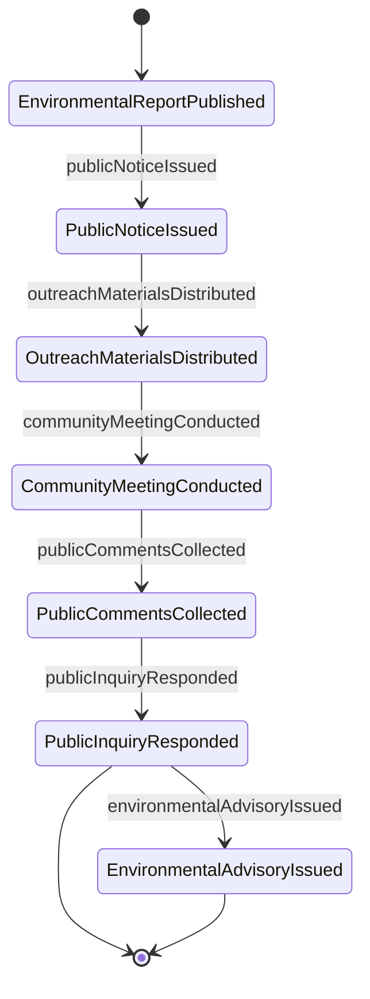
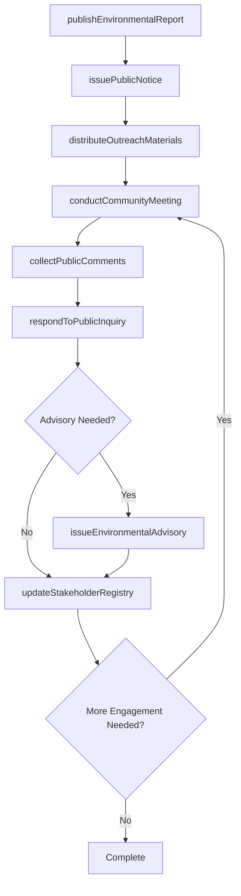
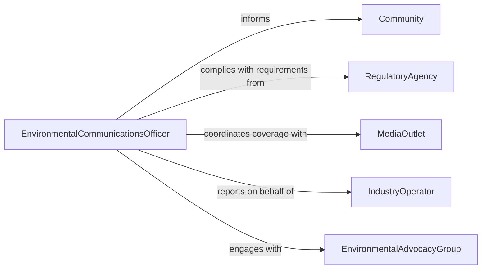

# Communicate with the Public on Environmental Issues

> Business-as-Code definition for communicating with the public on environmental issues. Models the outreach and engagement process where environmental professionals, government agencies, and organizations inform communities about environmental conditions, risks, regulations, and sustainability initiatives.

## Overview

Communicating with the public on environmental issues involves preparing public-facing materials, conducting community meetings, issuing environmental advisories, responding to public inquiries, and managing ongoing stakeholder engagement around environmental topics. This definition covers air and water quality notifications, environmental impact disclosures, hazardous waste advisories, and climate action communications, enabling organizations to maintain transparent public communication about environmental conditions and foster community participation in environmental stewardship.

## Actors

| Actor | Description |
|-------|-------------|
| Community | Residents and community groups affected by environmental conditions |
| RegulatoryAgency | Government bodies that mandate public environmental disclosures |
| MediaOutlet | News organizations that amplify environmental messages to the public |
| IndustryOperator | Businesses whose operations have environmental impacts requiring disclosure |
| EnvironmentalAdvocacyGroup | Organizations that monitor and respond to environmental communications |

## Roles

| Role | Description |
|------|-------------|
| EnvironmentalCommunicationsOfficer | Develops and delivers public environmental messages |
| PublicAffairsSpecialist | Manages community engagement and public meetings |
| EnvironmentalScientist | Provides technical data that informs public communications |
| ComplianceOfficer | Ensures communications meet regulatory disclosure requirements |

## Entities

| Entity | Description |
|--------|-------------|
| PublicNotice | A formal communication to the community about an environmental matter |
| EnvironmentalAdvisory | An alert about environmental conditions affecting public health or safety |
| CommunityMeeting | A scheduled public forum for discussing environmental topics |
| PublicComment | Feedback received from community members on environmental matters |
| EnvironmentalReport | A summary of environmental data prepared for public consumption |
| StakeholderRegistry | A list of individuals and groups to receive environmental communications |
| FAQDocument | Frequently asked questions and answers about an environmental issue |

## Actions

| Action | Description |
|--------|-------------|
| issuePublicNotice | Release a formal environmental communication to the community |
| conductCommunityMeeting | Host a public forum to discuss environmental conditions or plans |
| publishEnvironmentalReport | Make environmental data and findings available to the public |
| respondToPublicInquiry | Answer questions from community members about environmental issues |
| issueEnvironmentalAdvisory | Alert the public about environmental conditions requiring awareness |
| collectPublicComments | Gather community feedback on environmental proposals or conditions |
| updateStakeholderRegistry | Maintain the list of parties receiving environmental communications |
| distributeOutreachMaterials | Disseminate educational content about environmental topics |

## Events

| Event | Description |
|-------|-------------|
| publicNoticeIssued | A formal environmental communication has been released |
| communityMeetingConducted | A public forum on environmental topics has been held |
| environmentalReportPublished | Environmental findings have been made publicly available |
| publicInquiryResponded | A community question has been answered |
| environmentalAdvisoryIssued | A public environmental alert has been released |
| publicCommentsCollected | Community feedback has been gathered |
| outreachMaterialsDistributed | Educational environmental content has been disseminated |

## Searches

| Search | Description |
|--------|-------------|
| findNotices | List public notices by topic, date, or geographic area |
| getMeetings | Retrieve community meeting records by date or topic |
| getPublicComments | Find public feedback by issue, date, or commenter |
| findAdvisories | Locate environmental advisories by condition type or status |
| getReports | Retrieve published environmental reports by topic or period |

## Entity Relationships



## State Diagram



## Workflow



## Actor Relationships



## Usage

### Calling Actions

```typescript
import { communicatePublicEnvironmentalIssues } from '@headlessly/communicate-public-environmental-issues'

const envComm = communicatePublicEnvironmentalIssues()

// Issue a public notice about water quality
await envComm.issuePublicNotice({
  topic: 'Seasonal Water Quality Advisory',
  area: 'Cedar Creek Watershed',
  summary: 'Elevated phosphorus levels detected following agricultural runoff',
  actionRequired: 'Avoid recreational contact with Cedar Creek until further notice',
  channels: ['website', 'email-blast', 'social-media', 'local-newspaper']
})

// Host a community meeting
await envComm.conductCommunityMeeting({
  topic: 'Proposed Remediation Plan for Former Industrial Site',
  date: '2026-03-15',
  location: 'Riverside Community Center',
  format: 'town-hall',
  agenda: ['site-assessment-results', 'remediation-options', 'timeline', 'public-comment-period']
})

// Collect and respond to public comments
await envComm.collectPublicComments({
  issue: 'cedar-creek-remediation-plan',
  period: { start: '2026-03-15', end: '2026-04-15' },
  channels: ['online-portal', 'mail', 'in-person']
})
```

### Event-Driven Automation

```typescript
// Notify media when advisories are issued
envComm.environmentalAdvisoryIssued(async ({ topic, area, severity }) => {
  if (severity === 'high') {
    await notify({
      to: 'media-contacts',
      message: `Environmental advisory issued for ${area}: ${topic}`
    })
  }
})

// Auto-acknowledge public comments
envComm.publicCommentsCollected(async ({ issue, commentCount }) => {
  await notify({
    to: 'public-affairs',
    message: `${commentCount} public comments received on ${issue} - response preparation needed`
  })
})
```
