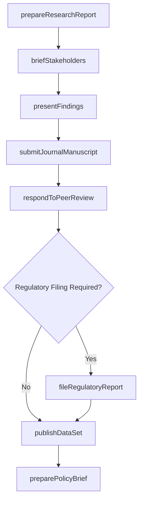
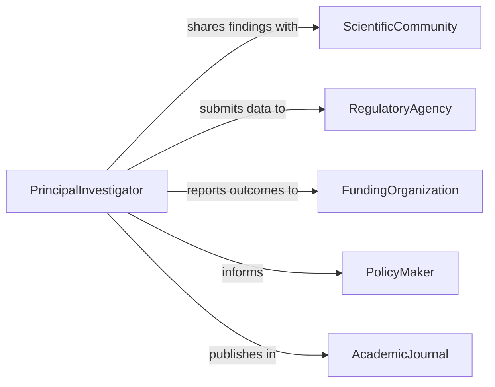

# Communicate Results of Environmental Research

> Business-as-Code definition for communicating results of environmental research. Models the dissemination process where environmental scientists, researchers, and consultants share study findings, field data, and analytical conclusions with colleagues, management, regulatory agencies, and the broader scientific community.

## Overview

Communicating results of environmental research involves preparing scientific reports, presenting findings at conferences, submitting data to regulatory bodies, publishing in peer-reviewed journals, and briefing internal stakeholders on research outcomes. This definition covers ecological survey results, contamination assessments, biodiversity studies, and climate change research findings, enabling research teams to effectively share environmental knowledge and inform evidence-based decision-making across organizational and regulatory contexts.

## Actors

| Actor | Description |
|-------|-------------|
| ScientificCommunity | Peer researchers who review and build upon environmental findings |
| RegulatoryAgency | Government bodies that use research data for policy and enforcement |
| FundingOrganization | Entities that sponsored the research and require outcome reports |
| PolicyMaker | Decision-makers who rely on research findings for environmental policy |
| AcademicJournal | Publications that disseminate peer-reviewed environmental research |

## Roles

| Role | Description |
|------|-------------|
| PrincipalInvestigator | Leads the research effort and oversees findings dissemination |
| ResearchAnalyst | Processes and interprets environmental data for reporting |
| TechnicalWriter | Prepares research reports and publications for various audiences |
| PresentationSpecialist | Develops visual materials for conference and stakeholder presentations |

## Entities

| Entity | Description |
|--------|-------------|
| ResearchReport | A comprehensive document detailing study methodology and findings |
| DataSet | Raw or processed environmental data collected during research |
| ConferencePresentation | A visual and verbal summary of research delivered at a professional event |
| JournalManuscript | A paper submitted for peer review and publication |
| PolicyBrief | A concise summary of research implications for decision-makers |
| TechnicalAppendix | Supplementary data, methods, and analyses supporting the main report |
| ExecutiveSummary | A high-level overview of research findings for non-technical audiences |

## Actions

| Action | Description |
|--------|-------------|
| prepareResearchReport | Compile study methodology, data, and findings into a formal report |
| presentFindings | Deliver research results to an audience at a conference or meeting |
| submitJournalManuscript | Send a research paper to an academic journal for peer review |
| briefStakeholders | Communicate research outcomes to internal leadership or funders |
| publishDataSet | Make research data available to the scientific community or public |
| preparePolicyBrief | Distill research implications into actionable guidance for policy-makers |
| fileRegulatoryReport | Submit research findings to regulatory agencies as required |
| respondToPeerReview | Address reviewer comments and revise research submissions |

## Events

| Event | Description |
|-------|-------------|
| researchReportPrepared | A formal research report has been completed |
| findingsPresented | Research results have been delivered to an audience |
| journalManuscriptSubmitted | A research paper has been sent for peer review |
| stakeholdersBriefed | Research outcomes have been communicated to leadership or funders |
| dataSetPublished | Research data has been made publicly available |
| policyBriefPrepared | An actionable summary for policy-makers has been completed |
| regulatoryReportFiled | Research findings have been submitted to a regulatory agency |

## Searches

| Search | Description |
|--------|-------------|
| findReports | List research reports by topic, author, or date |
| getPresentations | Retrieve conference presentations by event or researcher |
| findManuscripts | Locate journal submissions by topic, status, or journal |
| getDataSets | Find published data sets by study or environmental topic |
| findBriefs | Locate policy briefs by regulatory area or date |

## Workflow



## Actor Relationships



## Usage

### Calling Actions

```typescript
import { communicateResultsEnvironmentalResearch } from '@headlessly/communicate-results-environmental-research'

const envResearch = communicateResultsEnvironmentalResearch()

// Prepare and submit a research report
await envResearch.prepareResearchReport({
  title: 'Microplastic Contamination in Great Lakes Tributaries',
  study: 'GL-MP-2025',
  methodology: 'field-sampling-spectroscopy',
  findings: [
    { metric: 'microplastic-concentration', value: 4.2, unit: 'particles-per-liter', trend: 'increasing' },
    { metric: 'dominant-polymer-type', value: 'polyethylene', percentage: 62 }
  ],
  recommendations: ['enhanced-wastewater-filtration', 'upstream-source-reduction']
})

// Brief stakeholders on results
await envResearch.briefStakeholders({
  study: 'GL-MP-2025',
  audience: ['research-director', 'epa-liaison', 'grant-program-officer'],
  format: 'executive-summary',
  keyFindings: 'Microplastic levels 40% higher than 2020 baseline'
})

// Submit to journal
await envResearch.submitJournalManuscript({
  study: 'GL-MP-2025',
  journal: 'Environmental Science & Technology',
  manuscriptType: 'research-article',
  coAuthors: ['dr-chen', 'dr-martinez', 'dr-okafor']
})
```

### Event-Driven Automation

```typescript
// Notify funders when reports are completed
envResearch.researchReportPrepared(async ({ study, title }) => {
  await notify({
    to: 'funding-organization',
    message: `Research report completed for ${study}: ${title}`
  })
})

// Auto-prepare policy brief after regulatory filing
envResearch.regulatoryReportFiled(async ({ study, agency }) => {
  await envResearch.preparePolicyBrief({ study, targetAudience: 'legislative-staff' })
})
```
