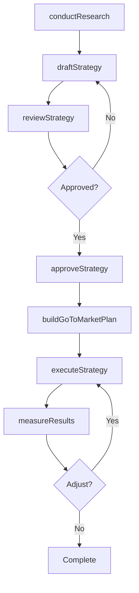
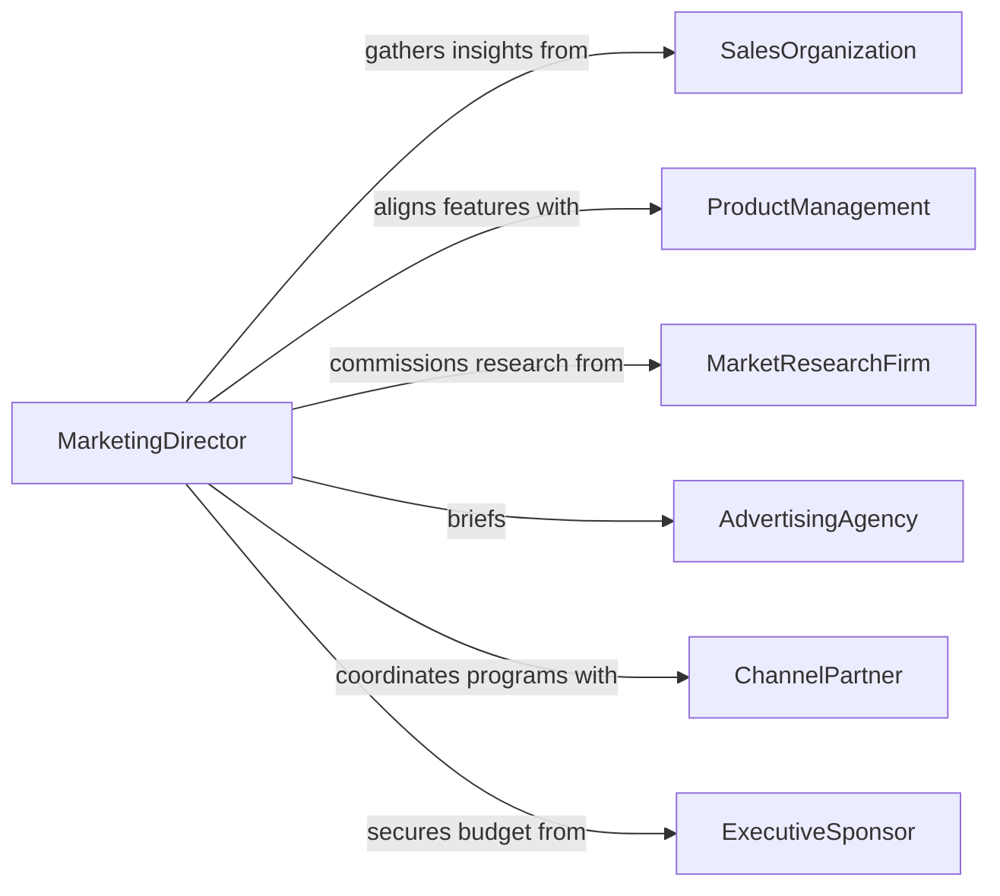

# Collaborate Others Develop Implement Marketing

> Business-as-Code definition for collaborating with others to develop or implement marketing strategies. Models the end-to-end process of co-creating marketing strategies with cross-functional teams, from market research through execution and measurement.

## Overview

Collaborating with others to develop or implement marketing strategies involves working across internal teams and external partners to research market opportunities, define positioning, set campaign objectives, and execute go-to-market plans. This definition covers the collaborative ideation process, strategy document creation, tactical planning, launch coordination, and post-launch performance evaluation. It ensures that marketing strategy reflects inputs from sales, product, finance, and customer-facing teams.

## Actors

| Actor | Description |
|-------|-------------|
| ProductManagement | Defines product roadmap and value propositions |
| SalesOrganization | Provides competitive intelligence and customer feedback |
| AdvertisingAgency | Creates campaign concepts and manages media execution |
| MarketResearchFirm | Conducts audience analysis and competitive benchmarking |
| ChannelPartner | Distributes products and co-markets through partner programs |
| ExecutiveSponsor | Approves strategy and allocates marketing budget |

## Roles

| Role | Description |
|------|-------------|
| MarketingDirector | Leads strategy development and ensures alignment with business goals |
| StrategyPlanner | Synthesizes research and inputs into a cohesive marketing plan |
| ImplementationLead | Manages the tactical execution of the approved strategy |
| PerformanceAnalyst | Measures results against KPIs and recommends adjustments |

## Entities

| Entity | Description |
|--------|-------------|
| MarketingStrategy | The overarching plan defining target markets, positioning, and goals |
| MarketAnalysis | Research data on market size, segments, and competitive landscape |
| GoToMarketPlan | The tactical blueprint for launching and promoting a product or service |
| BudgetAllocation | The distribution of marketing spend across channels and initiatives |
| PerformanceDashboard | A real-time view of marketing KPIs and campaign results |
| PartnerPlan | A co-marketing agreement outlining shared activities with channel partners |

## Actions

| Action | Description |
|--------|-------------|
| conductResearch | Gather market, competitive, and audience data to inform strategy |
| draftStrategy | Create the marketing strategy document with goals and positioning |
| reviewStrategy | Circulate the draft for feedback from cross-functional stakeholders |
| approveStrategy | Obtain executive sign-off and budget allocation for the plan |
| buildGoToMarketPlan | Develop the tactical execution plan with timelines and deliverables |
| executeStrategy | Launch campaigns and initiatives according to the plan |
| measureResults | Evaluate performance data against strategic objectives |

## Events

| Event | Description |
|-------|-------------|
| researchCompleted | Market and competitive analysis has been finalized |
| strategyDrafted | The marketing strategy document has been created |
| strategyReviewed | Cross-functional feedback has been collected on the draft |
| strategyApproved | Executive approval and budget have been secured |
| goToMarketPlanBuilt | The tactical execution plan has been developed |
| strategyExecuted | Campaigns and initiatives have been launched |
| resultsMeasured | Performance data has been evaluated against KPIs |

## Searches

| Search | Description |
|--------|-------------|
| findStrategies | List marketing strategies by status, product, or market segment |
| getMarketAnalysis | Retrieve market research data by segment or competitor |
| getPerformanceMetrics | Pull KPI data for active marketing strategies and campaigns |

## Workflow



## Actor Relationships



## Usage

### Calling Actions

```typescript
import { collaborateOthersDevelopImplementMarketing } from '@headlessly/collaborate-others-develop-implement-marketing'

const marketing = collaborateOthersDevelopImplementMarketing()

// Conduct market research for a new enterprise product
const research = await marketing.conductResearch({
  product: 'DataVault Enterprise',
  segments: ['mid-market', 'enterprise'],
  competitors: ['CompetitorA', 'CompetitorB'],
  sources: ['survey', 'industry-reports', 'sales-feedback']
})

// Draft the marketing strategy
const strategy = await marketing.draftStrategy({
  product: 'DataVault Enterprise',
  researchId: research.id,
  positioning: 'Secure, scalable data management for regulated industries',
  targetMarkets: ['financial-services', 'healthcare'],
  goals: {
    pipelineTarget: '$15M',
    leadTarget: 8000,
    timeframe: '6 months'
  }
})

// Execute after approval
await marketing.executeStrategy({
  strategyId: strategy.id,
  campaigns: ['digital-ads', 'webinar-series', 'partner-co-sell'],
  startDate: '2026-04-15'
})
```

### Event-Driven Automation

```typescript
// Notify product team when strategy is approved
marketing.strategyApproved(async ({ strategyId, product, budget }) => {
  await notify({
    to: 'product-management',
    message: `Marketing strategy approved for ${product} with $${budget} budget`
  })
})

// Auto-generate performance reports on measurement
marketing.resultsMeasured(async ({ strategyId, metrics }) => {
  await generateReport({
    type: 'marketing-performance',
    strategyId,
    metrics,
    sendTo: ['marketing-director', 'executive-sponsor']
  })
})
```
