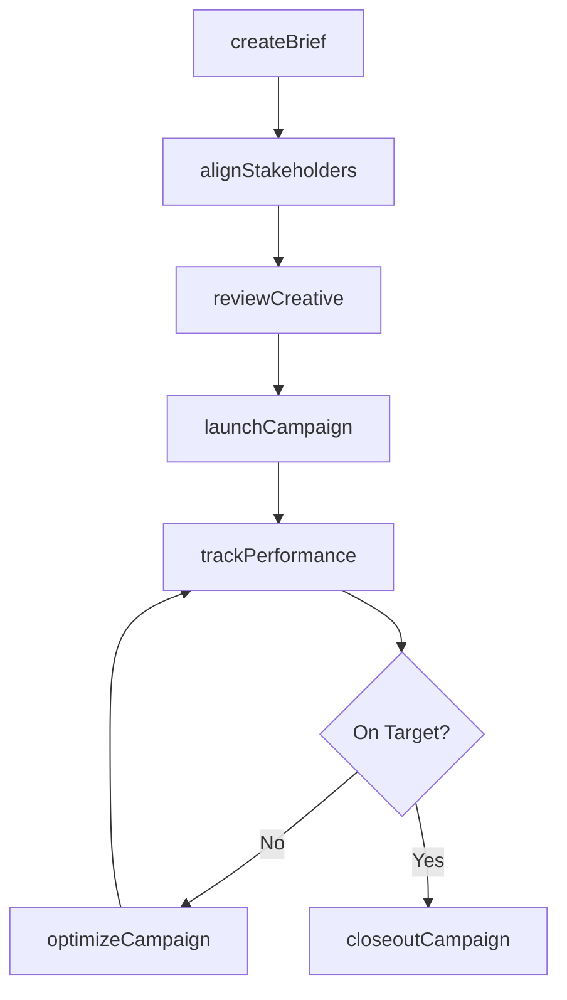
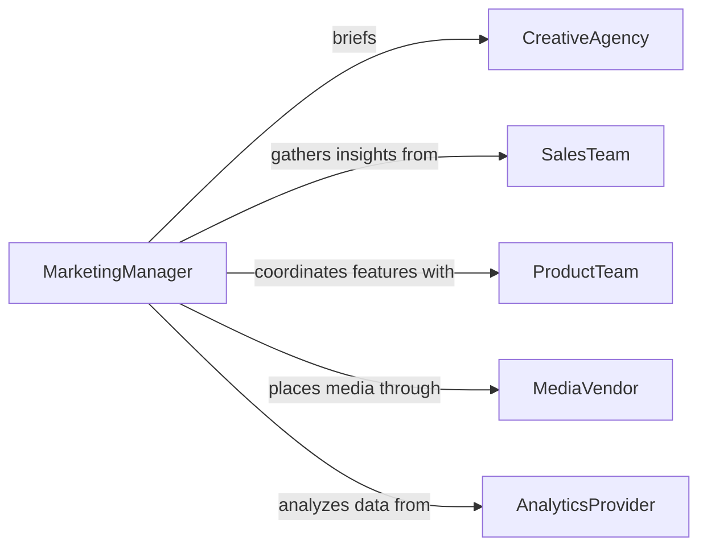

# Collaborate Others Marketing Activities

> Business-as-Code definition for collaborating with others in marketing activities. Models the cross-functional coordination required to plan, execute, and measure marketing campaigns and initiatives.

## Overview

Collaborating with others in marketing activities involves coordinating across teams such as creative, sales, product, and external agencies to align messaging, plan campaigns, and execute promotional efforts. This definition covers the lifecycle of marketing collaboration from initial strategy alignment through asset creation, campaign launch, and performance review. It ensures that all stakeholders contribute their expertise while maintaining a unified brand voice and consistent market positioning.

## Actors

| Actor | Description |
|-------|-------------|
| CreativeAgency | Develops advertising concepts, designs, and media content |
| SalesTeam | Provides field insights on customer needs and competitive positioning |
| ProductTeam | Supplies product details, features, and value propositions |
| MediaVendor | Places advertisements and manages paid media channels |
| Customer | The target audience whose feedback informs campaign direction |
| AnalyticsProvider | Delivers audience data and campaign performance metrics |

## Roles

| Role | Description |
|------|-------------|
| MarketingManager | Orchestrates the overall marketing plan and cross-team collaboration |
| CampaignCoordinator | Manages timelines, deliverables, and handoffs across contributors |
| ContentStrategist | Aligns messaging and content across channels |
| BrandManager | Ensures all materials conform to brand guidelines |

## Entities

| Entity | Description |
|--------|-------------|
| Campaign | A coordinated marketing initiative with defined goals and timeline |
| MarketingBrief | A document outlining objectives, audience, messaging, and deliverables |
| CreativeAsset | A design, copy block, video, or other content piece for the campaign |
| ChannelPlan | The selection and scheduling of distribution channels |
| PerformanceReport | Metrics and analysis of campaign results against objectives |

## Actions

| Action | Description |
|--------|-------------|
| createBrief | Draft a marketing brief with objectives, audience, and key messages |
| alignStakeholders | Convene cross-functional teams to agree on campaign strategy |
| reviewCreative | Evaluate and approve creative assets against the brief |
| launchCampaign | Activate the campaign across designated channels |
| trackPerformance | Monitor campaign metrics against targets in real time |
| optimizeCampaign | Adjust messaging, targeting, or spend based on performance data |
| closeoutCampaign | Conclude the campaign and compile final performance results |

## Events

| Event | Description |
|-------|-------------|
| briefCreated | A marketing brief has been drafted and shared with stakeholders |
| stakeholdersAligned | All teams have agreed on campaign strategy and responsibilities |
| creativeReviewed | Creative assets have been evaluated and feedback has been given |
| campaignLaunched | The campaign has gone live across its planned channels |
| performanceTracked | Campaign metrics have been captured at a reporting interval |
| campaignOptimized | Adjustments have been applied based on performance data |
| campaignClosedOut | The campaign has ended and final results have been compiled |

## Searches

| Search | Description |
|--------|-------------|
| findActiveCampaigns | List campaigns currently running or in development |
| getCampaignPerformance | Retrieve metrics for a specific campaign by channel or date range |
| getCreativeAssets | Find approved assets by campaign, format, or channel |

## Workflow



## Actor Relationships



## Usage

### Calling Actions

```typescript
import { collaborateOthersMarketingActivities } from '@headlessly/collaborate-others-marketing-activities'

const marketing = collaborateOthersMarketingActivities()

// Create a marketing brief for a product launch
const brief = await marketing.createBrief({
  name: 'Q2 Product Launch - CloudSync Pro',
  objective: 'Drive 5,000 qualified leads in 60 days',
  audience: ['IT Directors', 'DevOps Engineers'],
  channels: ['linkedin', 'email', 'webinar'],
  budget: 150000
})

// Align stakeholders on the plan
await marketing.alignStakeholders({
  briefId: brief.id,
  teams: ['creative', 'sales', 'product', 'analytics'],
  meetingDate: '2026-03-20'
})

// Launch the campaign
await marketing.launchCampaign({
  briefId: brief.id,
  startDate: '2026-04-01',
  channels: ['linkedin', 'email', 'webinar']
})
```

### Event-Driven Automation

```typescript
// Notify sales when campaign goes live
marketing.campaignLaunched(async ({ briefId, channels, startDate }) => {
  await notify({
    to: 'sales-team',
    message: `Campaign launched on ${channels.join(', ')} - expect inbound leads starting ${startDate}`
  })
})

// Auto-trigger optimization when metrics fall below target
marketing.performanceTracked(async ({ briefId, metrics }) => {
  if (metrics.conversionRate < metrics.targetConversionRate * 0.8) {
    await marketing.optimizeCampaign({
      briefId,
      adjustments: ['increase-bid', 'refine-audience-targeting']
    })
  }
})
```
