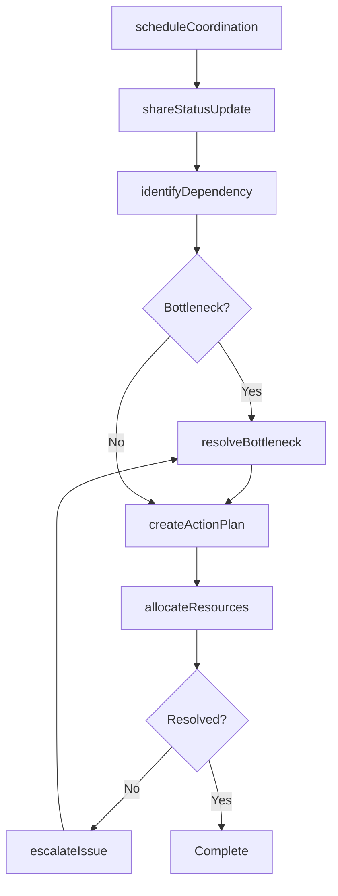
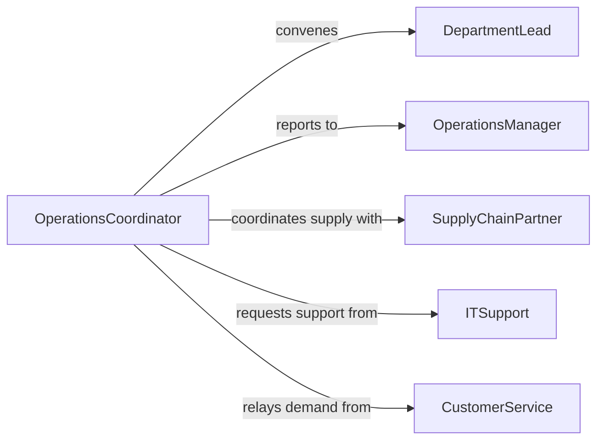

# Confer Personnel Coordinate Business Operations

> Business-as-Code definition for conferring with personnel to coordinate business operations. Models the cross-functional communication needed to align departments, resolve operational bottlenecks, and maintain smooth day-to-day business execution.

## Overview

Conferring with personnel to coordinate business operations involves regular and ad-hoc communication with staff across departments to ensure that production targets, service levels, and resource allocations are aligned. This definition covers the scheduling of coordination meetings, exchange of operational status updates, identification and resolution of cross-departmental dependencies, and documentation of agreed-upon action plans. It applies to manufacturing, retail, logistics, professional services, and any multi-team business environment.

## Actors

| Actor | Description |
|-------|-------------|
| OperationsManager | Oversees daily business execution across departments |
| DepartmentLead | Manages a functional team and represents its capacity and needs |
| SupplyChainPartner | Provides materials or services that affect operational schedules |
| ITSupport | Maintains systems and infrastructure that operations depend on |
| CustomerService | Communicates customer demand signals and service issues |

## Roles

| Role | Description |
|------|-------------|
| OperationsCoordinator | Facilitates cross-departmental meetings and tracks action items |
| ProcessOwner | Responsible for a specific business process end-to-end |
| ResourcePlanner | Allocates staff, equipment, and materials across operational needs |
| EscalationManager | Resolves conflicts and bottlenecks that teams cannot solve independently |

## Entities

| Entity | Description |
|--------|-------------|
| OperationalPlan | The current period plan detailing targets, schedules, and assignments |
| StatusUpdate | A report on the current state of a department or process |
| DependencyMap | A record of cross-departmental dependencies and handoff points |
| ActionPlan | An agreed-upon set of steps to address an operational issue |
| ResourceAllocation | The assignment of staff, equipment, or budget to specific operations |
| EscalationTicket | A formal request to resolve a cross-team conflict or bottleneck |

## Actions

| Action | Description |
|--------|-------------|
| scheduleCoordination | Set up a meeting or check-in with relevant personnel |
| shareStatusUpdate | Distribute current operational status to stakeholders |
| identifyDependency | Flag a cross-departmental dependency that requires coordination |
| resolveBottleneck | Work through an operational constraint with affected teams |
| createActionPlan | Document agreed-upon steps with owners and deadlines |
| allocateResources | Assign staff, equipment, or budget based on operational priorities |
| escalateIssue | Raise an unresolved operational conflict to senior management |

## Events

| Event | Description |
|-------|-------------|
| coordinationScheduled | A cross-team meeting has been placed on the calendar |
| statusUpdateShared | An operational status report has been distributed |
| dependencyIdentified | A cross-departmental dependency has been flagged |
| bottleneckResolved | An operational constraint has been addressed |
| actionPlanCreated | A set of coordinated action steps has been documented |
| resourcesAllocated | Staff, equipment, or budget has been assigned to operations |
| issueEscalated | An unresolved conflict has been raised to management |

## Searches

| Search | Description |
|--------|-------------|
| findOpenBottlenecks | List unresolved operational constraints across departments |
| getResourceAllocations | Retrieve current staff and equipment assignments by department |
| getActionPlanStatus | Check progress on outstanding action plans |
| getDependencyMap | View cross-departmental dependencies for a given process |

## Workflow



## Actor Relationships



## Usage

### Calling Actions

```typescript
import { conferPersonnelCoordinateBusinessOperations } from '@headlessly/confer-personnel-coordinate-business-operations'

const ops = conferPersonnelCoordinateBusinessOperations()

// Schedule a weekly operations coordination meeting
const meeting = await ops.scheduleCoordination({
  frequency: 'weekly',
  day: 'Monday',
  time: '09:00',
  attendees: ['production-lead', 'logistics-lead', 'customer-service-lead', 'it-support']
})

// Share a status update from production
await ops.shareStatusUpdate({
  department: 'Production',
  period: 'week-10',
  metrics: {
    outputVsTarget: '94%',
    downtime: '2.5 hours',
    qualityYield: '99.1%'
  },
  issues: ['Machine 4 intermittent fault reducing throughput']
})

// Create an action plan to resolve the bottleneck
await ops.createActionPlan({
  issue: 'Machine 4 intermittent fault',
  steps: [
    { action: 'Schedule preventive maintenance', owner: 'maintenance-lead', dueDate: '2026-03-12' },
    { action: 'Reroute production to Machine 5', owner: 'production-lead', dueDate: '2026-03-10' }
  ]
})
```

### Event-Driven Automation

```typescript
// Alert leadership when an issue is escalated
ops.issueEscalated(async ({ issue, department, escalatedBy }) => {
  await notify({
    to: 'operations-director',
    message: `Escalation from ${department}: ${issue} - raised by ${escalatedBy}`
  })
})

// Auto-send status summaries after each coordination meeting
ops.statusUpdateShared(async ({ department, period, metrics }) => {
  await dashboard.update({
    department,
    period,
    metrics,
    timestamp: new Date().toISOString()
  })
})
```
