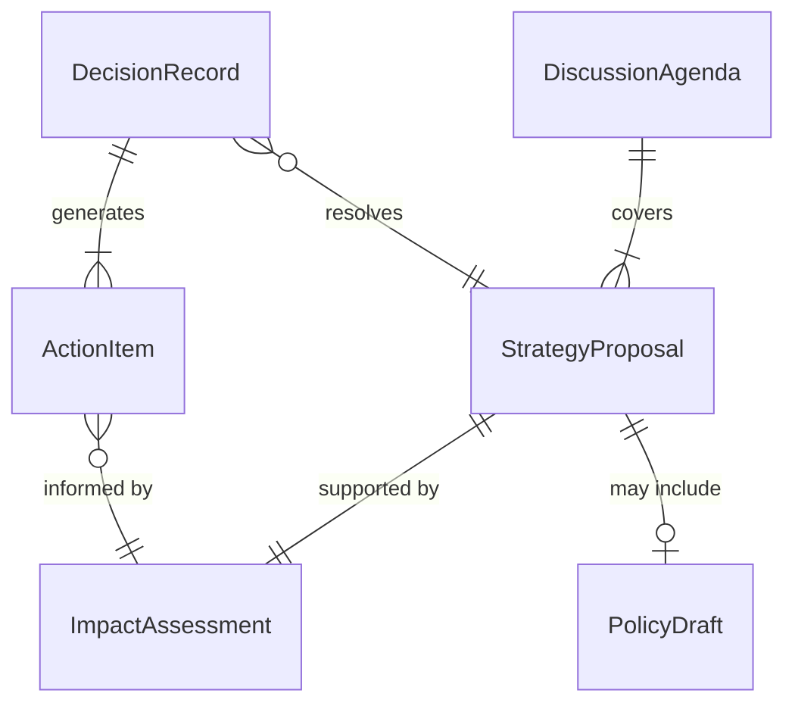
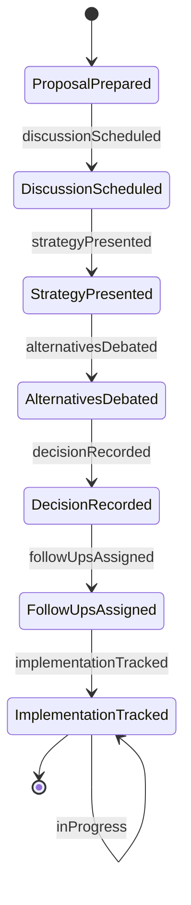
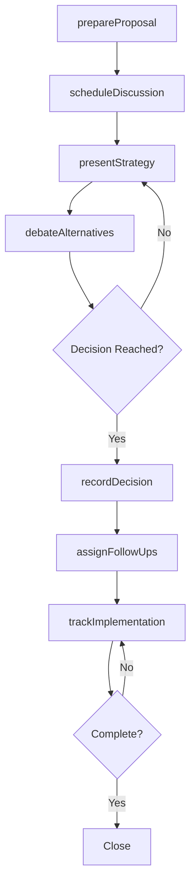
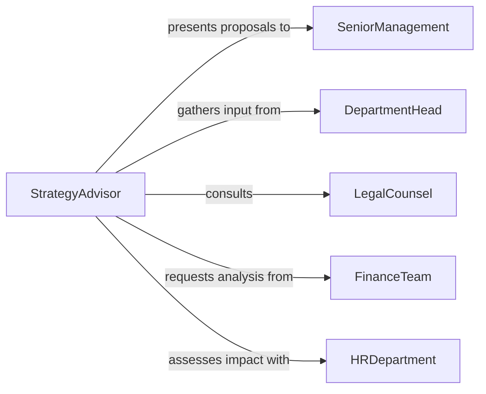

# Discuss Business Strategies Practices Policies

> Business-as-Code definition for discussing business strategies, practices, or policies with managers. Models the structured communication process for raising, deliberating, and resolving strategic and policy matters across organizational levels.

## Overview

Discussing business strategies, practices, and policies with managers involves presenting data-driven recommendations, debating alternative approaches, and reaching alignment on organizational direction. This definition covers the preparation of discussion materials, facilitation of strategy sessions, documentation of decisions, and tracking of follow-up actions. It applies to recurring strategic reviews, ad-hoc policy consultations, and change management discussions that shape how the business operates.

## Actors

| Actor | Description |
|-------|-------------|
| SeniorManagement | Sets strategic direction and approves policy changes |
| DepartmentHead | Advocates for functional priorities and resource needs |
| LegalCounsel | Advises on regulatory and compliance implications of policy changes |
| FinanceTeam | Provides financial analysis supporting strategic decisions |
| HRDepartment | Assesses workforce implications of proposed practices and policies |

## Roles

| Role | Description |
|------|-------------|
| StrategyAdvisor | Prepares analysis and recommendations for management discussions |
| MeetingFacilitator | Structures and guides the strategy discussion session |
| PolicyAnalyst | Evaluates current policies and drafts proposed changes |
| DecisionRecorder | Documents outcomes, decisions, and action items |

## Entities

| Entity | Description |
|--------|-------------|
| StrategyProposal | A formal recommendation for a new or revised business strategy |
| PolicyDraft | A proposed policy document for review and approval |
| DiscussionAgenda | The structured list of strategic topics to be addressed |
| DecisionRecord | A documented outcome from a strategy or policy discussion |
| ActionItem | A follow-up task assigned to a specific owner with a deadline |
| ImpactAssessment | An analysis of how a proposed change would affect operations |

## Actions

| Action | Description |
|--------|-------------|
| prepareProposal | Draft a strategy or policy proposal with supporting analysis |
| scheduleDiscussion | Set up a meeting with relevant managers and stakeholders |
| presentStrategy | Walk managers through the proposal and its rationale |
| debateAlternatives | Discuss competing approaches and their tradeoffs |
| recordDecision | Document the outcome and rationale of the discussion |
| assignFollowUps | Designate owners and deadlines for resulting action items |
| trackImplementation | Monitor progress on approved strategy or policy changes |

## Events

| Event | Description |
|-------|-------------|
| proposalPrepared | A strategy or policy proposal has been drafted |
| discussionScheduled | A strategy session has been placed on the calendar |
| strategyPresented | The proposal has been presented to management |
| alternativesDebated | Competing approaches have been discussed |
| decisionRecorded | The outcome of the discussion has been documented |
| followUpsAssigned | Action items have been designated to owners |
| implementationTracked | Progress on approved changes has been reviewed |

## Searches

| Search | Description |
|--------|-------------|
| findOpenProposals | List strategy and policy proposals awaiting discussion |
| getDecisionHistory | Retrieve past decision records by topic, date, or department |
| getPendingActions | Find outstanding action items from strategy discussions |
| getImpactAssessments | Retrieve impact analyses linked to specific proposals |

## Entity Relationships



## State Diagram



## Workflow



## Actor Relationships



## Usage

### Calling Actions

```typescript
import { discussBusinessStrategiesPracticesPolicies } from '@headlessly/discuss-business-strategies-practices-policies'

const strategy = discussBusinessStrategiesPracticesPolicies()

// Prepare a proposal for remote work policy update
const proposal = await strategy.prepareProposal({
  title: 'Hybrid Work Policy Revision',
  type: 'policy',
  summary: 'Transition from 3-day in-office to flexible 2-day minimum',
  impactAreas: ['workforce-productivity', 'real-estate-costs', 'employee-retention'],
  supportingData: {
    retentionImprovement: '12%',
    facilityCostReduction: '$2.4M annually'
  }
})

// Schedule the discussion with leadership
await strategy.scheduleDiscussion({
  proposalId: proposal.id,
  attendees: ['ceo', 'coo', 'chro', 'cfo'],
  date: '2026-04-10',
  duration: '90min'
})

// Record the decision after the meeting
await strategy.recordDecision({
  proposalId: proposal.id,
  outcome: 'approved-with-modifications',
  rationale: 'Approved 2-day minimum with quarterly review of productivity metrics',
  effectiveDate: '2026-05-01'
})
```

### Event-Driven Automation

```typescript
// Notify stakeholders when a decision is recorded
strategy.decisionRecorded(async ({ proposalId, outcome, rationale }) => {
  await notify({
    to: 'leadership-team',
    message: `Decision on proposal ${proposalId}: ${outcome} - ${rationale}`
  })
})

// Escalate overdue action items
strategy.followUpsAssigned(async ({ actionItems }) => {
  for (const item of actionItems) {
    scheduleReminder({
      owner: item.assignee,
      deadline: item.dueDate,
      escalateTo: 'strategy-advisor',
      escalateAfterDays: 5
    })
  }
})
```
