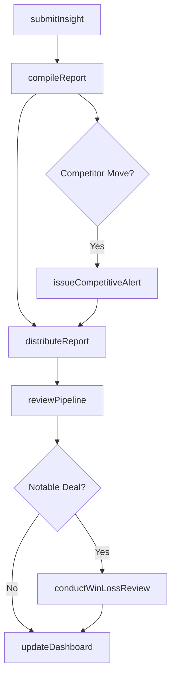
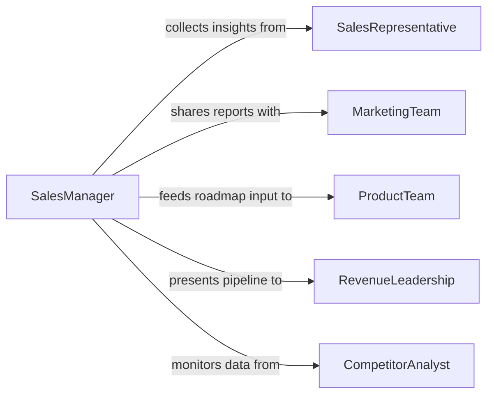

# Share Sales-related Market Information Colleagues

> Business-as-Code definition for sharing sales-related or market information with colleagues. Models the structured exchange of competitive intelligence, pipeline data, customer insights, and market trends across sales and business teams.

## Overview

Sharing sales-related and market information with colleagues involves distributing insights about customer buying patterns, competitive activity, pricing trends, and pipeline health to enable better decision-making across the organization. This definition covers the collection of field intelligence from sales representatives, aggregation into structured reports, distribution to relevant stakeholders, and follow-up discussions that turn data into action. It supports sales enablement, product planning, and strategic decision-making.

## Actors

| Actor | Description |
|-------|-------------|
| SalesRepresentative | Gathers firsthand intelligence from customer interactions |
| CompetitorAnalyst | Monitors competitor pricing, positioning, and product launches |
| MarketingTeam | Consumes market data to refine campaigns and messaging |
| ProductTeam | Uses customer feedback and competitive data for roadmap planning |
| RevenueLeadership | Reviews pipeline and market data to set strategic direction |

## Roles

| Role | Description |
|------|-------------|
| SalesManager | Aggregates team insights and presents pipeline summaries |
| MarketIntelligenceAnalyst | Curates and analyzes market and competitive data |
| SalesEnablementLead | Packages insights into tools and resources for the sales team |
| RevenueOperationsAnalyst | Maintains dashboards and data integrity for sales metrics |

## Entities

| Entity | Description |
|--------|-------------|
| MarketIntelligenceReport | A compiled summary of competitive and market trend data |
| PipelineSnapshot | A point-in-time view of sales pipeline by stage and segment |
| CompetitiveAlert | A notification about a competitor action relevant to the team |
| CustomerInsight | A documented observation from a customer interaction |
| WinLossAnalysis | A structured review of why deals were won or lost |

## Actions

| Action | Description |
|--------|-------------|
| submitInsight | Record a customer or market observation from the field |
| compileReport | Aggregate individual insights into a market intelligence report |
| distributeReport | Share the compiled report with relevant teams and stakeholders |
| issueCompetitiveAlert | Notify colleagues about a significant competitor action |
| reviewPipeline | Discuss current pipeline health and notable deal movements |
| conductWinLossReview | Analyze a closed deal to capture lessons learned |
| updateDashboard | Refresh sales and market dashboards with the latest data |

## Events

| Event | Description |
|-------|-------------|
| insightSubmitted | A field observation has been recorded by a sales representative |
| reportCompiled | A market intelligence report has been assembled |
| reportDistributed | The intelligence report has been shared with stakeholders |
| competitiveAlertIssued | A competitor action notification has been sent to the team |
| pipelineReviewed | The sales pipeline has been discussed and updated |
| winLossReviewCompleted | A deal analysis has been finalized with lessons captured |
| dashboardUpdated | Sales and market dashboards have been refreshed |

## Searches

| Search | Description |
|--------|-------------|
| findRecentInsights | List customer and market observations by date, rep, or segment |
| getCompetitiveAlerts | Retrieve competitor notifications by company or time period |
| getPipelineBySegment | Pull pipeline data filtered by market segment or deal stage |

## Workflow



## Actor Relationships



## Usage

### Calling Actions

```typescript
import { shareSalesRelatedMarketInformationColleagues } from '@headlessly/share-sales-related-market-information-colleagues'

const intel = shareSalesRelatedMarketInformationColleagues()

// Submit a field insight from a customer meeting
await intel.submitInsight({
  repId: 'rep-042',
  customer: 'Acme Corp',
  type: 'competitive-displacement',
  details: 'Customer evaluating CompetitorX due to lower pricing on storage tier',
  urgency: 'high'
})

// Compile a weekly market intelligence report
const report = await intel.compileReport({
  period: 'week-11',
  segments: ['enterprise', 'mid-market'],
  includeCompetitiveData: true,
  includePipelineSnapshot: true
})

// Distribute to stakeholders
await intel.distributeReport({
  reportId: report.id,
  recipients: ['marketing-team', 'product-team', 'revenue-leadership'],
  format: 'pdf'
})
```

### Event-Driven Automation

```typescript
// Notify product team on high-urgency competitive insights
intel.insightSubmitted(async ({ type, details, urgency, customer }) => {
  if (urgency === 'high' && type === 'competitive-displacement') {
    await notify({
      to: 'product-team',
      message: `Competitive threat at ${customer}: ${details}`
    })
  }
})

// Auto-refresh dashboards when reports are compiled
intel.reportCompiled(async ({ reportId, period }) => {
  await intel.updateDashboard({
    reportId,
    period,
    widgets: ['pipeline-by-stage', 'competitive-landscape', 'win-rate-trend']
  })
})
```
