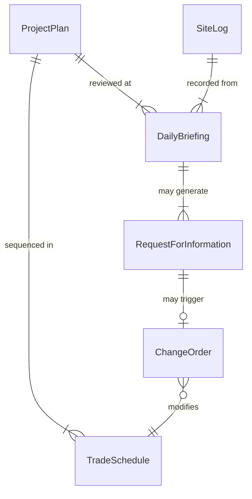
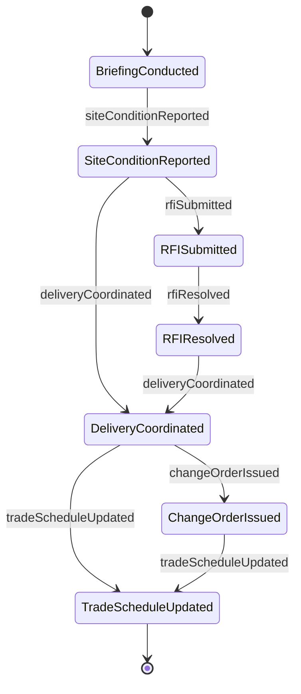
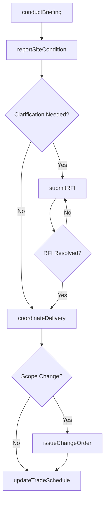
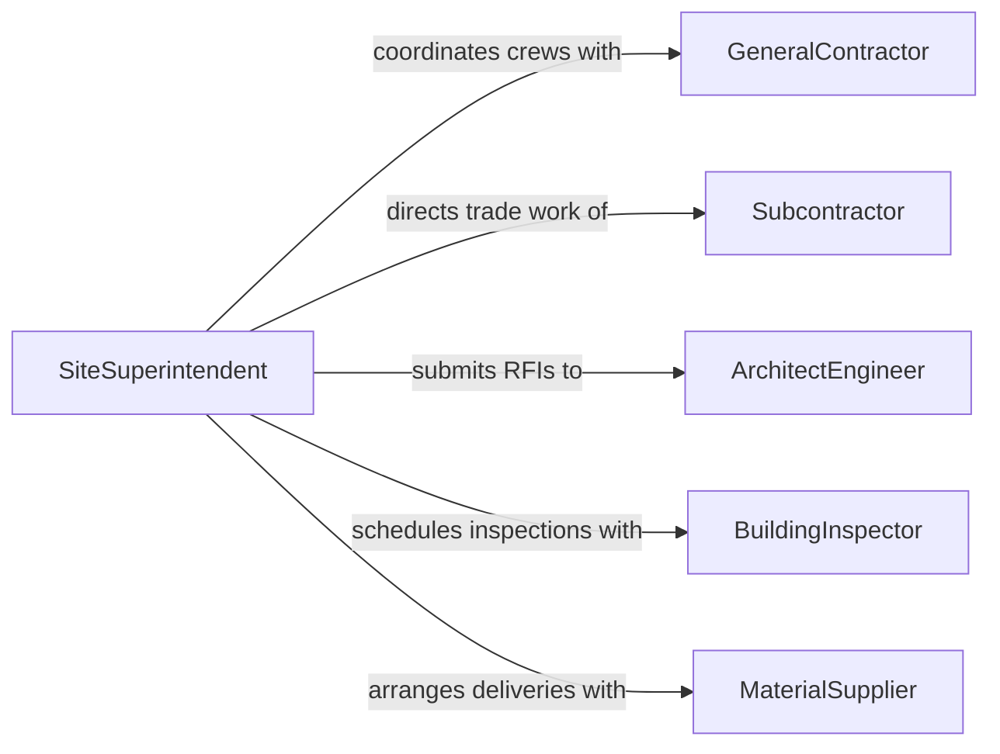

# Communicate Construction Extraction Personnel Discuss

> Business-as-Code definition for communicating with construction or extraction personnel to discuss project details. Models the coordination workflows required to share plans, resolve field issues, and align crews on jobsite activities.

## Overview

Communicating with other construction or extraction personnel to discuss project details involves sharing blueprints, schedules, and site conditions with crew members, subcontractors, and trade specialists. This definition captures the jobsite coordination lifecycle from pre-construction planning meetings through daily briefings and issue resolution. It ensures that all parties are aligned on scope changes, safety requirements, material deliveries, and sequencing of trade activities across the project timeline.

## Actors

| Actor | Description |
|-------|-------------|
| GeneralContractor | Manages overall project execution and subcontractor coordination |
| Subcontractor | Performs specialized trade work such as electrical, plumbing, or excavation |
| ArchitectEngineer | Provides design documents and responds to field clarification requests |
| BuildingInspector | Reviews work for code compliance at key milestones |
| MaterialSupplier | Delivers construction materials according to project schedules |

## Roles

| Role | Description |
|------|-------------|
| SiteSuperintendent | Directs daily jobsite operations and crew coordination |
| ProjectManager | Oversees project scope, budget, and schedule |
| Foreman | Leads a specific crew or trade team on site |
| SafetyOfficer | Monitors and enforces jobsite safety protocols |

## Entities

| Entity | Description |
|--------|-------------|
| ProjectPlan | The master schedule and scope document for the construction project |
| DailyBriefing | A structured morning meeting to align crews on the day's activities |
| RequestForInformation | A formal question submitted to the architect or engineer for clarification |
| ChangeOrder | A documented modification to the original project scope or specifications |
| SiteLog | A daily record of work performed, conditions, and incidents |
| TradeSchedule | The sequenced timeline for each trade's work on site |

## Actions

| Action | Description |
|--------|-------------|
| conductBriefing | Hold a daily or weekly coordination meeting with site personnel |
| submitRFI | Send a request for information to the design team |
| issueChangeOrder | Document and communicate a change to the project scope |
| updateTradeSchedule | Modify the sequencing of trade activities on site |
| reportSiteCondition | Communicate current field conditions that affect work |
| coordinateDelivery | Align material delivery timing with crew availability and staging areas |

## Events

| Event | Description |
|-------|-------------|
| briefingConducted | A coordination meeting has been held with site personnel |
| rfiSubmitted | A request for information has been sent to the design team |
| changeOrderIssued | A change to the project scope has been documented |
| tradeScheduleUpdated | The sequencing of trade activities has been modified |
| siteConditionReported | Field conditions affecting work have been communicated |
| deliveryCoordinated | Material delivery timing has been aligned with site needs |
| rfiResolved | A request for information has been answered by the design team |

## Searches

| Search | Description |
|--------|-------------|
| findOpenRFIs | List unresolved requests for information by trade or status |
| getTradeSchedule | Retrieve the current sequenced schedule for all trades on site |
| getSiteLogs | Look up daily site logs by date range or crew |
| getChangeOrders | Find change orders by status, trade, or impact level |

## Entity Relationships



## State Diagram



## Workflow



## Actor Relationships



## Usage

### Calling Actions

```typescript
import { communicateConstructionExtractionPersonnelDiscuss } from '@headlessly/communicate-construction-extraction-personnel-discuss'

const site = communicateConstructionExtractionPersonnelDiscuss()

// Conduct a daily morning briefing
const briefing = await site.conductBriefing({
  date: '2026-02-10',
  attendees: ['electrical-crew', 'plumbing-crew', 'concrete-crew'],
  topics: ['Foundation pour schedule', 'Electrical rough-in sequencing', 'Weather delay mitigation']
})

// Submit an RFI for design clarification
const rfi = await site.submitRFI({
  subject: 'Footing depth discrepancy on grid line C-4',
  description: 'Field conditions show bedrock at 4ft vs. 6ft specified in drawings',
  trade: 'excavation',
  priority: 'high'
})

// Coordinate material delivery with staging plan
await site.coordinateDelivery({
  material: 'structural-steel-beams',
  supplier: 'supplier-ironworks-inc',
  deliveryDate: '2026-02-12',
  stagingArea: 'north-lot',
  crewNeeded: 'steel-erection-crew'
})
```

### Event-Driven Automation

```typescript
// Notify project manager when change orders are issued
site.changeOrderIssued(async ({ changeOrderId, description, estimatedCostImpact }) => {
  await notify({
    to: 'project-manager',
    message: `Change order issued: ${description} (est. impact: $${estimatedCostImpact})`
  })
})

// Auto-update trade schedule when RFIs are resolved
site.rfiResolved(async ({ rfiId, trade, resolution }) => {
  await site.updateTradeSchedule({
    trade,
    reason: `RFI ${rfiId} resolved: ${resolution}`,
    adjustDays: 0
  })
})
```
