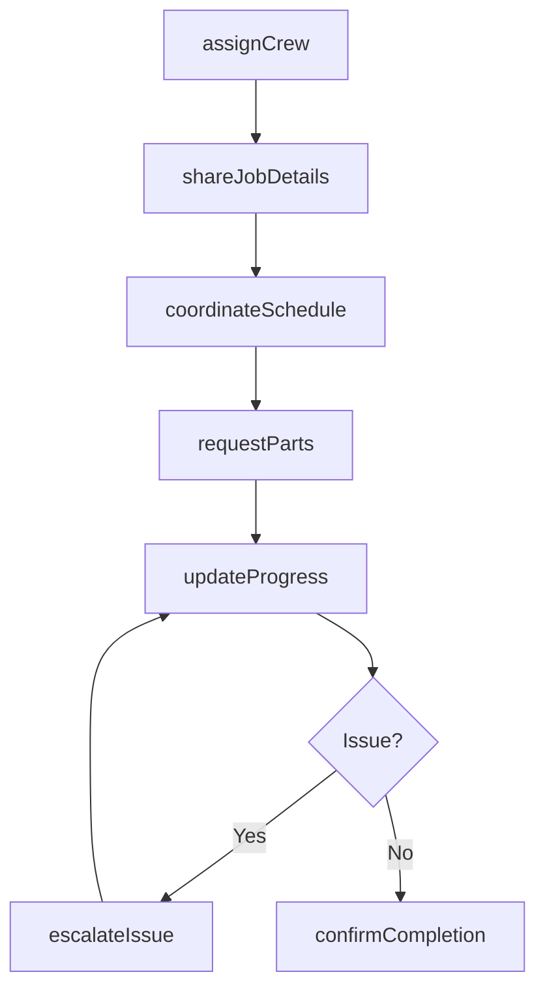
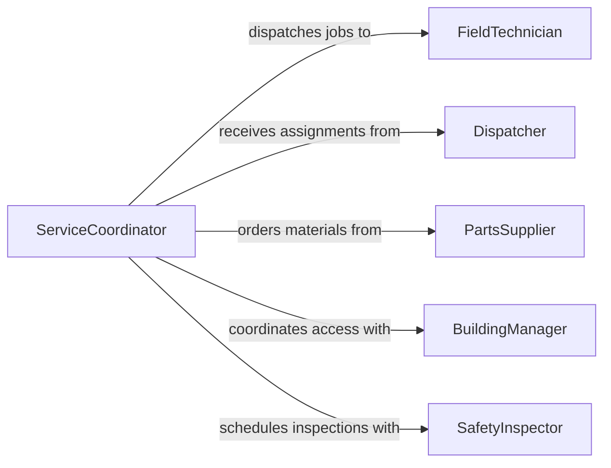

# Communicate Coworkers Coordinate Installations Repairs

> Business-as-Code definition for coordinating installation and repair activities among coworkers. Models the communication lifecycle from job assignment through scheduling, execution coordination, and completion verification.

## Overview

Coordinating installations and repairs requires structured communication between field technicians, dispatchers, and support teams to ensure work is completed safely and on schedule. This definition covers the exchange of technical details, scheduling constraints, material requirements, and status updates across distributed crews working on equipment installations, system upgrades, and corrective repairs.

## Actors

| Actor | Description |
|-------|-------------|
| FieldTechnician | Performs on-site installation and repair work |
| Dispatcher | Assigns jobs and coordinates crew schedules |
| PartsSupplier | Provides replacement parts and installation materials |
| BuildingManager | Grants site access and communicates facility constraints |
| SafetyInspector | Verifies completed work meets code and safety standards |

## Roles

| Role | Description |
|------|-------------|
| LeadInstaller | Oversees the installation crew and coordinates task sequencing |
| ServiceCoordinator | Manages communication between field crews and back office |
| TechnicalAdvisor | Provides remote guidance on complex installation or repair issues |

## Entities

| Entity | Description |
|--------|-------------|
| WorkOrder | A formal request describing the installation or repair to be performed |
| Schedule | The planned timeline for crew assignments and task execution |
| SiteReport | Documentation of site conditions and access requirements |
| PartsRequest | A request for materials needed to complete the job |
| CompletionRecord | A verified record that the installation or repair is finished |
| CommunicationLog | A timestamped log of messages exchanged between crew members |

## Actions

| Action | Description |
|--------|-------------|
| assignCrew | Designate technicians to a specific installation or repair job |
| shareJobDetails | Distribute work order specifications and site information to crew |
| requestParts | Submit a parts or materials request for the job |
| updateProgress | Report current status of installation or repair work |
| escalateIssue | Notify supervisors of unexpected problems requiring additional support |
| confirmCompletion | Verify and record that the work has been completed successfully |
| coordinateSchedule | Align crew availability with site access windows and dependencies |

## Events

| Event | Description |
|-------|-------------|
| crewAssigned | Technicians have been designated to the work order |
| jobDetailsShared | Work specifications have been distributed to the crew |
| partsRequested | A materials request has been submitted for the job |
| progressUpdated | Crew has reported an updated status on the work |
| issueEscalated | A problem has been flagged for supervisory attention |
| completionConfirmed | The installation or repair has been verified as done |
| scheduleCoordinated | Crew schedule has been aligned with site availability |

## Searches

| Search | Description |
|--------|-------------|
| findActiveJobs | List open installation and repair work orders by crew or location |
| getCrewAvailability | Retrieve technician schedules and current assignments |
| getPartsStatus | Check fulfillment status of outstanding parts requests |

## Workflow



## Actor Relationships



## Usage

### Calling Actions

```typescript
import { communicateCoworkersCoordinateInstallationsRepairs } from '@headlessly/communicate-coworkers-coordinate-installations-repairs'

const coordination = communicateCoworkersCoordinateInstallationsRepairs()

// Assign a crew to an HVAC installation
const assignment = await coordination.assignCrew({
  workOrderId: 'WO-4821',
  technicians: ['tech-101', 'tech-204'],
  scheduledDate: '2026-03-15',
  site: 'Building C, Floor 3'
})

// Share job details with the assigned crew
await coordination.shareJobDetails({
  workOrderId: 'WO-4821',
  specifications: { type: 'HVAC Installation', model: 'Carrier 50XC' },
  siteReport: { accessCode: '7734', contactName: 'Frank Davis' }
})

// Update progress from the field
await coordination.updateProgress({
  workOrderId: 'WO-4821',
  status: 'in-progress',
  percentComplete: 65,
  notes: 'Ductwork routed, awaiting condenser unit placement'
})
```

### Event-Driven Automation

```typescript
// Notify dispatcher when an issue is escalated
coordination.issueEscalated(async ({ workOrderId, issue, technicianId }) => {
  await notify({
    to: 'dispatch-team',
    message: `Issue on ${workOrderId}: ${issue.description} - reported by ${technicianId}`
  })
})

// Trigger inspection scheduling when work is completed
coordination.completionConfirmed(async ({ workOrderId, site }) => {
  await scheduleInspection({
    workOrderId,
    site,
    inspectorPool: 'safety-inspectors'
  })
})
```
