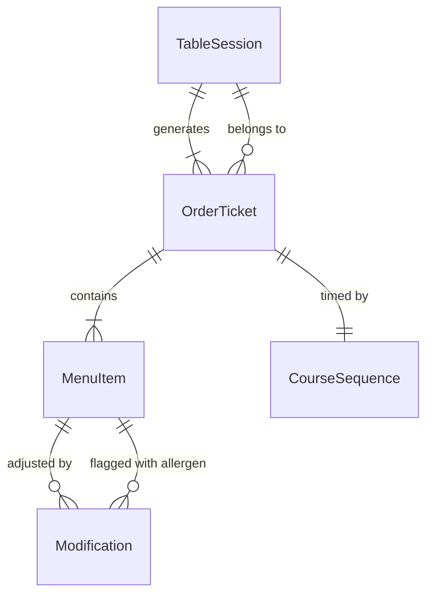
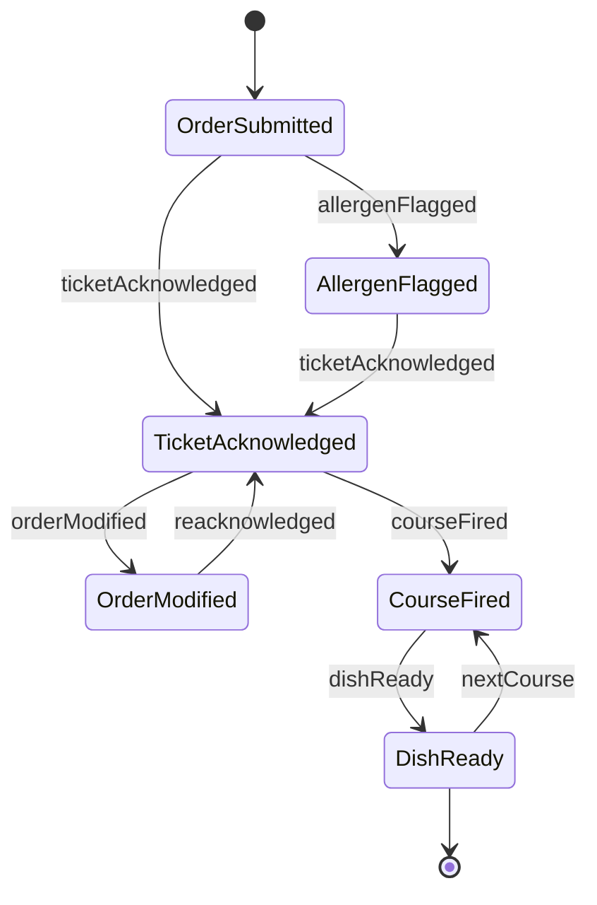
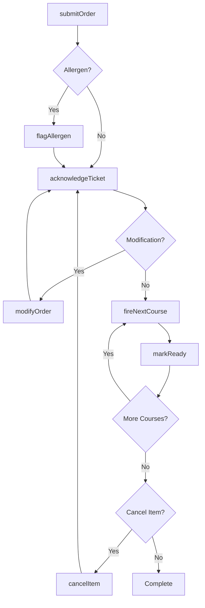
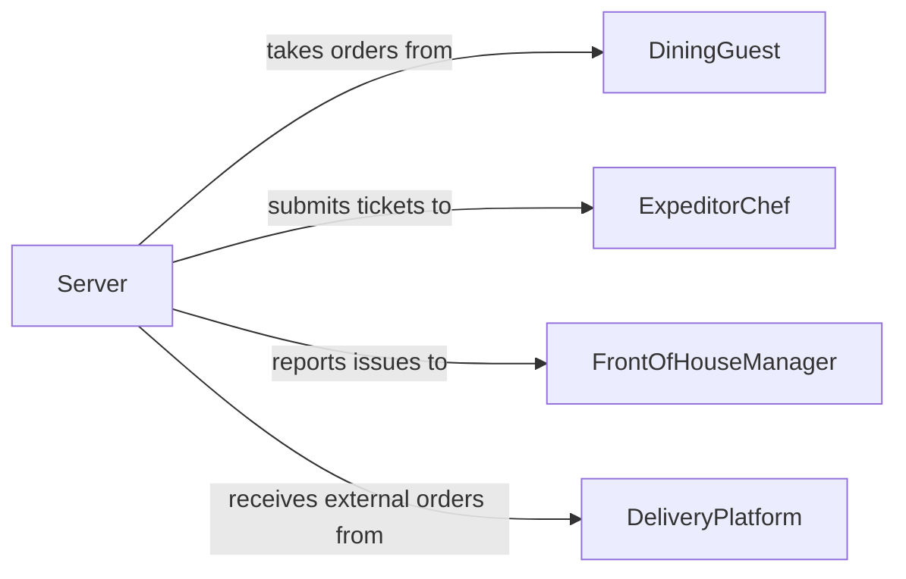

# Communicate Dining Order Details Kitchen

> Business-as-Code definition for communicating dining or order details to kitchen personnel. Models the flow of order information from front-of-house to kitchen staff for accurate and timely meal preparation.

## Overview

Communicating dining or order details to kitchen personnel involves transmitting guest orders, special requests, and dietary modifications from servers to the kitchen line. This definition captures the order relay lifecycle from initial ticket creation through preparation acknowledgment and completion. It ensures accurate communication of allergen alerts, course timing, and modification requests across the front-of-house and back-of-house divide.

## Actors

| Actor | Description |
|-------|-------------|
| DiningGuest | Places food and beverage orders with specific preferences |
| FoodSupplier | Provides ingredients that determine menu item availability |
| HealthInspector | Enforces food safety and allergen communication standards |
| DeliveryPlatform | Sends external delivery orders into the kitchen queue |

## Roles

| Role | Description |
|------|-------------|
| Server | Takes guest orders and relays them to the kitchen |
| ExpeditorChef | Manages the order queue and coordinates plating timing |
| LineCook | Prepares dishes according to ticket specifications |
| FrontOfHouseManager | Oversees guest experience and resolves order disputes |

## Entities

| Entity | Description |
|--------|-------------|
| OrderTicket | A structured record of items ordered by a guest or table |
| MenuItem | A dish or beverage available for ordering |
| Modification | A change to a standard menu item such as substitutions or allergen notes |
| CourseSequence | The timing order in which courses should be prepared and served |
| TableSession | An active dining session for a specific table or party |

## Actions

| Action | Description |
|--------|-------------|
| submitOrder | Send a new order ticket to the kitchen display or printer |
| modifyOrder | Update an existing ticket with changes or additions |
| flagAllergen | Mark an order with critical allergen or dietary information |
| acknowledgeTicket | Confirm receipt and begin preparation of an order |
| fireNextCourse | Signal the kitchen to begin preparing the next course |
| cancelItem | Remove an item from an active order ticket |
| markReady | Indicate that a dish is plated and ready for pickup |

## Events

| Event | Description |
|-------|-------------|
| orderSubmitted | A new order ticket has been sent to the kitchen |
| orderModified | An existing ticket has been updated with changes |
| allergenFlagged | An allergen or dietary alert has been attached to an order |
| ticketAcknowledged | The kitchen has confirmed receipt of an order |
| courseFired | The kitchen has begun preparing the next course |
| itemCanceled | An item has been removed from an active order |
| dishReady | A prepared dish is available for server pickup |

## Searches

| Search | Description |
|--------|-------------|
| findActiveOrders | List open order tickets by table, server, or status |
| getTicketDetails | Retrieve full details of a specific order ticket including modifications |
| getAllergenAlerts | Find all orders with active allergen or dietary flags |

## Entity Relationships



## State Diagram



## Workflow



## Actor Relationships



## Usage

### Calling Actions

```typescript
import { communicateDiningOrderDetailsKitchen } from '@headlessly/communicate-dining-order-details-kitchen'

const kitchen = communicateDiningOrderDetailsKitchen()

// Submit a new order ticket
const ticket = await kitchen.submitOrder({
  tableId: 'table-14',
  server: 'server-maria',
  items: [
    { menuItem: 'grilled-salmon', quantity: 1, course: 'entree' },
    { menuItem: 'caesar-salad', quantity: 2, course: 'appetizer' }
  ]
})

// Flag an allergen on the order
await kitchen.flagAllergen({
  ticketId: ticket.id,
  item: 'grilled-salmon',
  allergen: 'shellfish-cross-contact',
  severity: 'critical'
})

// Fire the next course when guests are ready
await kitchen.fireNextCourse({
  ticketId: ticket.id,
  course: 'entree'
})
```

### Event-Driven Automation

```typescript
// Alert server when dish is ready for pickup
kitchen.dishReady(async ({ ticketId, tableId, item }) => {
  await notify({
    to: `server-station-${tableId}`,
    message: `${item} is ready for pickup at the pass`
  })
})

// Escalate allergen flags to the expeditor
kitchen.allergenFlagged(async ({ ticketId, allergen, severity }) => {
  if (severity === 'critical') {
    await notify({
      to: 'expeditor-chef',
      message: `CRITICAL allergen alert on ticket ${ticketId}: ${allergen}`
    })
  }
})
```
