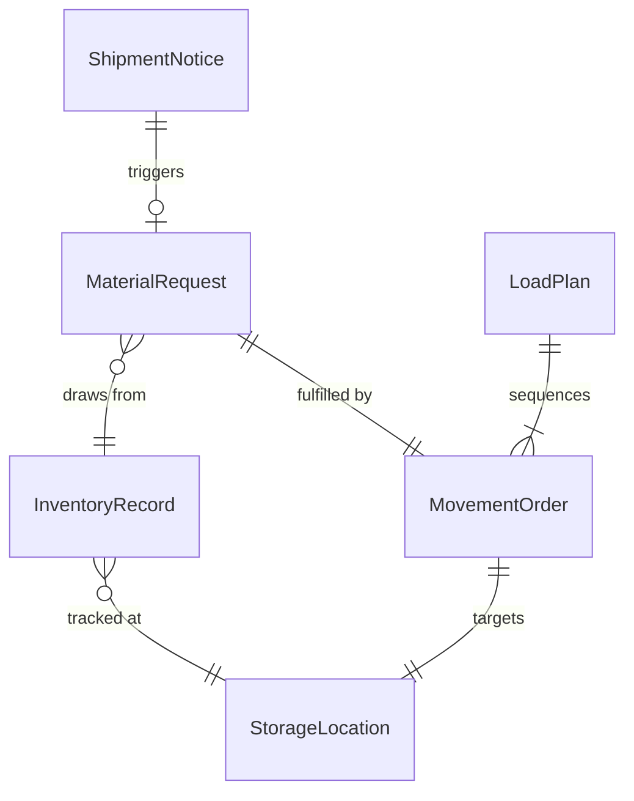
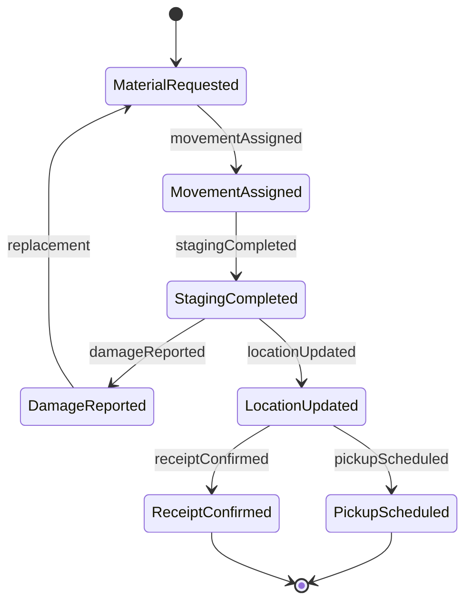
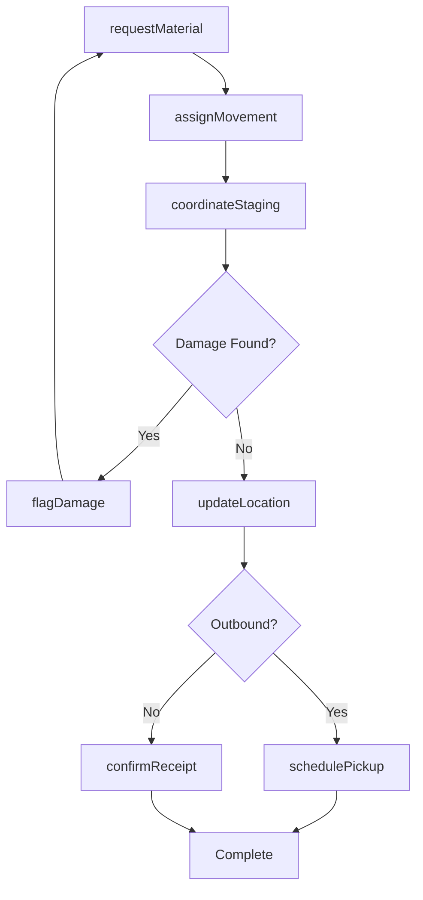
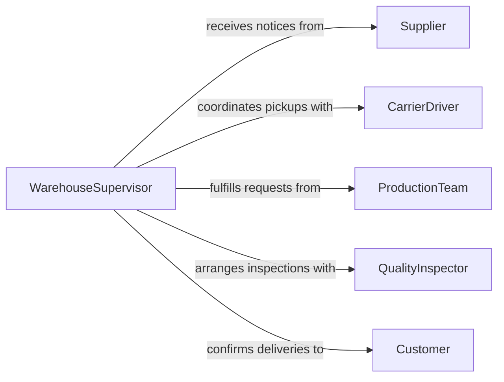

# Communicate Others Coordinate Material Handling

> Business-as-Code definition for communicating with others to coordinate material handling or movement. Models the logistics coordination workflows for receiving, staging, transporting, and delivering materials across warehouse and production environments.

## Overview

Communicating with others to coordinate material handling or movement involves relaying instructions and status updates about the receipt, storage, transfer, and dispatch of physical goods and raw materials. This definition captures the material flow coordination lifecycle from inbound receiving through internal movement and outbound shipping. It ensures that warehouse operators, forklift drivers, production teams, and shipping personnel maintain alignment on material locations, handling priorities, and movement schedules.

## Actors

| Actor | Description |
|-------|-------------|
| Supplier | Ships inbound materials and provides advance shipping notices |
| CarrierDriver | Transports materials between facilities or to customers |
| ProductionTeam | Consumes raw materials and requests stock replenishment |
| QualityInspector | Verifies material condition and specifications upon receipt |
| Customer | Receives outbound shipments and confirms delivery |

## Roles

| Role | Description |
|------|-------------|
| WarehouseSupervisor | Oversees material flow and storage operations |
| ForkliftOperator | Physically moves materials within the facility |
| ReceivingClerk | Processes inbound shipments and verifies against purchase orders |
| ShippingCoordinator | Arranges outbound loads and communicates pickup schedules |

## Entities

| Entity | Description |
|--------|-------------|
| MaterialRequest | A formal request to move or deliver specific materials |
| ShipmentNotice | An advance notification of an inbound or outbound shipment |
| StorageLocation | A designated bin, rack, or staging area within the facility |
| MovementOrder | An instruction to transfer materials from one location to another |
| InventoryRecord | The current quantity and location of a specific material |
| LoadPlan | The arrangement and sequence for loading materials onto a vehicle |

## Actions

| Action | Description |
|--------|-------------|
| requestMaterial | Submit a request for materials to be moved or delivered |
| assignMovement | Delegate a material movement task to an operator |
| confirmReceipt | Verify that inbound materials have been received and inspected |
| updateLocation | Record a material's new storage position after movement |
| schedulePickup | Arrange a carrier pickup time for outbound shipments |
| flagDamage | Report damaged or nonconforming materials during handling |
| coordinateStaging | Organize materials in a staging area for production or shipping |

## Events

| Event | Description |
|-------|-------------|
| materialRequested | A request for material movement has been submitted |
| movementAssigned | A material transfer task has been delegated to an operator |
| receiptConfirmed | Inbound materials have been verified and accepted |
| locationUpdated | A material's storage position has been recorded |
| pickupScheduled | A carrier pickup time has been arranged |
| damageReported | Damaged or nonconforming materials have been flagged |
| stagingCompleted | Materials have been organized in a staging area |

## Searches

| Search | Description |
|--------|-------------|
| findMaterialRequests | List material movement requests by status, priority, or requester |
| getInventoryLocations | Retrieve current locations and quantities for specific materials |
| getPendingMovements | Look up assigned but incomplete movement orders |
| getShipmentSchedule | Find upcoming inbound and outbound shipment times |

## Entity Relationships



## State Diagram



## Workflow



## Actor Relationships



## Usage

### Calling Actions

```typescript
import { communicateOthersCoordinateMaterialHandling } from '@headlessly/communicate-others-coordinate-material-handling'

const materials = communicateOthersCoordinateMaterialHandling()

// Submit a material movement request from production
const request = await materials.requestMaterial({
  material: 'aluminum-sheet-6061',
  quantity: 500,
  unit: 'sheets',
  fromLocation: 'warehouse-rack-B12',
  toLocation: 'production-line-3',
  priority: 'high',
  neededBy: '2026-02-10T08:00:00Z'
})

// Assign the movement to a forklift operator
await materials.assignMovement({
  requestId: request.id,
  operator: 'forklift-op-carlos',
  equipmentType: 'reach-truck',
  scheduledTime: '2026-02-10T06:30:00Z'
})

// Confirm receipt of inbound shipment
await materials.confirmReceipt({
  shipmentId: 'ASN-20260209-4521',
  receivedBy: 'receiving-clerk-dawn',
  itemsVerified: true,
  storageLocation: 'warehouse-rack-A04'
})
```

### Event-Driven Automation

```typescript
// Alert production when materials arrive at staging
materials.stagingCompleted(async ({ requestId, location, material }) => {
  await notify({
    to: 'production-line-supervisor',
    message: `${material} staged at ${location} and ready for use`
  })
})

// Trigger quality inspection when damage is reported
materials.damageReported(async ({ requestId, material, description }) => {
  await notify({
    to: 'quality-inspector',
    message: `Damage reported on ${material}: ${description}. Inspection required.`
  })
})
```
