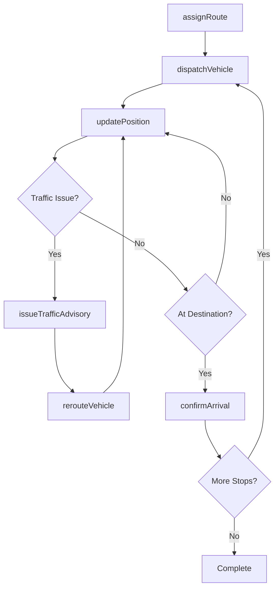
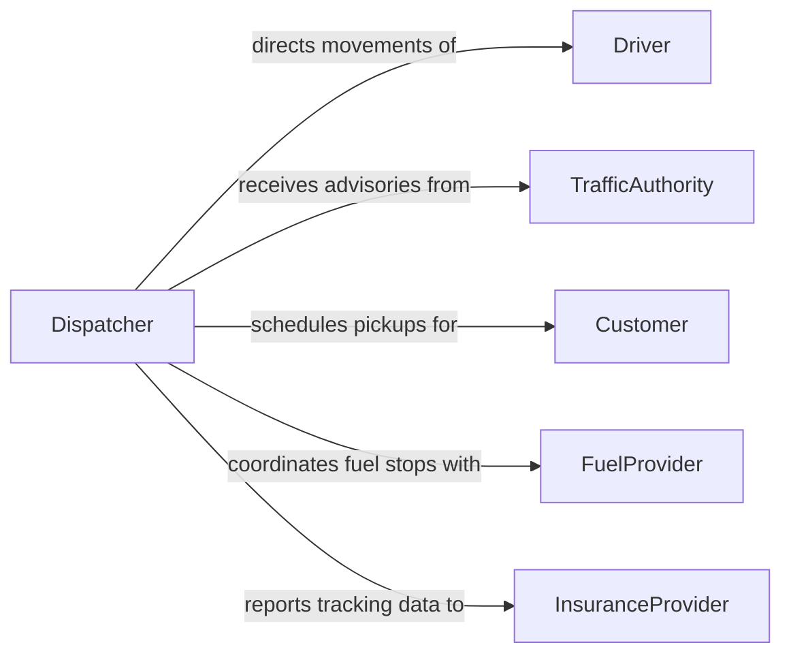

# Communicate Others Coordinate Vehicle Movement

> Business-as-Code definition for communicating with others to coordinate vehicle movement. Models the dispatch and coordination workflows for directing vehicles across fleets, terminals, and transit networks.

## Overview

Communicating with others to coordinate vehicle movement involves directing drivers, dispatchers, and ground crews to manage the safe and efficient flow of vehicles across routes, terminals, loading docks, and parking areas. This definition captures the vehicle coordination lifecycle from route assignment through real-time position updates, traffic advisories, and arrival confirmation. It enables fleet operators, logistics teams, and ground control personnel to maintain synchronized vehicle operations and respond to changing conditions in real time.

## Actors

| Actor | Description |
|-------|-------------|
| Driver | Operates the vehicle and reports position, status, and conditions |
| TrafficAuthority | Provides road closures, weight restrictions, and routing advisories |
| Customer | Receives deliveries or pickups that define vehicle routing requirements |
| FuelProvider | Supplies fuel or charging services at designated stops |
| InsuranceProvider | Requires vehicle tracking data for risk assessment and claims |

## Roles

| Role | Description |
|------|-------------|
| Dispatcher | Assigns routes and coordinates vehicle movements across the fleet |
| FleetManager | Oversees overall fleet operations and utilization |
| GroundController | Directs vehicle movement within terminals, docks, or yards |
| RouteAnalyst | Optimizes routing based on traffic, distance, and delivery windows |

## Entities

| Entity | Description |
|--------|-------------|
| RouteAssignment | A planned path and sequence of stops for a vehicle |
| VehiclePosition | The real-time location and heading of a vehicle |
| DispatchOrder | An instruction directing a specific vehicle to a destination |
| TrafficAdvisory | A notification about road conditions, closures, or restrictions |
| ArrivalConfirmation | A record verifying a vehicle has reached its destination |
| FuelStop | A scheduled or unscheduled refueling or recharging event |

## Actions

| Action | Description |
|--------|-------------|
| assignRoute | Set a planned path and stop sequence for a vehicle |
| dispatchVehicle | Send a vehicle to a specific destination with instructions |
| updatePosition | Record the real-time location and status of a vehicle |
| issueTrafficAdvisory | Communicate road condition or routing change information |
| confirmArrival | Verify that a vehicle has reached its assigned destination |
| rerouteVehicle | Redirect a vehicle to an alternate path or destination |
| logFuelStop | Record a refueling or recharging event during a route |

## Events

| Event | Description |
|-------|-------------|
| routeAssigned | A vehicle has been given a planned path and stop sequence |
| vehicleDispatched | A vehicle has been sent to a specific destination |
| positionUpdated | A vehicle's real-time location has been recorded |
| trafficAdvisoryIssued | Road condition or routing change information has been shared |
| arrivalConfirmed | A vehicle has been verified at its destination |
| vehicleRerouted | A vehicle has been redirected to an alternate path |
| fuelStopLogged | A refueling or recharging event has been recorded |

## Searches

| Search | Description |
|--------|-------------|
| findVehiclePositions | List current positions of all vehicles or a filtered subset |
| getRouteAssignments | Retrieve active route assignments by vehicle, driver, or date |
| getTrafficAdvisories | Find current traffic advisories affecting fleet routes |
| getArrivalHistory | Look up arrival confirmations by vehicle, destination, or date range |

## Workflow



## Actor Relationships



## Usage

### Calling Actions

```typescript
import { communicateOthersCoordinateVehicleMovement } from '@headlessly/communicate-others-coordinate-vehicle-movement'

const fleet = communicateOthersCoordinateVehicleMovement()

// Assign a route to a delivery vehicle
const route = await fleet.assignRoute({
  vehicleId: 'truck-4821',
  driver: 'driver-santos',
  stops: [
    { location: 'Warehouse A', type: 'pickup', window: '06:00-07:00' },
    { location: '1450 Industrial Blvd', type: 'delivery', window: '08:00-09:00' },
    { location: '790 Commerce Dr', type: 'delivery', window: '10:00-11:00' }
  ],
  date: '2026-02-10'
})

// Dispatch the vehicle
await fleet.dispatchVehicle({
  routeId: route.id,
  vehicleId: 'truck-4821',
  instructions: 'Use I-90 westbound. Loading dock at Warehouse A is gate 3.'
})

// Reroute due to road closure
await fleet.rerouteVehicle({
  routeId: route.id,
  vehicleId: 'truck-4821',
  reason: 'Accident on I-90 westbound at mile marker 42',
  newPath: 'Divert to Route 20 via Exit 38'
})
```

### Event-Driven Automation

```typescript
// Notify customers of estimated arrival
fleet.positionUpdated(async ({ vehicleId, routeId, currentLocation, nextStop }) => {
  const eta = calculateETA(currentLocation, nextStop.location)
  if (eta.minutesRemaining <= 30) {
    await notify({
      to: nextStop.customerId,
      message: `Your delivery is approximately ${eta.minutesRemaining} minutes away`
    })
  }
})

// Alert dispatcher when vehicles deviate from route
fleet.positionUpdated(async ({ vehicleId, routeId, currentLocation, expectedPath }) => {
  if (isOffRoute(currentLocation, expectedPath)) {
    await notify({
      to: 'dispatcher',
      message: `Vehicle ${vehicleId} has deviated from assigned route ${routeId}`
    })
  }
})
```
