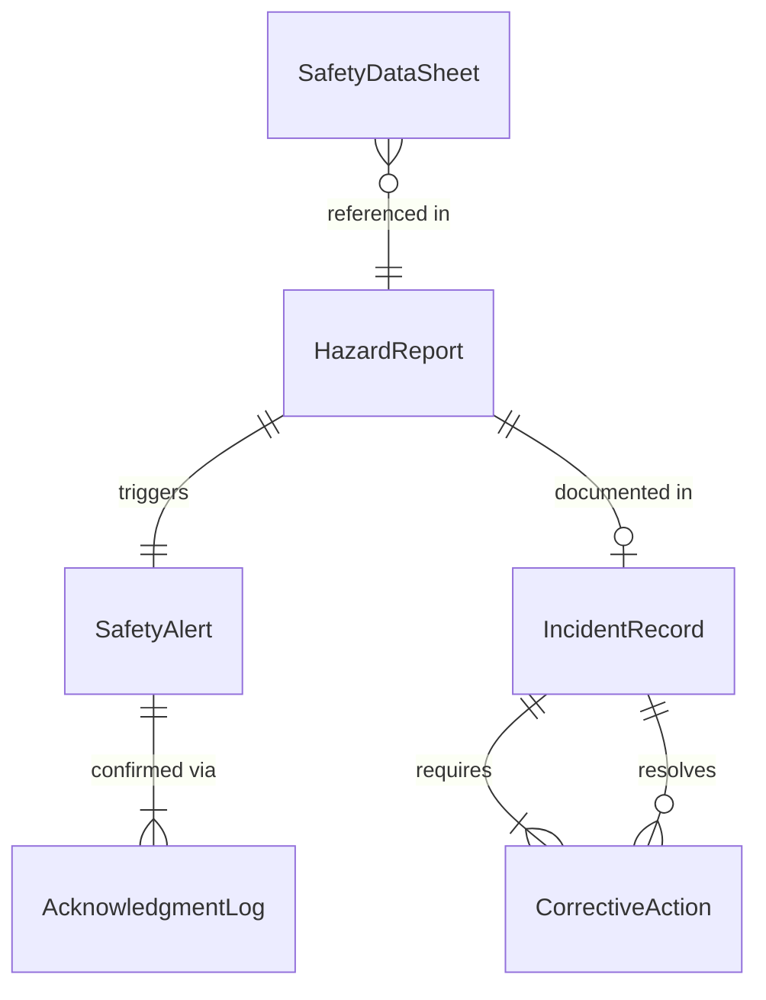
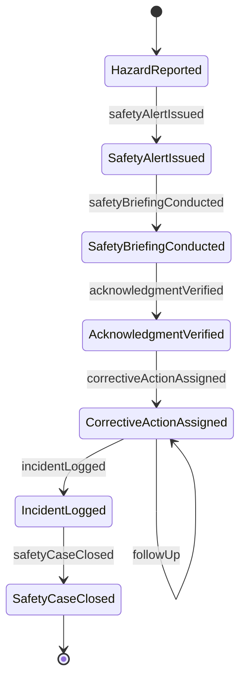
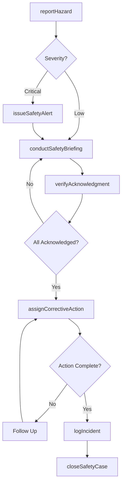
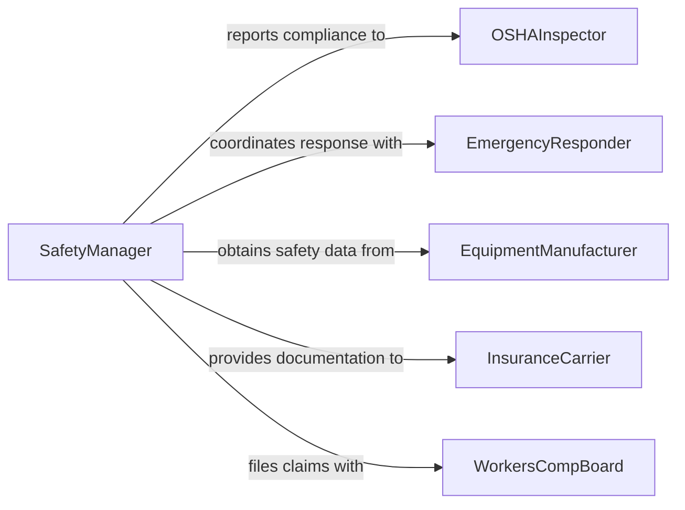

# Communicate Safety Hazard Information Others

> Business-as-Code definition for communicating safety or hazard information to others. Models the critical communication workflows for identifying, reporting, disseminating, and tracking safety hazards and risk mitigation actions across an organization.

## Overview

Communicating safety or hazard information to others involves identifying workplace hazards, reporting incidents, issuing warnings, and ensuring all affected personnel receive timely safety notifications. This definition captures the safety communication lifecycle from hazard detection through alert dissemination, corrective action, and verification of understanding. It enables organizations to maintain a culture of safety by providing structured channels for reporting risks, broadcasting alerts, conducting safety briefings, and tracking acknowledgment of critical safety information.

## Actors

| Actor | Description |
|-------|-------------|
| OSHAInspector | Conducts workplace safety inspections and enforces federal standards |
| EmergencyResponder | Provides emergency services during serious safety incidents |
| EquipmentManufacturer | Supplies safety data sheets and hazard warnings for products |
| InsuranceCarrier | Assesses risk exposure and requires safety documentation |
| WorkersCompBoard | Processes claims related to workplace injuries and exposures |

## Roles

| Role | Description |
|------|-------------|
| SafetyManager | Oversees the safety program and manages hazard communications |
| SafetyCommitteeRep | Participates in safety reviews and communicates findings to teams |
| IncidentReporter | Identifies and formally reports hazards or safety events |
| TrainingSupervisor | Delivers safety briefings and verifies worker comprehension |

## Entities

| Entity | Description |
|--------|-------------|
| HazardReport | A formal notification of an identified workplace safety risk |
| SafetyAlert | A broadcast warning about an active or imminent hazard |
| IncidentRecord | A documented account of a safety event including root cause and actions taken |
| SafetyDataSheet | A standardized document describing chemical hazards and handling procedures |
| CorrectiveAction | A specific measure taken to eliminate or mitigate a hazard |
| AcknowledgmentLog | A record confirming that personnel have received safety information |

## Actions

| Action | Description |
|--------|-------------|
| reportHazard | Submit a formal notification of an identified safety risk |
| issueSafetyAlert | Broadcast an urgent warning about an active or imminent hazard |
| conductSafetyBriefing | Deliver a safety information session to affected personnel |
| logIncident | Document a safety event with details, root cause, and response |
| assignCorrectiveAction | Delegate a specific hazard mitigation measure to responsible personnel |
| verifyAcknowledgment | Confirm that all affected workers have received safety information |
| closeSafetyCase | Mark a hazard or incident as resolved after all actions are complete |

## Events

| Event | Description |
|-------|-------------|
| hazardReported | A workplace safety risk has been formally identified |
| safetyAlertIssued | An urgent hazard warning has been broadcast to personnel |
| safetyBriefingConducted | A safety information session has been delivered |
| incidentLogged | A safety event has been documented with root cause |
| correctiveActionAssigned | A hazard mitigation measure has been delegated |
| acknowledgmentVerified | All affected workers have confirmed receipt of safety information |
| safetyCaseClosed | A hazard or incident has been fully resolved |

## Searches

| Search | Description |
|--------|-------------|
| findOpenHazards | List unresolved hazard reports by location, severity, or date |
| getIncidentHistory | Retrieve past incident records by type, department, or date range |
| getPendingActions | Find corrective actions that are still awaiting completion |
| getAcknowledgmentStatus | Check which personnel have or have not acknowledged a safety alert |

## Entity Relationships



## State Diagram



## Workflow



## Actor Relationships



## Usage

### Calling Actions

```typescript
import { communicateSafetyHazardInformationOthers } from '@headlessly/communicate-safety-hazard-information-others'

const safety = communicateSafetyHazardInformationOthers()

// Report a newly identified hazard
const hazard = await safety.reportHazard({
  location: 'Warehouse B - Aisle 7',
  type: 'chemical-spill',
  severity: 'high',
  description: 'Hydraulic fluid leak from forklift creating slip hazard',
  reportedBy: 'operator-jenkins'
})

// Issue an immediate safety alert
await safety.issueSafetyAlert({
  hazardId: hazard.id,
  urgency: 'immediate',
  affectedAreas: ['Warehouse B'],
  message: 'Hydraulic fluid spill in Aisle 7. Area cordoned off. Avoid until cleanup complete.',
  recipients: ['warehouse-b-all', 'safety-committee']
})

// Assign corrective action
await safety.assignCorrectiveAction({
  hazardId: hazard.id,
  action: 'Deploy spill kit and complete cleanup',
  assignee: 'hazmat-team-lead',
  deadline: '2026-02-10T12:00:00Z'
})
```

### Event-Driven Automation

```typescript
// Escalate when critical hazards are reported
safety.hazardReported(async ({ hazardId, severity, location }) => {
  if (severity === 'critical') {
    await notify({
      to: ['safety-manager', 'plant-director', 'emergency-responder'],
      message: `CRITICAL hazard reported at ${location}. Immediate response required.`
    })
  }
})

// Track acknowledgment deadlines
safety.safetyAlertIssued(async ({ alertId, recipients, urgency }) => {
  const deadline = urgency === 'immediate' ? '1h' : '24h'
  setTimeout(async () => {
    const status = await safety.getAcknowledgmentStatus({ alertId })
    if (status.unacknowledged.length > 0) {
      await notify({
        to: 'safety-manager',
        message: `${status.unacknowledged.length} personnel have not acknowledged alert ${alertId}`
      })
    }
  }, parseDuration(deadline))
})
```
