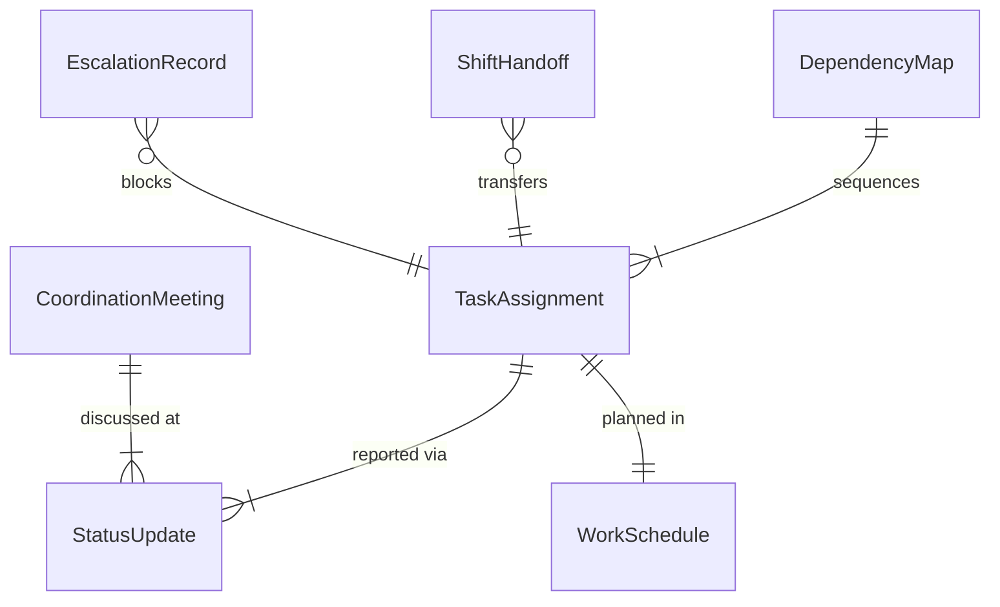
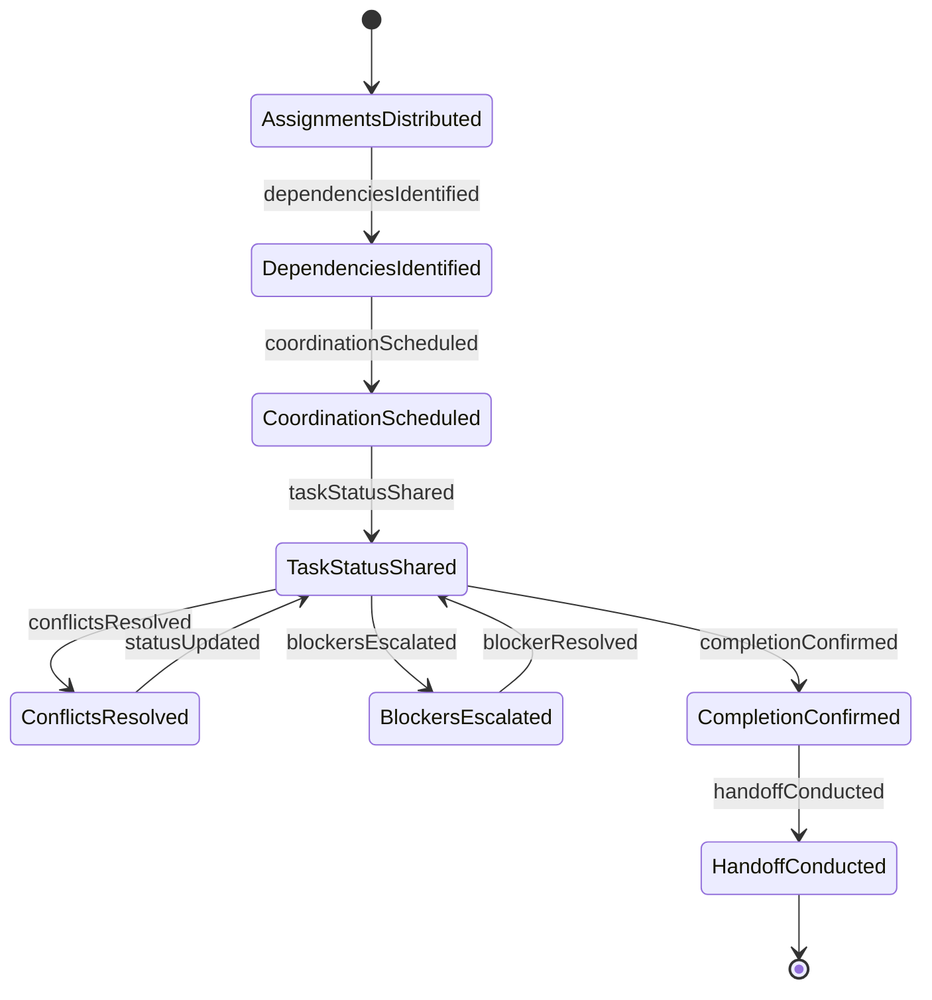
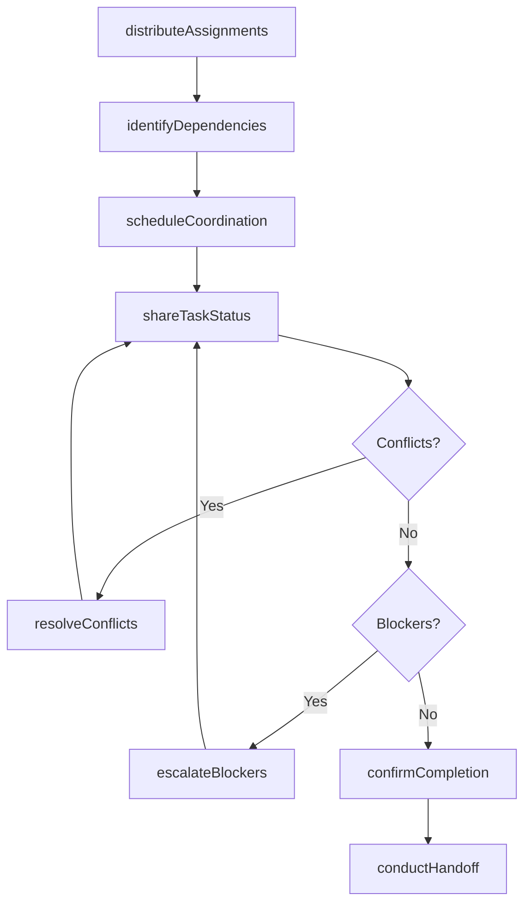
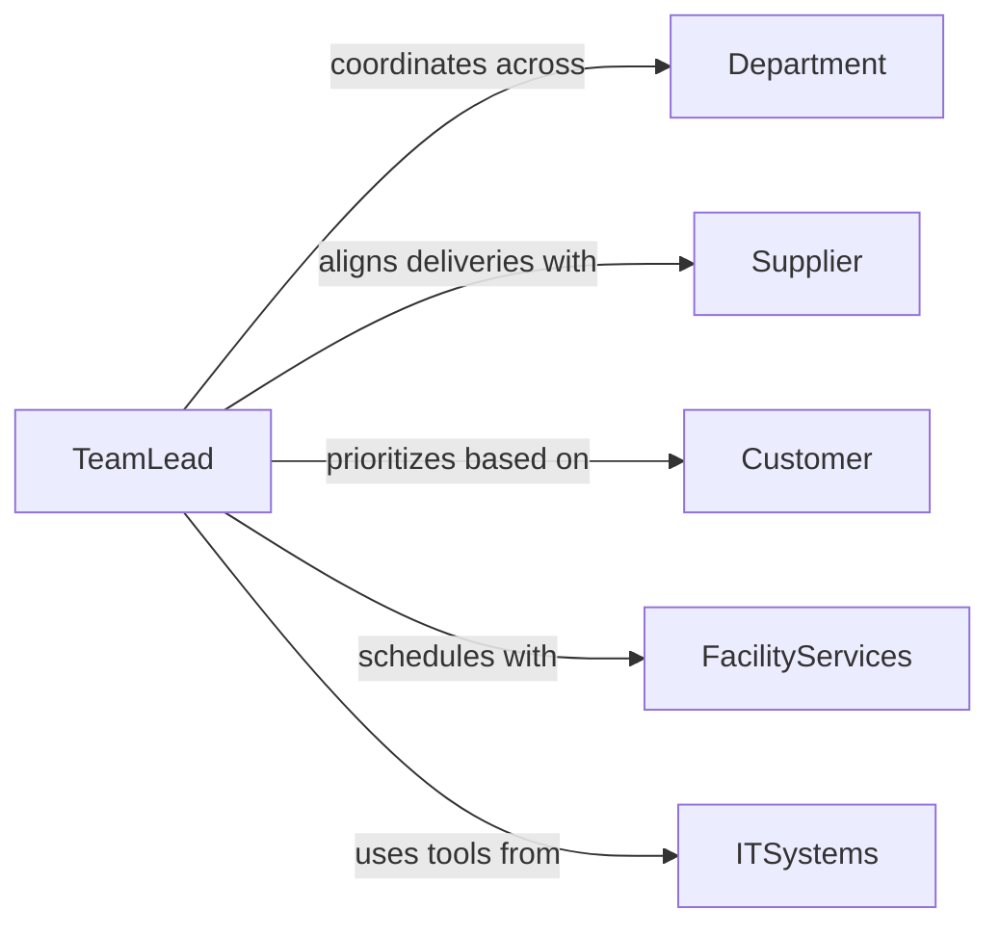

# Communicate with Other Workers to Coordinate Activities

> Business-as-Code definition for communicating with other workers to coordinate activities. Models the internal coordination process where team members share task status, align schedules, hand off work, and synchronize efforts across shifts, departments, or functional areas to ensure smooth operations.

## Overview

Communicating with other workers to coordinate activities involves sharing task assignments, providing status updates, aligning schedules across teams, conducting shift handoffs, and resolving coordination conflicts. This definition covers daily standups, cross-team coordination meetings, shift change briefings, and real-time operational communications, enabling organizations to maintain synchronized workflows and prevent gaps or duplications in work execution.

## Actors

| Actor | Description |
|-------|-------------|
| Department | An organizational unit whose activities require coordination with others |
| Supplier | External provider whose delivery schedules affect internal coordination |
| Customer | End recipient whose requirements drive activity prioritization |
| FacilityServices | Building and infrastructure services that support operational coordination |
| ITSystems | Technology platforms that facilitate communication and scheduling |

## Roles

| Role | Description |
|------|-------------|
| TeamLead | Coordinates activities within and across work groups |
| ShiftSupervisor | Manages handoffs and continuity between work shifts |
| ProjectCoordinator | Synchronizes tasks across multiple contributors |
| OperationsAssociate | Executes tasks and communicates status to colleagues |

## Entities

| Entity | Description |
|--------|-------------|
| TaskAssignment | A specific work item assigned to a team member |
| StatusUpdate | A communication about the progress of an activity |
| ShiftHandoff | A structured transfer of responsibilities between shifts |
| CoordinationMeeting | A scheduled gathering to align activities across workers |
| WorkSchedule | A plan defining when and where activities will occur |
| DependencyMap | A record of task relationships requiring coordination |
| EscalationRecord | Documentation of coordination issues requiring management attention |

## Actions

| Action | Description |
|--------|-------------|
| shareTaskStatus | Communicate the progress of assigned work to colleagues |
| conductHandoff | Transfer responsibilities and context between workers or shifts |
| scheduleCoordination | Arrange meetings or check-ins to align activities |
| identifyDependencies | Map tasks that require sequencing or parallel coordination |
| resolveConflicts | Address scheduling or resource conflicts between workers |
| distributeAssignments | Communicate task allocations to team members |
| escalateBlockers | Raise coordination issues that require supervisory intervention |
| confirmCompletion | Verify and communicate that coordinated activities are finished |

## Events

| Event | Description |
|-------|-------------|
| taskStatusShared | Progress on assigned work has been communicated |
| handoffConducted | Responsibilities have been transferred between workers |
| coordinationScheduled | A coordination meeting or check-in has been arranged |
| dependenciesIdentified | Task relationships requiring coordination have been mapped |
| conflictsResolved | Scheduling or resource conflicts have been addressed |
| assignmentsDistributed | Task allocations have been communicated to the team |
| blockersEscalated | Coordination issues have been raised to management |
| completionConfirmed | Coordinated activities have been verified as finished |

## Searches

| Search | Description |
|--------|-------------|
| findAssignments | List task assignments by worker, team, or status |
| getStatusUpdates | Retrieve activity status by task, worker, or date |
| findHandoffs | Locate shift handoff records by date or team |
| getMeetings | Find coordination meetings by date or participants |
| getBlockers | Retrieve escalated coordination issues by status or team |

## Entity Relationships



## State Diagram



## Workflow



## Actor Relationships



## Usage

### Calling Actions

```typescript
import { communicateWorkersCoordinateActivities } from '@headlessly/communicate-workers-coordinate-activities'

const coordination = communicateWorkersCoordinateActivities()

// Distribute morning assignments
await coordination.distributeAssignments({
  team: 'warehouse-operations',
  shift: 'morning',
  assignments: [
    { worker: 'garcia-m', task: 'inbound-receiving', area: 'dock-3' },
    { worker: 'johnson-t', task: 'order-picking', area: 'zone-b' },
    { worker: 'patel-r', task: 'inventory-count', area: 'aisle-12-15' }
  ]
})

// Conduct shift handoff
await coordination.conductHandoff({
  outgoingShift: 'morning',
  incomingShift: 'afternoon',
  team: 'warehouse-operations',
  openItems: [
    { task: 'inbound-receiving', status: '80-percent-complete', notes: 'Trailer 4 still unloading' },
    { task: 'inventory-count', status: 'complete', discrepancies: 3 }
  ]
})

// Escalate a blocker
await coordination.escalateBlockers({
  team: 'warehouse-operations',
  blocker: 'Forklift 2 out of service - dock operations delayed',
  impact: 'inbound-receiving-delayed-2-hours',
  requestedAction: 'reassign-forklift-from-zone-a'
})
```

### Event-Driven Automation

```typescript
// Notify incoming shift when handoff is ready
coordination.handoffConducted(async ({ outgoingShift, incomingShift, team }) => {
  await notify({
    to: `${incomingShift}-${team}`,
    message: `Shift handoff from ${outgoingShift} is available - review open items`
  })
})

// Alert supervisor when blockers are escalated
coordination.blockersEscalated(async ({ team, blocker }) => {
  await notify({
    to: 'shift-supervisor',
    message: `Coordination blocker in ${team}: ${blocker}`
  })
})
```
