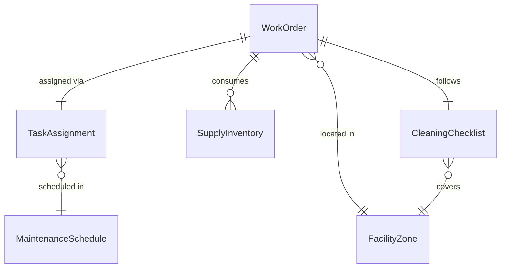
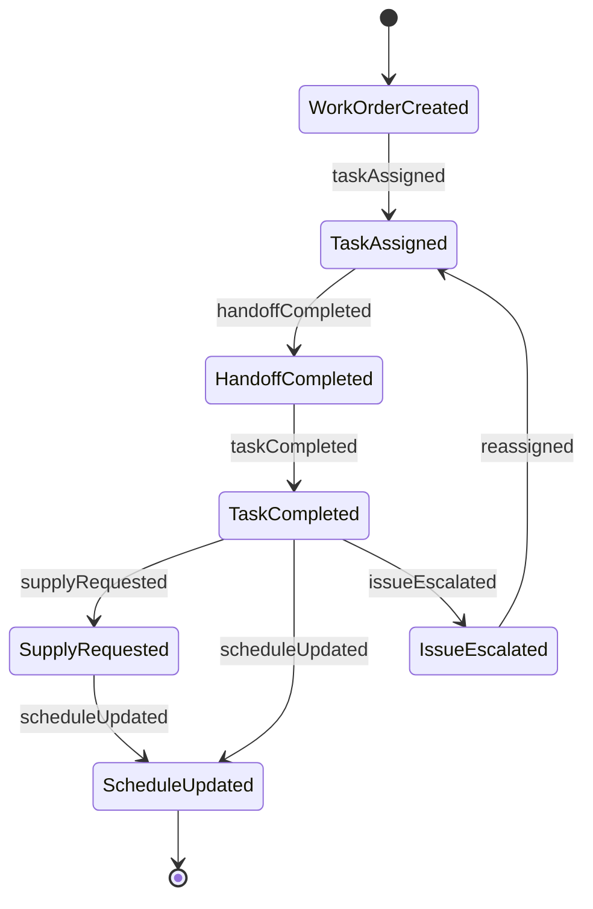
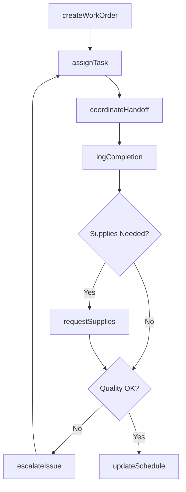
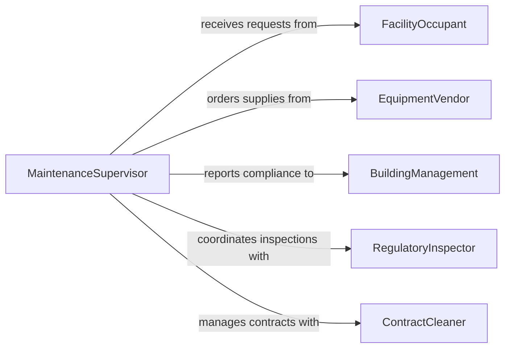

# Confer Coworkers Coordinate Maintenance Cleaning

> Business-as-Code definition for coordinating maintenance and cleaning activities with coworkers. Models the communication workflows required to schedule, assign, and track facility upkeep tasks across teams.

## Overview

Conferring with coworkers to coordinate maintenance or cleaning activities involves scheduling work orders, assigning tasks to available personnel, and communicating priorities for facility upkeep. This definition captures the full coordination lifecycle from identifying maintenance needs through task completion and verification. It enables teams to align on cleaning schedules, equipment maintenance windows, and resource allocation across shifts.

## Actors

| Actor | Description |
|-------|-------------|
| FacilityOccupant | Reports maintenance needs or cleaning requests |
| EquipmentVendor | Provides replacement parts or specialized cleaning supplies |
| BuildingManagement | Sets facility standards and maintenance policies |
| RegulatoryInspector | Verifies compliance with health and safety cleaning standards |
| ContractCleaner | External cleaning service provider for specialized tasks |

## Roles

| Role | Description |
|------|-------------|
| MaintenanceSupervisor | Oversees scheduling and prioritization of maintenance tasks |
| Custodian | Performs routine cleaning and minor maintenance duties |
| MaintenanceTechnician | Executes repair and preventive maintenance work orders |
| ShiftLead | Coordinates task handoffs between shifts |

## Entities

| Entity | Description |
|--------|-------------|
| WorkOrder | A formal request for maintenance or cleaning work |
| MaintenanceSchedule | Recurring calendar of planned maintenance activities |
| CleaningChecklist | Itemized list of cleaning tasks for a specific area |
| TaskAssignment | Mapping of a specific task to a responsible worker |
| FacilityZone | A designated area within the building requiring upkeep |
| SupplyInventory | Stock levels of cleaning products and maintenance parts |

## Actions

| Action | Description |
|--------|-------------|
| createWorkOrder | Submit a new maintenance or cleaning request |
| assignTask | Delegate a specific task to a team member or shift |
| updateSchedule | Modify the maintenance or cleaning calendar |
| logCompletion | Record that a task has been finished and verified |
| requestSupplies | Initiate a restock order for cleaning or maintenance materials |
| escalateIssue | Flag a task that requires additional resources or expertise |
| coordinateHandoff | Transfer pending tasks between shifts or teams |

## Events

| Event | Description |
|-------|-------------|
| workOrderCreated | A new maintenance or cleaning request has been submitted |
| taskAssigned | A task has been delegated to a specific worker |
| scheduleUpdated | The maintenance or cleaning calendar has been modified |
| taskCompleted | A maintenance or cleaning task has been finished |
| supplyRequested | A restock order for materials has been initiated |
| issueEscalated | A task has been flagged for additional attention |
| handoffCompleted | Pending tasks have been transferred between shifts |

## Searches

| Search | Description |
|--------|-------------|
| findWorkOrders | List work orders by status, zone, or priority |
| getSchedule | Retrieve maintenance or cleaning schedules by date range and zone |
| getTaskAssignments | Look up tasks assigned to a specific worker or shift |
| getSupplyLevels | Check current inventory of cleaning and maintenance supplies |

## Entity Relationships



## State Diagram



## Workflow



## Actor Relationships



## Usage

### Calling Actions

```typescript
import { conferCoworkersCoordinateMaintenanceCleaning } from '@headlessly/confer-coworkers-coordinate-maintenance-cleaning'

const maintenance = conferCoworkersCoordinateMaintenanceCleaning()

// Create a new maintenance work order
const workOrder = await maintenance.createWorkOrder({
  zone: 'Building A - 3rd Floor',
  type: 'preventive',
  description: 'HVAC filter replacement and duct cleaning',
  priority: 'medium',
  requestedBy: 'facility-occupant-042'
})

// Assign the task to the morning shift technician
await maintenance.assignTask({
  workOrderId: workOrder.id,
  assignee: 'tech-james-wilson',
  shift: 'morning',
  scheduledDate: '2026-02-10'
})

// Log task completion after work is done
await maintenance.logCompletion({
  workOrderId: workOrder.id,
  completedBy: 'tech-james-wilson',
  notes: 'Filters replaced, ducts cleaned and inspected',
  qualityCheck: 'passed'
})
```

### Event-Driven Automation

```typescript
// Notify supervisor when issues are escalated
maintenance.issueEscalated(async ({ workOrderId, zone, reason }) => {
  await notify({
    to: 'maintenance-supervisor',
    message: `Escalated issue in ${zone}: ${reason}`
  })
})

// Auto-reorder supplies when tasks deplete inventory
maintenance.taskCompleted(async ({ workOrderId, suppliesUsed }) => {
  for (const supply of suppliesUsed) {
    const levels = await maintenance.getSupplyLevels({ item: supply.id })
    if (levels.quantity < levels.reorderThreshold) {
      await maintenance.requestSupplies({ items: [supply.id], quantity: supply.reorderAmount })
    }
  }
})
```
